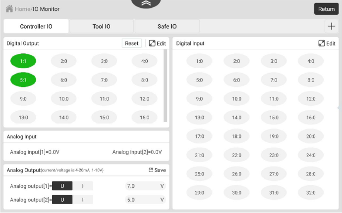
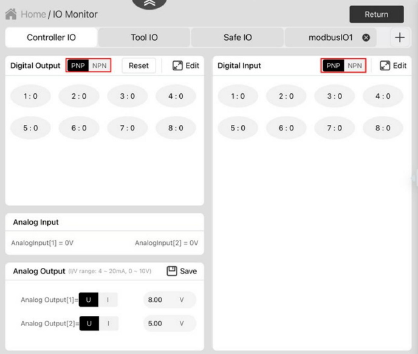
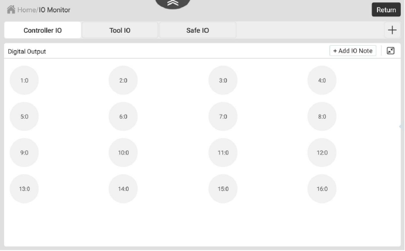
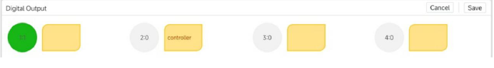
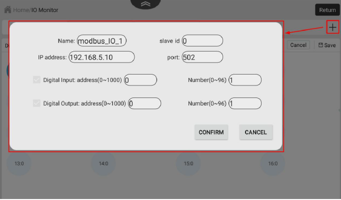
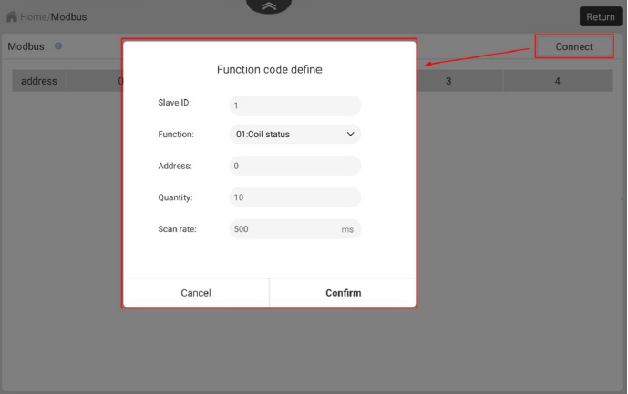
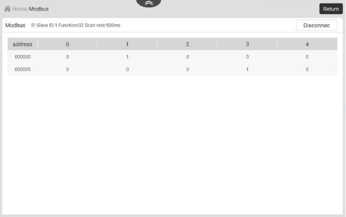

# **Chapter 05: 모니터링**

```
[Summary]
5.1: 입출력 모니터
5.2: 모드버스
5.3: 글로벌 변수
5.4: 로봇 상태
5.5: 실행 로그
5.6: 두봇+
```

---

## **5.1: 입출력 모니터(I/O Monitor)**
### **5.1.1: 컨트롤러 및 도구 I/O**


> I/O 모니터를 구성하는 세 가지 기능
1. 출력         : 디지털 / 아날로그 출력 설정
2. 모니터       : 입력 및 출력 상태를 모니터링
3. 시뮬레이션   : 프로그램 디버깅을 위한 디지털 입력 상태를 시뮬레이션

|기능|요약|
|---|---|
|출력|디지털/아날로그 출력 설정(아날로그 출력은 설정이 유지되어야만 유효) Digital Output 패널에서 Reset을 클릭하면 수정된 출력 값을 모두 초기화할 수 있음|
|모니터|입력 및 출력 상태를 모니터링|
|시뮬레이션|프로그램 디버깅을 위한 디지털 입력 상태를 시뮬레이션|

> 제어 캐비넷 유형이 `CCBOX`인 경우 아래와 같이 디지털 입력/출력의 유형을 `PNP(상한 수준 유효)` 또는 `NPN(하한 수준 유효)`로 설정할 수 있다.
> 


> Digital Output / Digital Input 모듈 우측 상단의 `Edit`을 클릭하면 해당 I/O 모듈이 확대된다. (Digital Output 예시)



> `Add IO Note` 를 클릭하면 메모 설정 페이지가 나타난다. 포트 오른쪽에 있는 메모 상자를 클릭하면 해당 포트에 대한 메모를 추가하거나 수정할 수 있다. 설정 후 `저장`을 클릭한다.



### **5.1.2: 안전한 IO**
Safe IO 페이지에서 각 안전 I/O 인터페이스의 기능을 설정할 수 있다. `편집`을 클릭하여 기능을 수정 및 설정할 수 있다.

제어 캐비닛의 유형이 `CCBOX`인 경우, Safe I/O와 Universal I/O는 동일한 단자를 공유한다. 리모트 I/O(고급 설정 포함)로 구성된 단자는 <u>`안전한 I/O`  설정을 할 수 없다.</U>

### **5.1.3: 확장 IO**
> 기본 탭 외에 +를 클릭하여 아래와 같이 Modbus 통신에서 I/O를 모니터링하기 위한 사용자 지정 탭을 추가할 수 있다.

|구분|설명|
|---|---|
|이름|탭의 이름이다|
|슬레이브 ID|장치의 ID를 입력한다|
|IP주소|Modbus 장치의 주소를 입력한다|
|포트| Modbus 통신의 포트 번호를 입력한다|
|디지털 입력/디지털 출력|레지스터 선택 후 DI/Do의 레지스터 주소와 번호를 구성한다|




`확인`을 클릭하면 IO 모듈에 새 탭이 나타난다. 컨트롤러 재시작 후 적용됨.

---

## **5.2: 모드버스**
이 모듈은 Modbus 슬레이브를 연결하는 데 사용됨.

|구분|설명|
|---|---|
|슬레이브 ID|슬레이브 장치 ID|
|기능|코일 레지스터, 이산 입력, 홀드 레지스터 및 입력 레지스터를 포함한 슬레이브 장치의 기능 유형 선택|
|스캐닝 속도|로봇 팔이 슬레이브 스테이션을 스캐닝하는 시간 간격|




`연결`을 클릭하여 슬레이브 스테이션에 연결을 시작.
`Disconnect`를 클릭하여 슬레이브와의 연결을 끊을 수 있다.



* 슬레이브 기능이 `코일 레지스터` 또는 `홀드 레지스터`인 경우 테이블의 셀을 클릭하면 해당 주소의 값과 별칭을 수정할 수 있다.
* 슬레이브 기능이 `이산 입력` 또는 `입력 레지스터`인 경우 테이블의 셀을 클릭하면 해당 주소의 별칭을 수정할 수 있다.

---

## **5.3: 글로벌 변수**
모듈은 전역 변수를 구성하고 확인하는 데 사용된다. 설정된 전역 변수는 Blockly 프로그래밍 혹은 Script 프로그래밍에서 블록 혹은 변수명을 통해 호출할 수 있다.

> CR Studio에서 지원되는 전역 변수 유형

|구분|설명|
|---|---|
|부울|부울 값|
|String|String|
|int|Integer|
|float|배정도 부동 소수점|


* `전역 보류`로 설정된 변수의 경우, 전역 변수의 값은 블록 또는 스크립트 프로그래밍에서 수정된 후 여기에서 동기화된다. 그렇지 않으면 수정된 값은 해당 프로젝트에만 적용되며 전체적으로 동기화되지 않는다.

> 로봇의 점은 아래와 같이 지정된 위치로 로봇을 이동하여 얻을 수 있다.


---

## **5.4: 로봇 상태**
이 모듈은 로봇의 실시간 상태를 확인하는 데 사용된다. 제어 유형이 `CCBOX`인 경우, 평균 소비 전력 및 로봇 전류는 표시되지 않는다.

* 관리자 모드에서만 런타임 데이터를 지우고 컨트롤러 시스템 시간을 수정할 수 있다.


---

## **5.5: 실행 로그**

실행 로그를 통해 로봇의 동작 이력 확인이 가능하다.


---

## **5.6: 두봇+**
로봇의 엔드 툴을 제어하기 위한 엔드 플러그인을 설치 및 구성하는 데 사용된다.


`플러그인 추가`를 클릭하여 플러그인의 목록을 볼 수 있다. `+`를 클릭하여 플러그인을 설치하거나, `가져오기`를 클릭하여 플러그인을 업로드할 수 있다.


설치된 플러그인은 `두봇+`의 메인 페이지에 표시된다.

