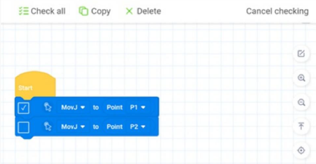

# **Chapter 06: 프로그래밍**

```
[Summary]
6.1: 블록리(Blockly)
6.2: 스크립트
```

---
## **6.1: 블록리(Blockly)**

CR Studio는 블록 프로그래밍을 제공한다. 관련 기능에 대한 블록을 드래그하여 제어할 수 있다.


### **6.1.1: 프로그램**


|No.|설명|
|---|---|
|1|현재 프로젝트 이름을 표시|
|2|프로젝트 파일을 관리하고 프로그래밍 작업을 실행 취소하거나 복원하는 데 사용. 파일 드롭다운 목록에서 Blockly 프로그램을 Script로 변환할 수 있다.|
|3|프로젝트 실행을 제어|
|4|프로그래밍에 사용되는 Block들을 제공|
|5|프로그램 편집 영역. 블록을 영역으로 드래그하여 프로그램을 편집할 수 있음.|
|6|포인트 패널. 저장하지 않은 변경 사항이 있는 경우, 아이콘 우측 하단에 빨간 점이 표시됨|

프로그램 작성 영역의 아이콘들은 다음과 같다.

|버튼|설명|
|---|---|
||편집 모드를 활성화한다. 편집 모드에서 복사하거나 삭제할 블록을 여러 개 또는 모두 선택할 수 있다.<br>|
||프로그래밍 영역 잠금/잠금 해제|
||확대 / 축소 / 프로그래밍 영역 복원|
||블록 상단으로 / 중앙 블록 / 블록 하단으로 돌아가기|
||블록을 이 아이콘으로 드래그하여 삭제하거나 블록을 길게 누르고 블록 삭제를 선택하여 삭제한다|

### **6.1.2: Point**

`Point` 인터페이스는 프로그래밍에서 포인트를 관리하는 데 사용된다.


|No.|구분|
|---|---|
|1|Point 패널 표시/숨김|
|2|`Run To`의 동작 모드를 설정|
|3|포인트 목록 파일을 가져오거나 현재 포인트 목록을 파일로 내보냄|
|4|컨트롤 패널 확대/축소|
|5|포인트 관리 영역|

* 로봇 암을 지정된 포인트로 이동한 후, `Add`를 클릭하여, 현재 포인트를 새로운 티칭 포인트로 저장할 수 있음.
* 티칭 포인트를 선택한 후, `Name`을 제외한 값 중 아무 값이나 더블클릭하여 값을 직접 수정할 수 있음.
* 티칭 포인트를 선택한 후, `Cover`을 클릭하여 현재 포인트로 덮어쓸 수 있음.
* 티칭 포인트를 선택한 후, `Run To`를 길게 누르면 로봇 암이 해당 포인트로 이동함.
* 티칭 포인트를 선택한 후, `Delete`를 클릭하여 티칭 포인트를 삭제할 수 있음.

### **6.1.3: 디버깅 및 실행**
> 디버깅

프로젝트를 저장한 후, `Debug`를 클릭하면, 프로젝트가 단계별로 실행되며, 이 과정에서 작업 Log를 확인할 수 있음.


* `Step`을 클릭하여, 프로젝트를 단계별로 실행할 수 있음.
* `Exit Debugging`을 클릭하여 디버깅 모드를 종료할 수 있음.
* `Script`를 클릭하여 프로젝트에 해당하는 실행 스크립트를 표시할 수 있음.

> 실행

프로젝트를 저장한 후 `Start`를 클릭하면 프로젝트가 실행되며, 실행 과정의 Log가 표시된다.
* `Pause`를 클릭하여 프로젝트 실행을 일시 중지할 수 있으며, 버튼은 `Continue`로 변경된다.
* `Resume`을 클릭하여 프로젝트 실행을 계속할 수 있음.
* `Stop`을 클릭하여 프로젝트 실행을 중지할 수 있음.
* `Script`를 클릭하여 프로젝트에 해당하는 실행 스크립트를 표시할 수 있음.


### **6.1.4: 예시**

> 두 지점 사이를 반복적으로 이동하도록 로봇을 제어하는 프로그램을 편집하는 예시


1. `Point` 페이지에서 로봇 팔을 임의 지점으로 이동 후, `추가`를 클릭하여 `포인트 P1`을 저장한다.
   
2. 포인트 P1과 다른 새로운 임의의 지점으로 로봇 팔을 이동 후, `추가`를 클릭하여 `포인트 P2`를 저장한다.


3. `프로그램` 페이지로 이동하여, 블록 영역에서 `Forever` 블록을 드래그하여 `Start` 블록 아래에 배치한다.
   
4. 이하 블록을 드래그 및 설정하여 `Forever`에 배치하고 `P1`을 대상 지점으로 설정한다.

    

5. 이하 블록을 드래그 및 설정하여 `Forever`에 배치하고 `P2`를 대상 지점으로 설정하여 이전 블록 아래에 배치한다.

    

6. `저장`을 클릭하고 프로젝트 이름을 입력한 후 저장을 클릭한다.

7. `실행`을 클릭하면 로봇이 움직이기 시작한다.

---

## **6.2: 스크립트**

CR은 2차 개발을 위해 `Lua 언어`를 사용하는 모션 명령, TCP/UDP 명령 등과 같은 다양한 API를 지원한다. CR Studio는 Lua Script를 위한 프로그래밍 환경을 제공하여, 자신만의 Lua 스크립트를 작성해 로봇 작동을 제어할 수 있다.

### **6.2.1: 프로그램**


|No.|설명|
|---|---|
|1|현재 프로젝트 이름을 표시|
|2|프로젝트 파일을 관리하고 프로그래밍 작업을 실행 취소 또는 복원하는 데 사용|
|3|디버그 페이지를 표시|
|4|프로젝트 실행을 제어|
|5|명령 목록|
|6|프로그램 편집 영역|

### **6.2.2: Point**
`Point` 페이지는 프로그래밍에서 포인트를 관리하는 데 사용된다.


|No.|구분|
|---|---|
|1|포인트 패널 표시/숨기기|
|2|`Run To`의 모션 모드 설정|
|3|포인트 리스트 파일을 가져오거나 현재 포인트 리스트를 파일로 내보냄|
|4|제어 패널 확대/축소|
|5|포인트 관리 영역<br>이하 Blockly와 동일|

### **6.2.3: 디버깅 및 실행**
> 디버깅

프로젝트를 저장한 후, `Debug`를 클릭하면, 프로젝트가 단계별로 실행되며, 이 과정에서 작업 Log를 확인할 수 있음.


* 코드 좌측의 `줄 번호`를 클릭하여 `중단점`을 설정할 수 있음. 디버그 모드에서는 프로그램이 중단점까지 실행되면 자동으로 일시 정지됨.
* 프로그램이 중단점에서 일시 정지된 후에 계속 실행하려면 `Continue`를 클릭하거나, 단계별로 실행하려면 `Step`를 클릭한다.
* 디버그 모드를 종료하려면 `Exit Debugging`을 클릭한다.

> 실행

프로젝트를 저장한 후 `Start`를 클릭하면 프로젝트가 실행되며, 실행 과정의 Log가 표시된다.
* `Pause`를 클릭하여 프로젝트 실행을 일시 중지할 수 있으며, 버튼은 `Continue`로 변경된다.
* `Resume`을 클릭하여 프로젝트 실행을 계속할 수 있음.
* `Stop`을 클릭하여 프로젝트 실행을 중지할 수 있음.


### **6.2.3: 예시**

> 두 지점 사이를 반복적으로 이동하도록 로봇을 제어하는 스크립트 프로그램을 편집하는 예시


1. `Point` 패널을 열어 로봇 팔을 임의 지점으로 이동 후, `추가`를 클릭하여 `포인트 P1`을 저장한다.
   
2. 포인트 P1과 다른 새로운 임의의 지점으로 로봇 팔을 이동 후, `추가`를 클릭하여 `포인트 P2`를 저장한다.

    ```
    while(true)
    do
        Go(P1)
        Go(P2)
    end
    ```


3. `프로그래밍` 영역에서 루프 명령을 추가한다.

4. 루프 명령 아래에 모션 명령을 추가하고, P1을 목표 지점으로 설정한다.

5. 다른 동작 명령을 추가하고 P2를 목표점으로 설정한다.

6. `저장`을 클릭하고 프로젝트 이름을 입력한 다음 `예`를 클릭한다.

7. `실행`을 클릭하면 로봇이 움직이기 시작한다.