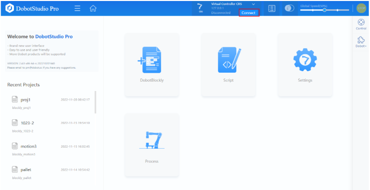

# **Chapter 08: 모범 사례**

---
## **8.1: 시나리오**
원격 I/O를 통해 로봇 팔을 제어하는 전체 프로세스를 설명

`시작` 버튼을 누르면 실행 표시등이 나타나고, 로봇 팔은 엔드 툴에 장착된 Gripper을 통해 `Picking Point(피킹 지점)`에서 물질을 잡고, 목표 지점으로 이동하여 물질을 놓은 다음 다시 Picking Point로 돌아와 물질을 잡는 작업을 반복적으로 실행한다.

* 로봇 팔 끝에 Gripper을 설치해야 함(예로 DH Gripper을 다룸)
* 버튼과 표시등을 Controller의 `I/O Interface`에 연결해야 함(이하는 연결된 위치를 가정)
  * `시작` 버튼: DI11
  * `종료` 버튼: DI12
  * `실행` 표시등: DO11
  * `알람` 표시등: DO12

## **8.2: 전반적인 과정**
하드웨어를 설치하고 로봇 팔의 전원을 켠 후 다음과 같이 소프트웨어 작업을 수행

1. 로봇 연결
2. Dobot+ 플러그인 설치(선택사항)
3. Tool 좌표계 설정 및 선택
4. 프로젝트 파일 편집
5. 원격 I/O 모드 구성 및 진입

## **8.3: 절차**

### **8.3.1: 로봇 연결 및 활성화**
1. 두봇 컨트롤러 WiFi 이름을 검색하여 연결
   * WiFi SSID는 Dobot_WIFI_XXX(XXX는 베이스에 위치한 로봇 인덱스)를 검색하여 연결한다.
   * WiFi비밀번호는 기본적으로 `1234567890`
   * 인터페이스 상단에서 로봇을 선택 후 `Connect`를 클릭한다.

      

2. `Enabling` 버튼 클릭 후 로드 매개변수를 설정하여 로봇을 활성화한다.

### **8.3.2: Dobot+ 플러그인 설치(선택사항)**


1. 메인 인터페이스의 오른쪽에 있는 `Dobot+`를 클릭하여 패널을 연다.
2. `Add Plug-in`을 클릭한 후, DH 플러그인의 설치를 완료하기 위해 `Install`을 클릭한다.

* 설치된 엔드 툴에 대한 플러그인이 없다면, 후속 프로그래밍에서 I/O 명령을 통해 직접 엔드 툴을 제어해야 함.

### **8.3.3: Tool 좌표계 설정 및 선택**

1. `Settings(설정)` > `Coordination System(좌표계)` > `Tool Coordinate System(도구 좌표계)` 페이지를 연다.
2. `Coordination System(좌표계)`을 `추가(Add)`하거나, `수정(Modify)`한다. 도구의 중심점과 Flange(플랜지)의 중심점 사이의 Offset을 입력하고, `OK`를 클릭한다.

      

3. Control 패널에서 방금 설정한 `Tool Coordinate System(도구 좌표계)`를 선택한다.

### **8.3.4: 프로젝트 편집(Blockly 기준)**


시작 전 4가지의 Point를 가르쳐야 한다.

* P1: Picking Point(피킹 지점)
* P2: P1 지점 위의 이동 지점
* P3: P4 지점 위의 이동 지점
* P4: Upload 지점

1. `Point` 페이지를 열고 로봇 팔을 `P1` 지점으로 이동한 후, `Add`를 클릭한다.

 

2. 동일한 방법으로 `P2`, `P3`, `P4` 지점을 `Point`에 추가한다.

> 코드 블록 지점


> Script 코드

```
DhInit(9600,1)
DhOpen(0,1)
Sync()
while 1 do
    Sleep(50)
    Move((InitialPose))
    Move((InitialPose))
    DhClose(0,1)
    Move((InitialPose))
    Move((InitialPose))
    DhClose(0,1)
    Move((InitialPose))
end

```

### **8.3.5: 원격 I/O 모드 구성 및 시작**

예시 시나리오를 기반으로 원격 I/O 모드를 구성하고 진입하는 방법에 대해서만 설명

1. `Settings(설정)` > `Remote Control(원격 제어)` 페이지 이동
2. `Current mode`를 `Remote I/O`로 설정한다.
3. `Open(열기)`을 클릭하고, 이전에 저장한 Blockly 프로젝트를 선택한다.
4. `Modify(수정)`을 클릭하여 앞서 설명한 시나리오에 맞게 I/O 구성을 수정한다.
5. `Apply(적용)`을 클릭하여 원격 I/O 모드에 진입한다.


리모트 I/O 진입 후 로봇 팔 컨트롤러에 연결된 `시작` 버튼을 누르면 로봇 팔이 프로젝트 실행을 시작한다.