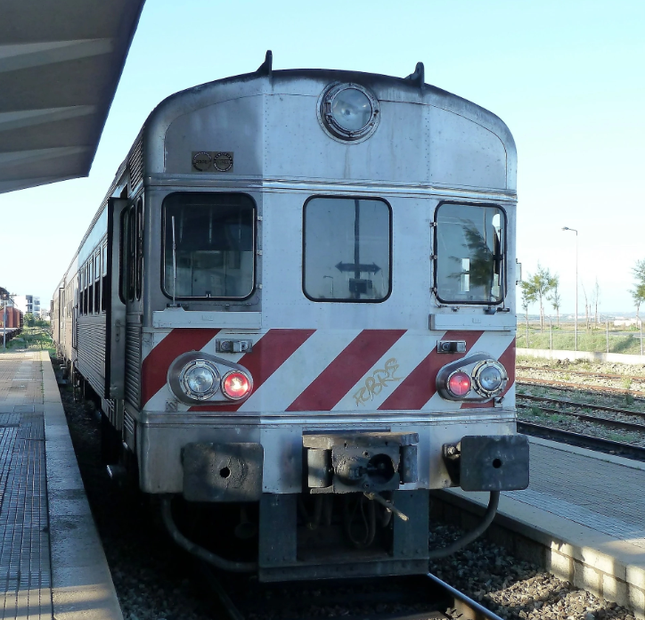
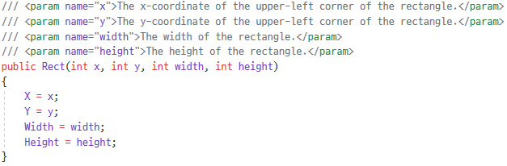
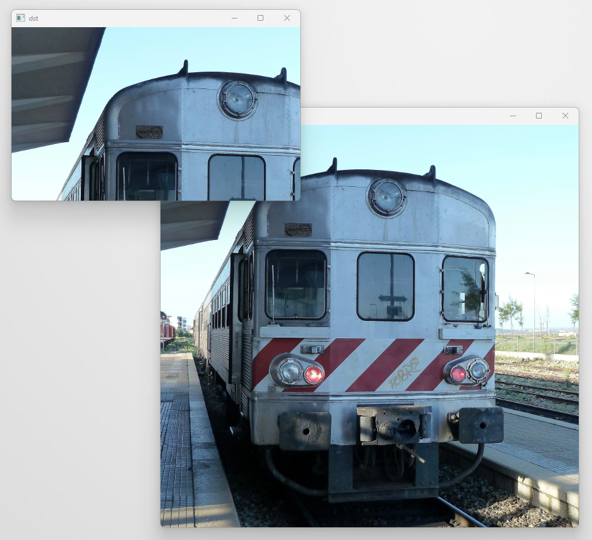

# **Chapter10. 자르기**
## **개요**

영상이나 이미지의 원하는 부분을 자를 수 있다.  

이미지의 특정 영역에 대해 작업하는 동작이므로, `관심 영역`이라 부르며, 또한 이미지는 `행렬`이므로 특정 부분을 잘라내기 때문에 `하위 행렬`이라고도 부른다.

\* 해당 작업은 원본 이미지 자체에 영향을 미치지 않기 때문에, 원하는 부분을 `추출`하는 작업에 가깝다고 생각됨.

## **10.1. 프로그램 작성**

> 원본 이미지: transport.png



```cs
using System;
using OpenCvSharp;

namespace Project {
    class Program {
        static void Main(string[] args) {
            Mat src = new Mat("transport.png");
            Mat dst = src.SubMat(new Rect(0, 0, 500, 300));

            Cv2.ImShow("src", src);
            Cv2.ImShow("dst", dst);
            Cv2.WaitKey(0);
        }
    }
}
```

### **(Mat).SubMat()**

Mat 클래스로 생성된 인스턴스로부터 하위 행렬을 생성하는 메서드이다. Mat Type으로 반환한다.

```cs
Mat dst = src.SubMat(new Rect(0, 0, 500, 300));
```
Rect 클래스를 사용해 값을 대입하여 하위 행렬을 생성한다.

> Rect 클래스의 구조


* X: 사각형 좌상단 꼭짓점의 x좌표
* Y: 사각형 좌상단 꼭짓점의 y좌표
* width: X를 기준으로 사각형의 가로 길이
* height: Y를 기준으로 사각형의 세로 길이

해당 코드에 의해 원본 이미지(src)의 0, 0지점을 기준으로 가로 500px, 세로 300px만큼의 하위 행렬을 생성하여 `Mat dst`에 저장한다.

> 다른 방법으로 이미지 자르기(하위 행렬 생성하기)
>```cs
> Mat roi1 = new Mat(src, new Rect(300, 300, 100, 100));
> Mat roi2 = src[0, 100, 0, 100];
> ```

### **실행 결과**

