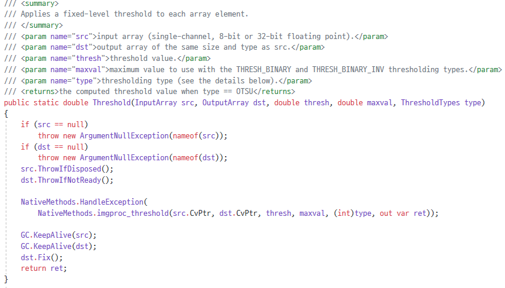
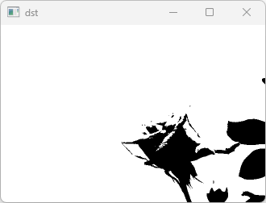
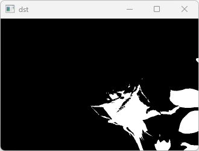
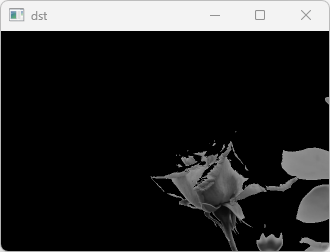
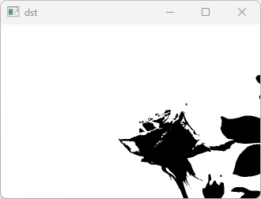

# **Chapter11. 이진화**
## **개요**

영상 혹은 이미지의 특정한 지점을 기준으로 픽셀을 분류하여 `검정(0)` 혹은 `흰색(1)`의 이분화된 값으로 나누어 변경하는 작업을 이진화라고 한다.

특정 값(Threshold)를 기준으로 값이 높거나 낮은 픽셀을 특정하여 작업한다.

## **11.1. 프로그램 작성**

> 원본 이미지: rose.jpg


```cs
using System;
using OpenCvSharp;

namespace Project {
    class Program {
        static void Main(string[] args) {
            Mat src = new Mat("rose.jpg");
            Mat gray = new Mat();
            Mat binary = new Mat();

            Cv2.CvtColor(src, gray, ColorConversionCodes.BGR2GRAY);
            Cv2.Threshold(gray, binary, 150, 255, ThresholdTypes.Binary);

            Cv2.ImShow("src", src);
            Cv2.ImShow("dst", binary);
            Cv2.WaitKey(0);
        }
    }
}
```

### **색상 공간 변환 및 이진화**
```cs
Cv2.CvtColor(src, gray, ColorConversionCodes.BGR2GRAY);
```

Cv2.CvtColor을 통해 원본 이미지 `src`를 1채널의 흑백 이미지로 변환한다. 이진화 적용에 앞서 선행작업으로 많이 적용된다.

\* 이진화는 단일 채널에 대해서만 적용되며, 가령 `src`에 적용할 경우, 각 채널 별로 이진화가 적용된다.

```cs
Cv2.Threshold(gray, binary, 150, 255, ThresholdTypes.Binary);
```
`Cv2.Threshold`를 활용해 이미지를 이진화시킬 수 있다.



* `InputArray src`: 원본 이미지
* `OutputArray dst`: 결과 이미지
* `double thresh`: 임곗값(Threshold)
* `double maxval`: 최댓값
* `ThresholdTypes type`: 임곗값 형식

### **Threshold Types**

|속성|설명|예시|
|---|---|---|
**ThresholdTypes.Binary** |val > thresh => maxval / else => 0|
**ThresholdTypes.BinaryInv** | val > thresh => 0 / else => maxval|
**ThresholdTypes.Trunc** |val > thresh => thresh / else => NOTHING|
**ThresholdTypes.Tozero** |val > thresh => NOTHING / else => 0|
**ThresholdTypes.TozeroInv** |val > thresh => 0 / else => NOTHING|
**ThresholdTypes.Mask** |=> 0 / 검은색 이미지로 변경|
**ThresholdTypes.Otsu** |Otsu(오츠) 알고리즘 적용(단일 채널 이미지만 적용 가능)|
**ThresholdTypes.Triangle** |삼각형 알고리즘 적용(단일 채널 이미지만 적용 가능)|

### **실행 결과**

