# **Chapter12. 이미지 연산(1)**
## **개요**
이미지 연산은 `하나 또는 둘 이상`의 이미지에 대해 **수학적인 연산**을 수행한다. Mat 클래스의 행렬 연산은 OpenCvSharp의 `대수적 표현(+, - 등)`을 통해서도 Mat 클래스 간의 연산을 수행할 수 있다.

> 이미지 연산(1)에서 다루는 함수들
> 
> `덧셈`, `뺄셈`, `곱셈`, `나눗셈`, `최댓값`, `최솟값`, `절댓값`, `절댓값 차이`

## **12.1. 프로그램 작성**

> 원본 이미지: flamingo.jpg


```cs
Mat src = new Mat("flamingo.jpg", ImreadModes.ReducedColor2);
Mat val = new Mat(src.Size(), MatType.CV_8UC3, new Scalar(0, 0, 30));
```

둘 이상의 이미지를 연산 대상에 사용하는 경우, 이미지는 서로 `크기`, `데이터 타입`, `깊이`가 서로 일치해야 한다.

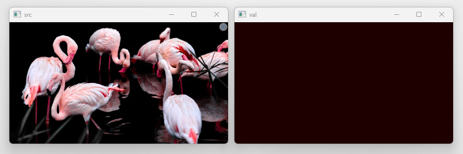

### **12.1.1. 덧셈 연산(Add)**
덧셈 함수 `Cv2.Add()`는 배열과 배열, 또는 배열과 스칼라의 요소별 `합`을 계산한다.

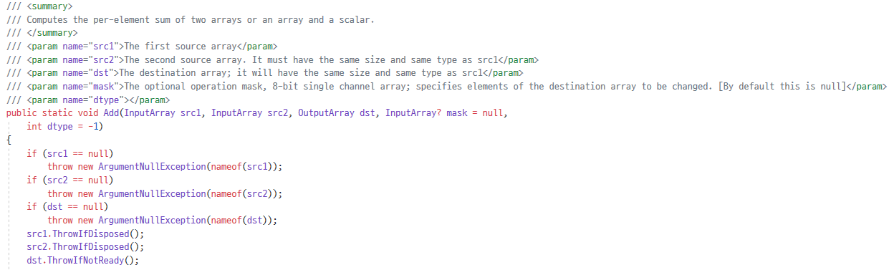
**Cv2.Add(원본 배열1, 원본 배열2, 결과 배열, 마스크, 반환 형식)** 으로 덧셈을 적용한다.

수식으로 표현할 경우 `dst = src1 + src2`의 형태를 갖는다. 

마스크가 `null`이 아닌 경우, 마스크의 요솟값이 0이 아닌 곳만 연산을 진행한다.

```cs
Mat add = new Mat();
Cv2.Add(src, val, add);
```
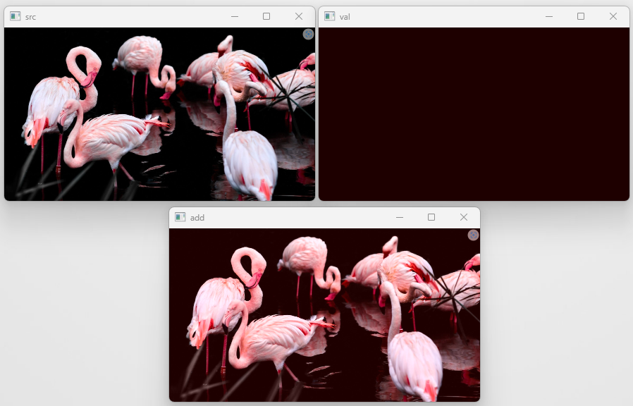

### **12.1.2. 뺄셈 연산(Subtract)**
뺄셈 함수 `Cv2.Substrct()`는 배열과 배열, 또는 배열과 스칼라의 요소별 `차`을 계산한다.

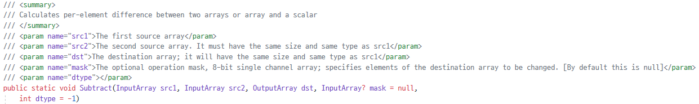
**Cv2.Subtract(원본 배열1, 원본 배열2, 결과 배열, 마스크, 반환 형식)** 으로 뺄셈을 적용한다.

수식으로 표현할 경우 `dst = src1 - src2`의 형태를 갖는다. 

마스크가 `null`이 아닌 경우, 마스크의 요솟값이 0이 아닌 곳만 연산을 진행한다.

```cs
Mat sub = new Mat();
Cv2.Subtract(src, val, sub);
```
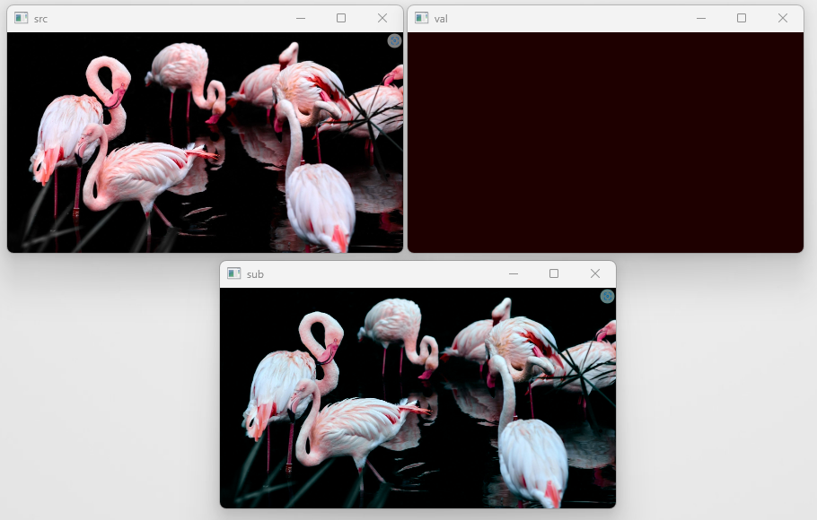

### **12.1.3. 곱셈 연산(Multiply)**
곱셈 함수 `Cv2.Multiply()`는 배열과 배열, 또는 배열과 스칼라의 요소별 `곱`을 계산한다.

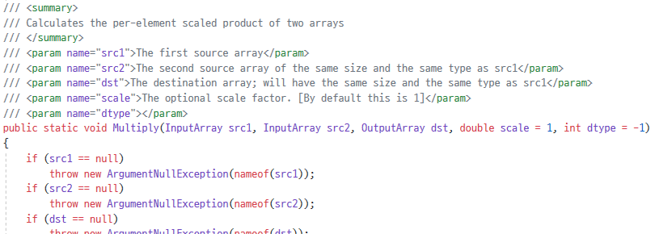
**Cv2.Multiply(원본 배열1, 원본 배열2, 결과 배열, 비율, 반환 형식)** 으로 곱셈을 적용한다.

수식으로 표현할 경우 `dst = src1 * src2`의 형태를 갖는다. 

비율이 `null`이 아닌 경우, 연산에 `비율` 값을 추가로 곱한다.

```cs
Mat mul = new Mat();
Cv2.Multiply(src, val, mul);
```
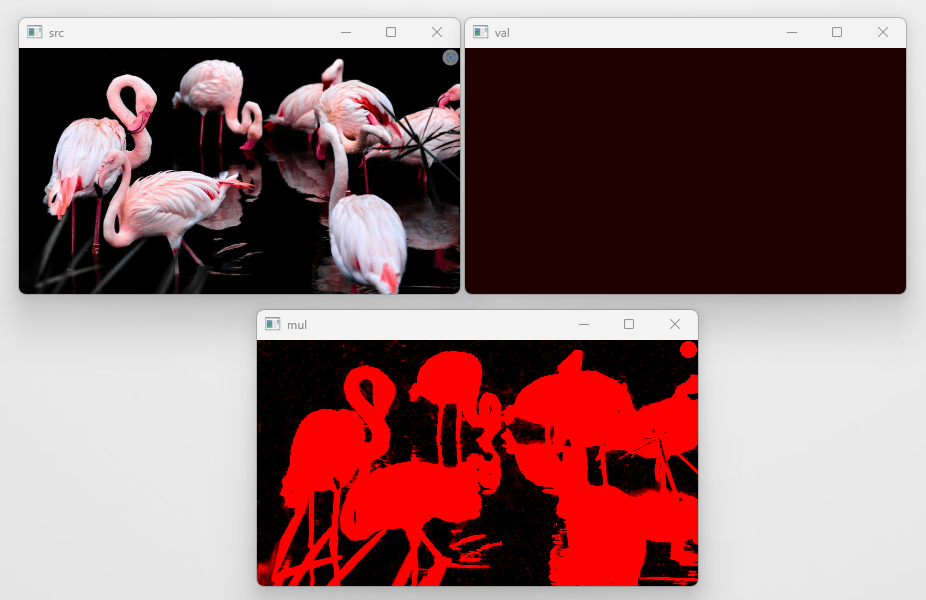

### **12.1.4. 나눗셈 연산(Divide)**
나눗셈 함수 `Cv2.Divide()`는 배열과 배열, 또는 배열과 스칼라의 요소별 `나눗셈`을 계산한다.

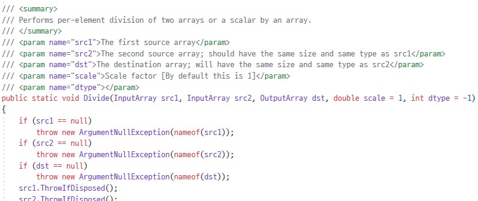
**Cv2.Divide(원본 배열1, 원본 배열2, 결과 배열, 비율, 반환 형식)** 으로 나눗셈을 적용한다.

수식으로 표현할 경우 `dst = src1 / src2`의 형태를 갖는다. 

비율이 `null`이 아닌 경우, 연산에 `비율` 값을 추가로 곱한다.

```cs
Mat div = new Mat();
Cv2.Divide(src, val, div);
```
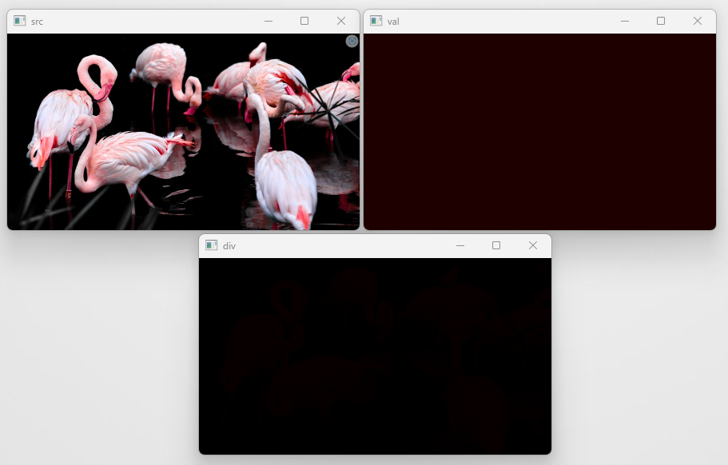

### **12.1.5. 최댓값 연산(Max)**
최댓값 함수 `Cv2.Max()`는 배열과 배열, 또는 배열과 스칼라의 요소별 `최댓값`을 계산한다.

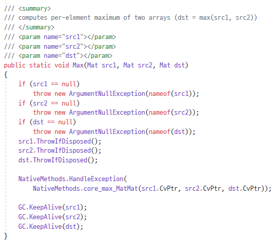
**Cv2.Max(원본 배열1, 원본 배열2, 결과 배열)** 으로 최댓값을 적용한다.

두 배열(src1, src2)의 요소 중 `최댓값인 값`으로 결과 배열의 요솟값이 할당된다.
```cs
Mat max = new Mat();
Cv2.Max(src, mul, max);
```
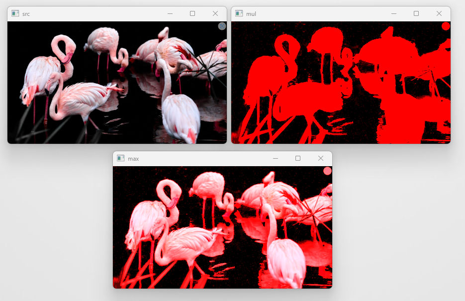

### **12.1.6. 최솟값 연산(Max)**
최솟값 함수 `Cv2.Max()`는 배열과 배열, 또는 배열과 스칼라의 요소별 `최솟값`을 계산한다.

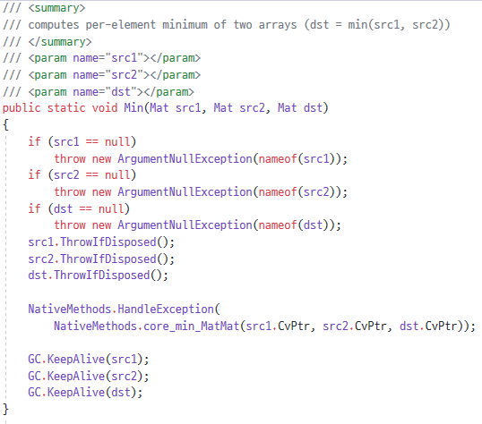
**Cv2.Min(원본 배열1, 원본 배열2, 결과 배열)** 으로 최솟값을 적용한다.

두 배열(src1, src2)의 요소 중 `최솟값인 값`으로 결과 배열의 요솟값이 할당된다.
```cs
Mat min = new Mat();
Cv2.Min(src, mul, min);
```
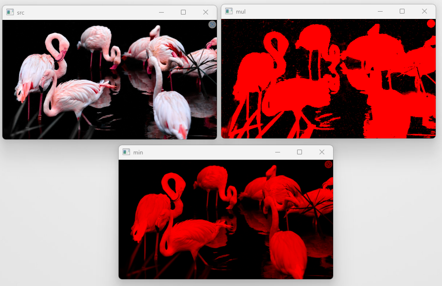

### **12.1.7. 절댓값 연산(Abs)**
절댓값 함수 `Cv2.Abs()`는 배열의 요소별 `절댓값`을 계산한다.

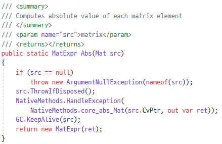
**Cv2.Abs(원본 배열)** 으로 절댓값을 적용한다.

절댓값 함수는 반환 형식이 행렬 표현식(MatExpr 클래스)이며, 매개변수로도 활용할 수 있어 특수한 경우 적절한 연산을 수행할 수 있다.
```cs
Mat abs = new Mat();
abs = Cv2.Abs(mul);
```
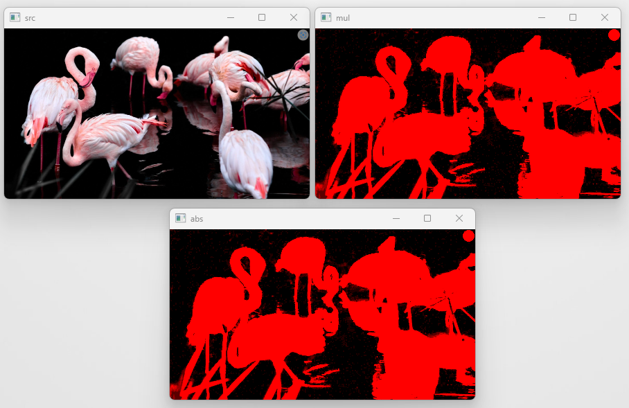

### **12.1.8. 절댓값 차이 연산(Absdiff)**
절댓값 차이 함수 `Cv2.Absdiff()`는 배열과 배열, 또는 배열과 스칼라의 요소별 `절댓값 차이`를 계산한다.

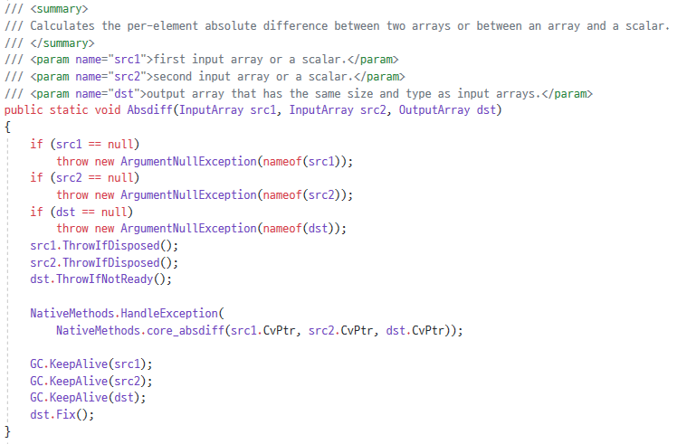
**Cv2.Absdiff(원본 배열1, 원본 배열2, 결과 배열)** 으로 절댓값 차이를 적용한다.

덧셈 함수나 뺄셈 함수에서는 두 배열의 요소를 서로 연산 시 음수가 발생되면, 0을 반환하였으나, `절댓값 차이 함수`는 이 값을 절댓값으로 변경해서 양수 형태로 반환한다.
```cs
Mat absdiff = new Mat();
Cv2.Absdiff(src, mul, absdiff);
```
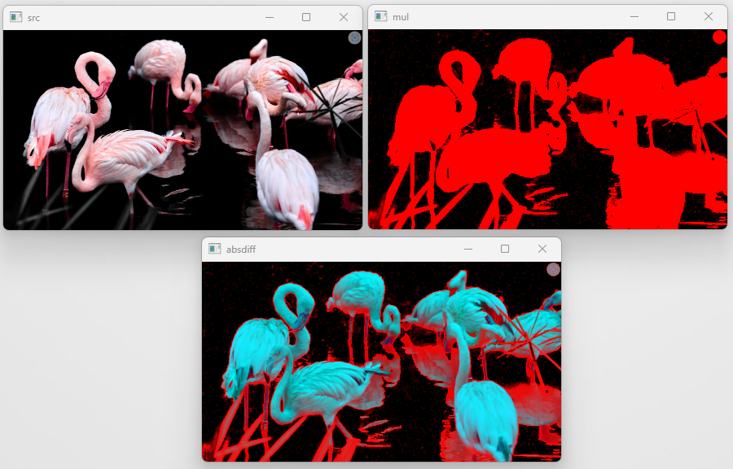