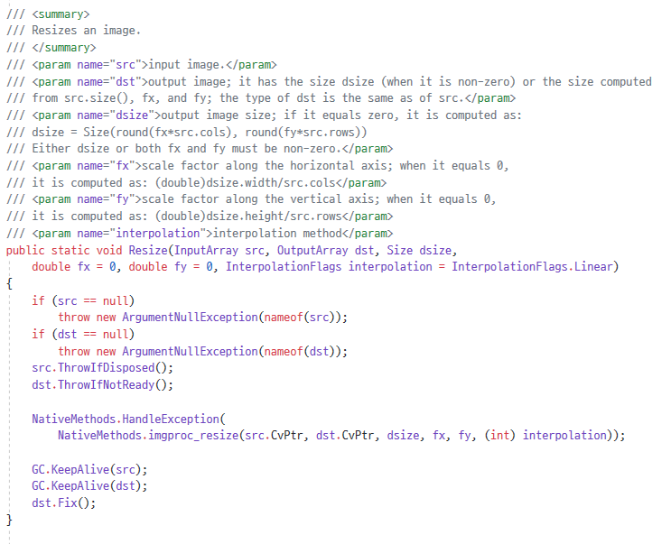
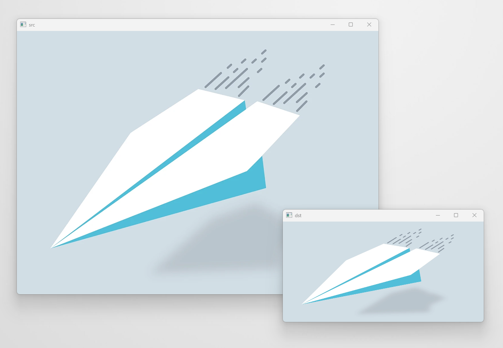

# **Chapter09. 크기 조절**
## **개요**

영상이나 이미지의 크기를 원하는 크기로 조절할 수 있음.

확대 시 Pixel에 대한 `보간법`, 축소 시 Pixel에 대한 `병합법`이 수행된다.

이미지의 크기는 `절대 크기`와 `상대 크기`로 조절할 수 있다.

## 9.1. 프로그램 작성

> 원본 이미지: `plane.png`


```cs
using System;
using OpenCvSharp;

namespace Project {
    class Program     {
        static void Main(string[] args)         {
            Mat src = new Mat("plane.png");
            Mat dst = new Mat();

            Cv2.Resize(src, dst, new Size(500, 250));

            Cv2.ImShow("src", src);
            Cv2.ImShow("dst", dst);
            Cv2.WaitKey(0);
        }
    }
}
```

### **Cv2.Resize()**



Mat의 크기 조절 동작을 하는 메서드이다.

* InputArray src: 원본 이미지(필수)
* OutputArray dst: 결과 이미지(필수)
* dsize: 절대 크기(필수)
* double fx, fy: 상대 크기(x, y)
* InterpolationFlags interpolation: 보간법

`if it equals zero, it is computed as: 
    /// dsize = Size(round(fx*src.cols), round(fy*src.rows))`

```cs
Cv2.Resize(src, dst, new Size(500, 250));
```
예제에서 적용한 코드에서는 원본 이미지 src를 width: 500, Height: 250(px)의 `절대 크기`로 변경한다.

> dsize(절대 크기)는 필수 입력 사항이므로 상대 경로 입력을 원할 경우 `Size`구조체의 값 중 하나 이상에 `0`의 값을 사용해 주어야 한다.
> ```cs
> Cv2.Resize(src, dst, new Size(0, 0), 0.5, 0.5);
> ```

### **보간법**
사이즈가 변하면 pixel 사이의 값을 결정하기 위해 사용하는 것

기본 값은 기본값으로 `쌍 선형 보간법`으로 할당되어 있음

|속성|의미|
|---|---|
|InterpolationFlags.Nearest|가장 가까운 이웃 보간법|
|InterpolationFlags.Linear|쌍 선형 보간법|
|InterpolationFlags.Area|영역 보간법|
|InterpolationFlags.Cubic|4 * 4 바이 큐빅 보간법|
|InterpolationFlags.Lanczos4|8 * 8 란초스 보간법|

### **실행 결과**
