# Dobot CRStudio User Guide
## HELP MANUAL
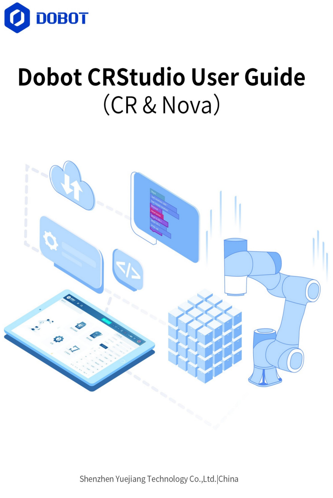

****************************************
# <목차>
## 1. 시작하기
## 2. 로봇에 연결하기
## 3. 메인 인터페이스
## 4. 설정
## 5. 모니터링
## 6. 프로그래밍
## 7. 프로세스
## 8. 모범 사례

****************************************

# 머리말
## 목적
+ 산업용 로봇 두봇의 모바일 앱 CR Studio를 소개.
+ 사용자가 이해하고 제어할 수 있도록합니다.
## 대상 청중
+ 고객
+ 영업 엔지니어
+ 설치 및 시운전 엔지니어
+ 기술 지원 엔지니어

****************************************

# 1. 시작하기

CR Studio를 사용하여 CR 로봇(6축)을 제어하는 방법을 설명.

****************************************

# 2. 로봇에 연결하기

로봇에 연결하기 전에 컨트롤러에 WIFI 모듈이 설치되어 있는지 확인하십시오.

1. WIFI 이름 : "Dobot_WIFI_XXX" (XXX는 팔 베이서의 로봇 색인), 초기 와이파이 비밀번호 : 1234567890 (관리자 모드에서 수정 가능, 재시작 후 적용됨.)
2. 기본 인터페이스에서 "연결"을 클릭하여 컨트롤러에 연결.

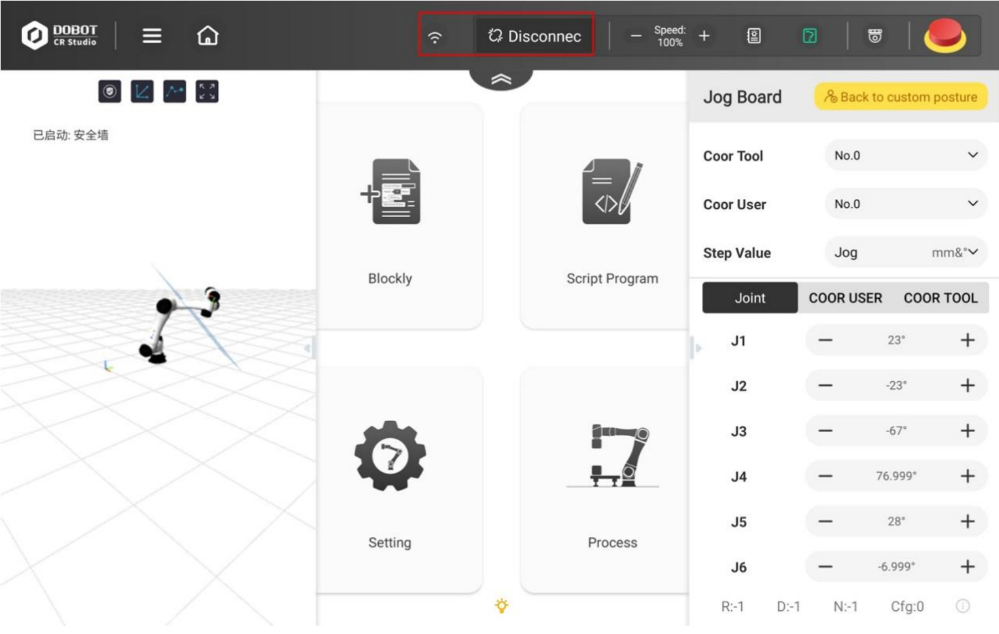

****************************************

# 3. 메인 인터페이스

+ 3.1 개요
+ 3.2 상단 툴바 
+ 3.3 3D 모델 패널 
+ 3.4 주요기능 패널
+ 3.5 조그 보드

****************************************
## 3.1 개요

CR Studio는 Android, IOS 지원. 

태블릿 사용 권장. 

IOS와 Android UI 거의 유사함. 

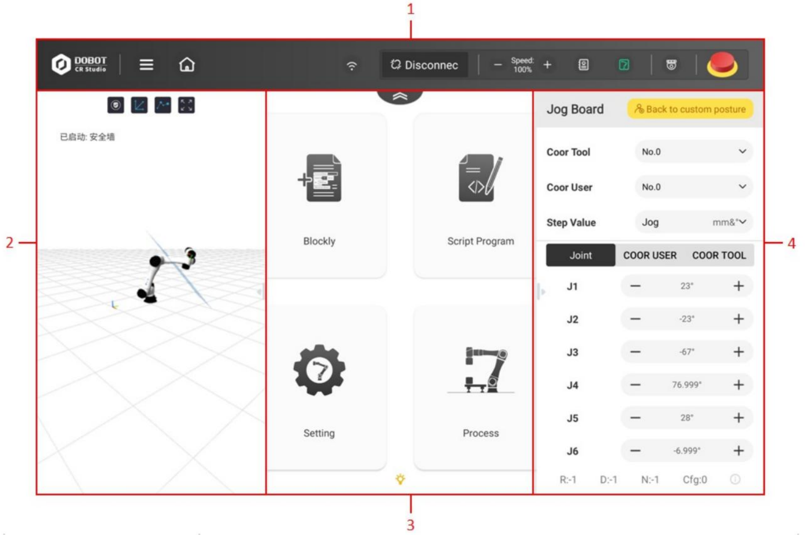

|그림 번호|설명|목차|
|-|-|-|-|
|1|상단 도구 모음|3.2 상단 툴바|
|2|3D 모델 패널|3.3|
|3|주요 기능 패널|3.4|
|4|조그보드|3.5|

****************************************

## 3.2 상단 툴바
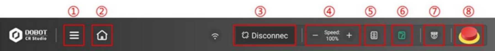

|-|이름				|설명|
|-|-----------------|----|
|1|메뉴				|아이콘을 클릭하면 다음 항목이 나타남.  잠금 : 앱 화면 잠금.  충돌 로그 : 문제 해결에 도움이 되는 앱 충돌 로그를 업로드  버전정보 : 로봇 및 앱의 버전 정보 회사소개 : Yuejiang Technology Co.,Ltd 앱 종료 : CR Studio 앱 종료
|2|홈페이지			|기본 인터페이르소 돌아가기. 데이터 손실이 일어나지 않습니다.|
|3|연결				|CR 로봇의 WIFI를 연결한 후 연결을 클릭하여 앱을 로봇 팔에 연결 다시 클릭시 로봇 팔을 분리|
|4|글로벌 속도 비율	|전역 속도 비율 설정.|
|5|알람 정보		|알람 없음 : 흰색   알람 있음 : 빨강  알람 정보 표시 : 더블 클릭|
|6|활성화 버튼		|로봇 팔의 활성화 상태를 전환.|
|7|모니터링 버튼	|IO 모니터 인터페이스.|
|8|비상 정지 버튼	|누를시 로봇 팔이 작동을 정지하고 전원이 꺼짐|

### < 알람 정보 >

아래 그림은 알람 정보의 인터페이스.
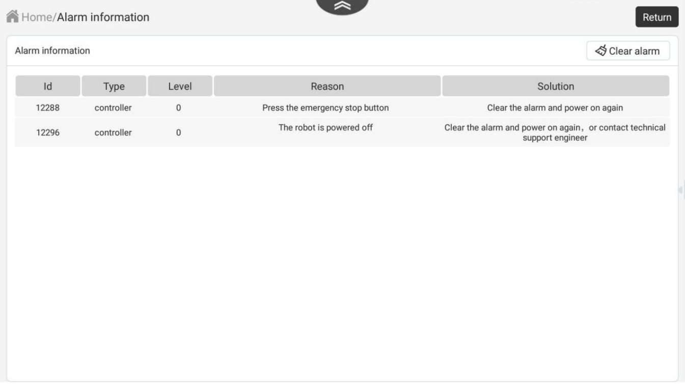

(Type : 알람을 보낸 사람 구분.)

### < 활성화 상태 >
 : 로봇 팔 비활성화 상태

 : 로봇 팔 활성화 상태  
 
{: width="400" height="100"} -> 활성화 버튼 클릭시 팝업창. 

- 활성화 버튼이 녹색이면 로봇 팔이 활성화된 상태. 버튼을 클릭하면 확인 상자가 표시됩니다. 
확인 후 로봇 팔이 비활성화 됩니다.
- 로봇 팔 끝에 있는 표시등이 파란색으로 바뀌어 로봇 팔이 비활성화되었음을 나타냅니다. 
동시에 활성화 버튼도 파란색으로 바뀝니다.
- 활성화 버튼이 파란색으로 깜박이면 로봇이 드래그 모드에 있는 것입니다. 이 경우 로봇을 비활성화하거나 로봇 동작을 제어할 수 없습니다.
- CR Studio에 연결된 상태에서 로봇 팔의 전원이 꺼지면 활성화 버튼이 흰색으로 바뀝니다. 활성화 상태를 변경하려면 먼저 로봇의 전원을 켜야 합니다.

### < 비상 정지 버튼 >
 : 비상 정지 버튼

버튼 클릭시, 로봇 팔이 작동을 멈추고 전원이 꺼짐. 

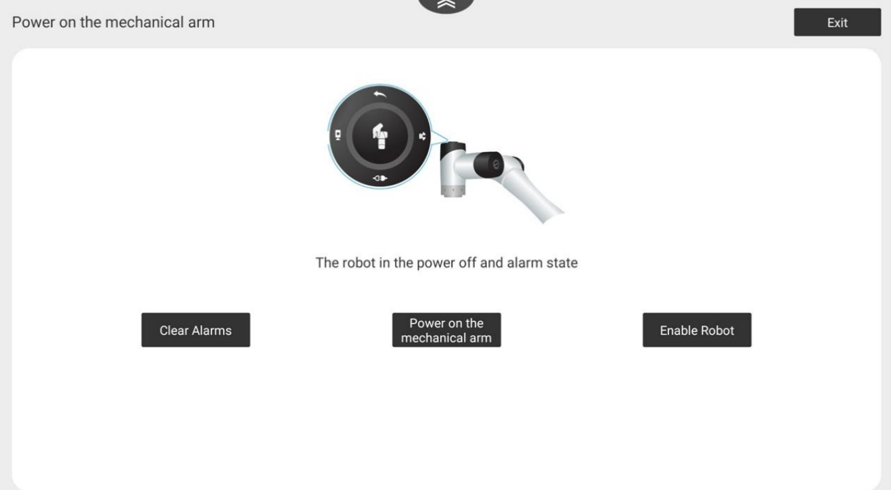
로봇 팔을 다시 활성화해야 하는 경우 비상 정지 버튼을 재설정하고 알람을 지우고 전원을 켜십시오.
로봇을 활성화한 다음 활성화합니다.

> ### < 메모 >
> - 물리적 비상 정지 버튼을 누르면 소프트웨어의 비상 정지 버튼 아이콘이 변경되지 않습니다. 
알람을 해제하기 전에 먼저 물리적 비상 정지 버튼을 재설정해야 합니다.(일반적으로 버튼을 시계 방향으로 회전)
> - 원격 제어 모드에서는 페이지가 표시되지 않습니다.

****************************************

## 3.3 3D 모델 패널
메인 인터페이스의 왼쪽에 있는 3D 모델 패널은 로봇의 현재 자세를 표시하는데 사용.

패널의 오른쪽 여백을 두고 누르고 왼쪽으로 드래그하면 패널을 숨길 수 있음.

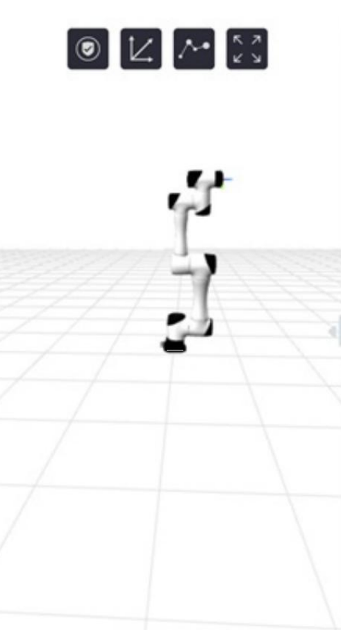{: width="200" height="400"}

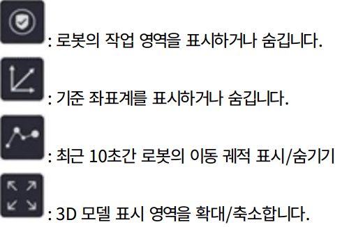{: width="300" height="200"}

****************************************

## 3.4 주요 기능 패널

주요 기능 모듈은 기본 인터페이스의 중앙 부분에 있으며 이를 통해 액세스 가능.
각 패널의 세부 내용은 뒷 부분에서 참조.

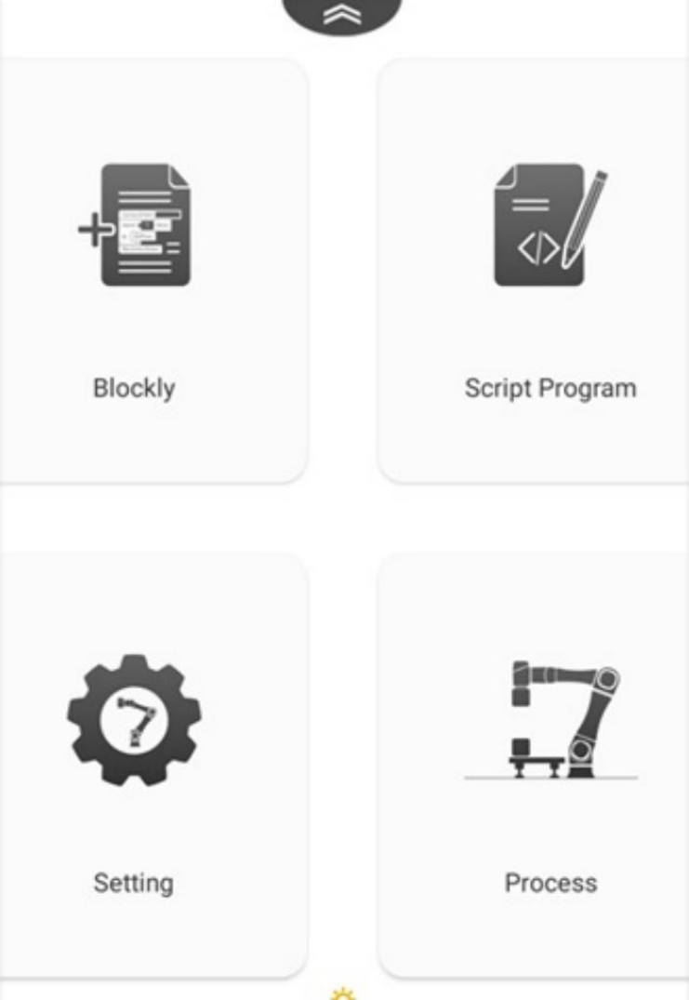{: width="300" height="400"}

****************************************

## 3.5 조그보드

로봇의 움직임을 제어하는데 사용.

패널을 누르고 오른쪽으로 드래그하면 보드를 숨길 수 있음.

오른쪽 여백을 누르고 왼쪽으로 드래그시 패널 표시. 

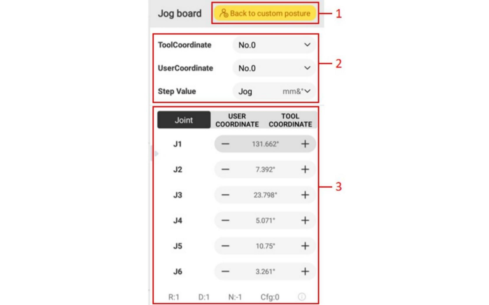{: width="500" height="300"}

### 1. Back to custom posture
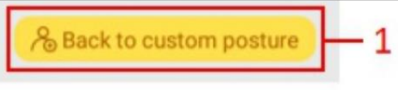{: width="200" height="50"}

사용자 정의 자세를 설정후 길게 누르면 로봇이 이동.

### 2. 좌표계 및 단계 값
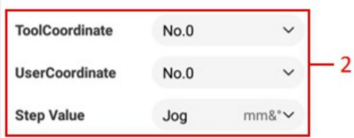{: width="400" height="200"}

- ToolCoordinate : 도구 좌표계 참조.
- UserCoordinate : 사용자 좌표계 참조.
- Step Value : 단일 조그의 변위 값. 
	- 조그 : 조그의 버튼을 누르고 있으면 로봇이 계속 움직임(떼면 멈춤).

### 3. 조그 조작 패널
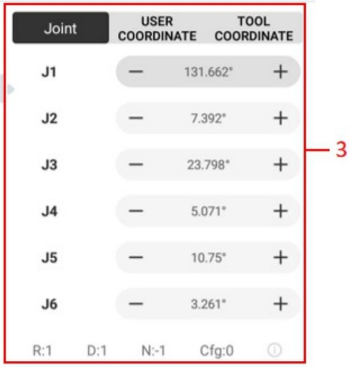{: width="300" height="300"}

+,-를 이용하여 로봇을 조그함.

하단의 R, D, N, Cfg는 각 암의 방향을 나타냄.

- 관절 좌표계 : 움직이는 관절을 기준으로 결정. 

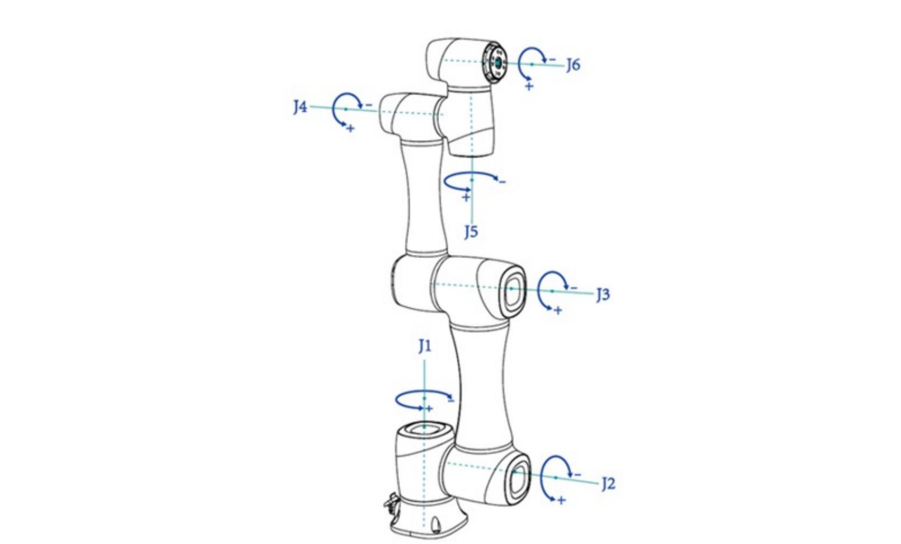{: width="600" height="300"}

- 사용자 좌표계(Coodinate User ***4-2***) : 워크벤치 또는 공작물의 사용자 정의 좌표계입니다.
(각 축의 원점과 방향은 실제 필요에 따라 결정될 수 있습니다.) 

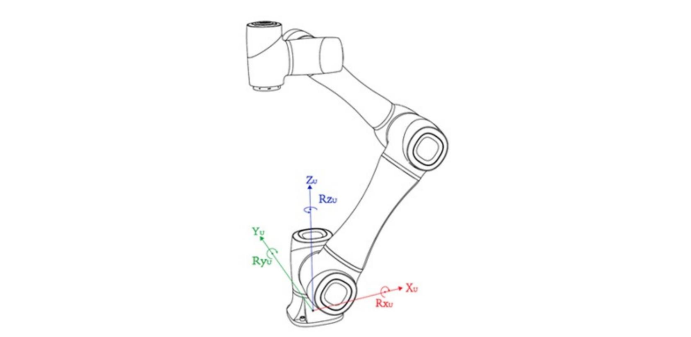{: width="600" height="300"}

- 도구 좌표계(Coordinate Tool ***4-1***) : 공구의 중심점(TCP)의 위치와 공구 자세를 정의

{: width="600" height="300"}

