# 4. 설정

- 4.1 공구 좌표계
- 4.2 사용자 좌표계
- 4.3 조그 설정
- 4.4 재생 설정
- 4.5 안전 설정
	- 4.5.1 안전한 충돌
	- 4.5.2 조인트 브레이크
	- 4.5.3 종단부하
	- 4.5.4 드래그 감도
	- 4.5.5 고급 기능
- 4.6 원격 제어
- 4.7 로봇 자세
- 4.8 설치
- 4.9 소프트웨어 설정
- 4.10 제조
- 4.11 전원 전압 (CCBOX)

****************************************

## 4.1 공구 좌표계 (Tool Cordinate)
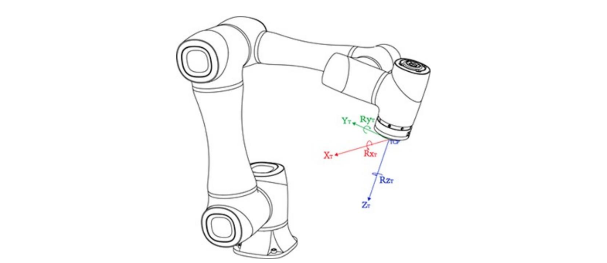{: width="600" height="300"}

+ 용접 토치나 그리퍼와 같은 엔드 이펙터가 로봇에 장착될때 사용.

+ 10개의 도구 좌표계 지원. 

+ 기본 좌표계 : 0
+ 9개 도구 좌표 등록시 '추가'버튼이 사라지고 더 이상 추가 불가능.

6축 좌표계는 3점 보정 방법(TCP + ZX)으로 생성.

엔드 이펙터를 장착한 후 엔드 이펙터의 방향을 조정하여 TCP(Tool Center Point)가 동일한 지점(기준점)에 정렬 되도록 합니다.) 

엔드 이펙터의 위치 오프셋을 얻기 위해 세 가지 다른 방향으로. 그런 다음 로봇을 세 개의 지점(A, B, C)으로 조그하여 각도 오프셋을 얻습니다.

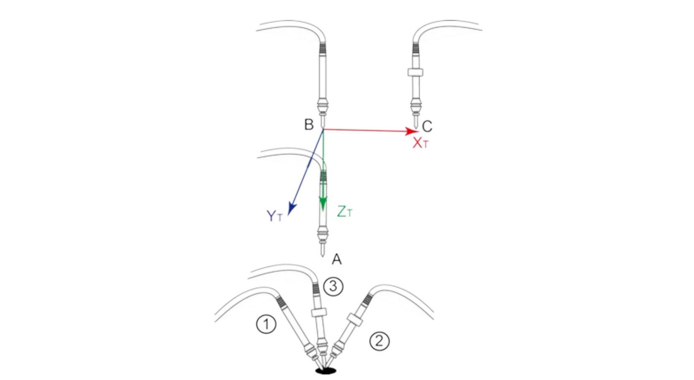 (참고 그림)

### < 도구 좌표계 추가>
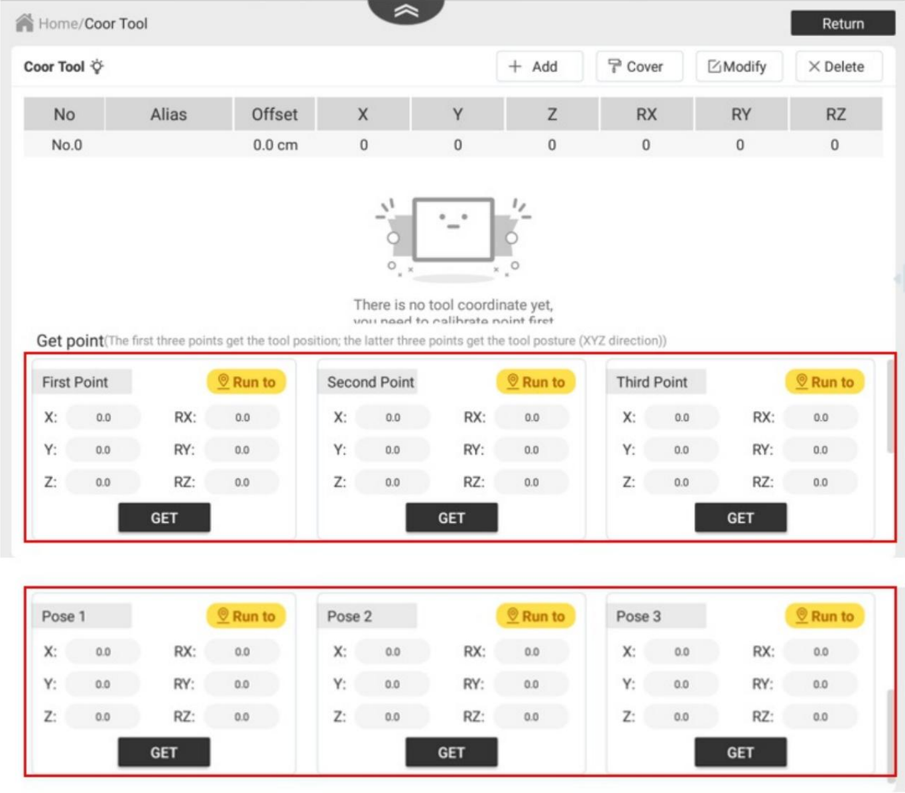

전제 조건 : 로봇 팔 전원 ON, 로봇 팔 활성화

절차 : 

1. 엔드 이펙터를 로봇에 장착
2. First Point 패널 : 로봇을 조그하여 TCP가 첫 번째 항목의 기준점(공간의 한 점)과 정렬. GET 클릭
3. Second Point 패널 : TCP가 두 번째 방향의 기준점과 정렬되도록 로봇을 조깅합니다. GET 클릭. 			
4. Third Point 패널 : 에서 로봇을 조그하여 TCP가 세 번째 방향의 기준점에 정렬되도록 합니다. GET 클릭.
5. Pose 1 패널 : 로봇을 조그하여 TCP가 수직 방향의 기준점에 정렬되도록 합니다. GET 클릭. 네 번째 지점(A 지점)을 얻습니다.
6. Pose 2 패널 : Z축을 + 방향으로 조그하여 로봇을 한 지점으로 이동합니다. GET 클릭. 다섯 번째 지점(B 지점)을 얻습니다.
7. Pose 3 패널 : +방향을 따라 x축을 조그하여 로봇을 C로 이동합니다.(지점 A 및 지점 B와 같은 선상에 있지 않음.)
 GET을 클릭.
8. 추가를 클릭. 도구 좌표계 생성 완료.

### < 기타 작업 >

해당 좌표계의 번호(0번 제외)를 클릭하면 좌표계를 선택할 수 있으며,
다른 열을 클릭하면 해당 파라미터의 값을 수정할 수 있습니다.
(Offset 은 수정 불가)

Run to : 실행 대상을 길게 눌러 로봇 팔을 획득한 지점으로 이동합니다.

Cover : 6개 점의 좌표를 구한 후 좌표계를 선택하고 Cover를 클릭하면 좌표계가 
새로 보정된 좌표계로 바뀝니다.

Modify(수정) : 기존 좌표계의 좌표값을 수정한 후 좌표계를 선택하고 수정을 클릭하면
좌표값이 업데이트 됩니다.

Delete(삭제) : 좌표계를 선택하고 삭제를 클릭하면 좌표계 값이 지워집니다.

****************************************

## 4.2 사용자 좌표계 ( User Coordinate )

CR Studio는 10개의 사용자 좌표계를 지원. 사용자 0 좌표계는 변경 불가(기본 좌표계)

사용자 좌표계는 3점 캘리브레이션 방식으로 생성됩니다. 로봇을 A, B, C의 임의의
세 지점으로 이동합니다. 지점 A를 원점으로 정의힙니다. 점 A에서 점 B까지의 선을
x축의 양의 방향으로 정의합니다. 점 C가 x축에 수직인 선을 y축의 양의 방향으로 
정의합니다. (실제 교정에서 점 C는 y축에 있을 필요는 없지만, x축과 y축의 양의
방향이고 x축에 있으면 안 됩니다. 시스템은 y축의 양의 방향을 자동으로 계산할 수
있습니다.) z축은 오른손 법칙에 따라 정의할 수 있습니다.
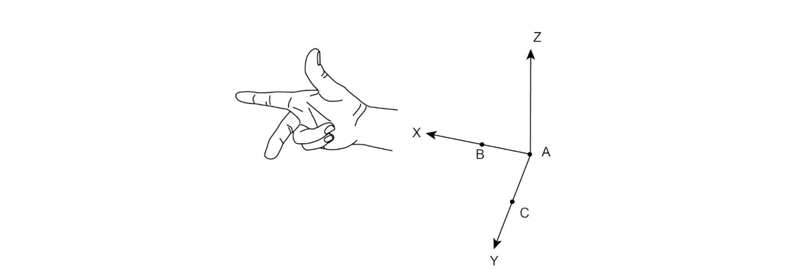

### < 사용자 좌표계 추가 > 

전제조건 : 로봇 팔 전원 ON, 로봇 팔 활성화

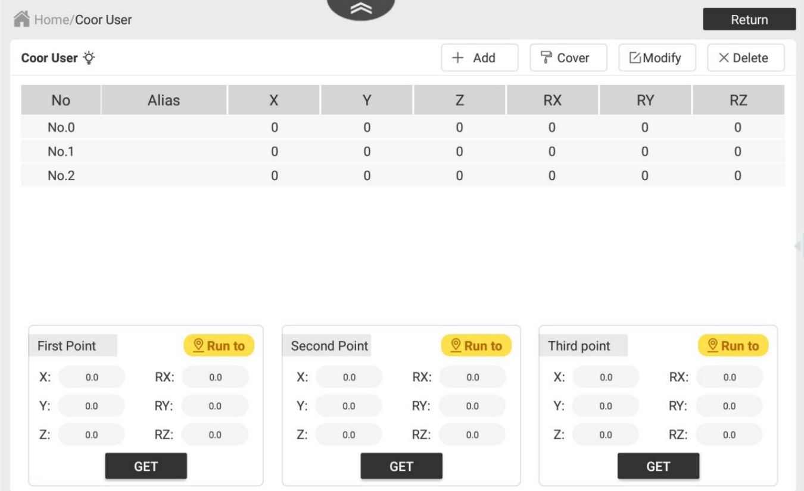

절차 : 

1. First Point : 로봇을 점(좌표계의 원점)으로 조그합니다. 첫 번째 포인트 패널에서 GET 클릭.
2. Second Point : 로봇을 x축의 두 번째 지점으로 조그합니다. 두 번째 포인트 패널에서 GET 클릭.
3. Third Point 로봇을 세 번째 점으로 이동합니다. (점은 양수로 결정된 평면 사분면에 있어야 합니다. 
x축과 y축의 방향이며 x축에 있지 않앙야 합니다.) 세 번째 지점 패널에서 GET을 클릭합니다.

4. 추가를 클릭합니다. 페이지에서 새 레코드를 볼 수 있으므로 사용자 좌표계가 
성공적으로 생성되었습니다.

### <기타 작업>
해당 좌표계의 번호(0번 제외)를 클릭하면 좌표계를 선택할 수 있으며, 다른 열을
클릭하면 해당 파라미터의 값을 수정할 수 있습니다.

Run to : 실행 대상을 길게 눌러 로봇 팔을 획득한 지점으로 이동합니다.

Cover : 세 점의 좌표를 구한 후 좌표계를 선택하고 Cover를 클릭하면 이 좌표계가
새로 보정된 자표계로 바뀝니다.

Modify : 기존 좌표계의 좌표값을 수정한 후 좌표계를 선택하고 수정을 클릭하면
좌표값이 업데이트 됩니다.

삭제 : 좌표계를 선택하고 삭제를 클릭하면 좌표계의 값이 지워집니다.

****************************************

## 4.3 조그 설정 (Jog setting )

관절 좌표계와 직교 좌표계에서 최대 속도와 가속도를 설정할 수 있습니다. 
매개변수를 설정한 후 저장을 클릭합니다.
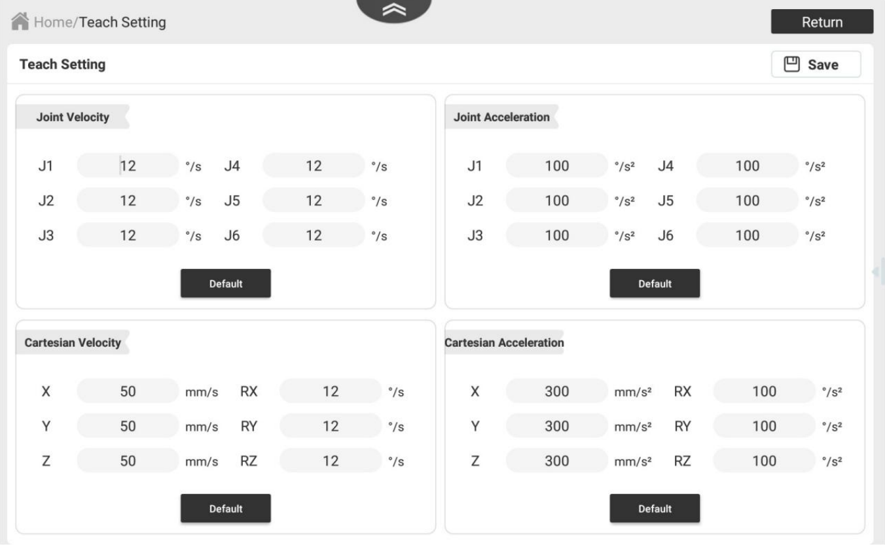
실제 로봇 속도 / 가속도 = 설정속도/가속도 X 전역 속도 X 비율

해당 모듈의 모든 값을 기본값으로 복원하려면 기본값을 클릭 합니다.

****************************************

## 4.4 재생 설정 (Playback setting)
> <메모>
>  
> 이 기능은 관리자 권한(기본 암호 : 000000)이 필요합니다.
 

관절 좌표계와 직교 좌표계에서 속도, 가속도, 및 저크 매개변수를 설정할 수 있습니다. 
설정 후 저장을 클릭합니다.
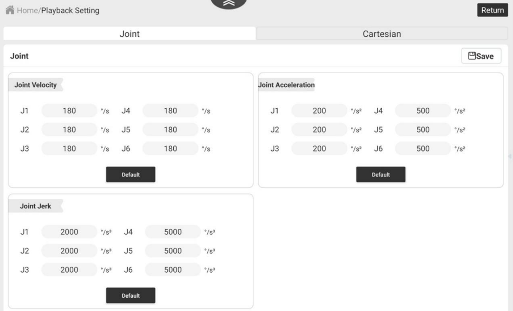
실제 로봇 속도/가속 = 설정 속도/가속 X 전역 속도 비율 X 프로그래밍 시 속도
명령에서 설정된 백분율.

## 4.5 안전 설정 ( Safety setting )
### 4.5.1 안전한 충돌
로봇 충돌시 충돌 감지가 활성화 되어 자동으로 실행을 멈춤.
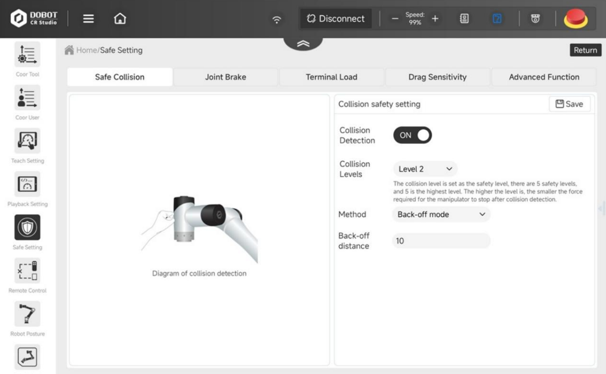

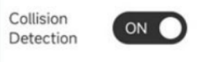
충돌 감지(Collision Dectecdtion) 기능을 활성화 또는 비활성화 할 수 있습니다.

충돌 감지 민감도를 설정할 수 있습니다. 5가지의 민감도가 있습니다.
단계가 올라갈 수록 적은 충격으로도 충돌 감지가 활성화 됩니다.

방법은 로봇 팔이 프로젝트를 실행하는 동안 충돌 후 처리를 나타냅니다.
+ Stop(정지) : 로봇 팔이 프로젝트 실행 중지합니다.
+ Pause(일시 중지) : 로봇 팔이 일시 중지됩니다. 실제 상황에 따라 충돌 원인을 해결한
후 작업을 재개할지 아니면 작업을 주지할지 선택해야 합니다.
+ Drag Mode(끌기 모드) : 로봇 팔이 프로젝트 실행을 중지하고 자동으로 끌기 모드로 들어갑니다.
+ Back-off mode(백오프 모드) : 로봇 팔은 충돌 궤적에 따라 지정된 거리만큼 자동으로 후퇴합니다. 
백오프 거리의 범위는 0~50(mm)입니다.

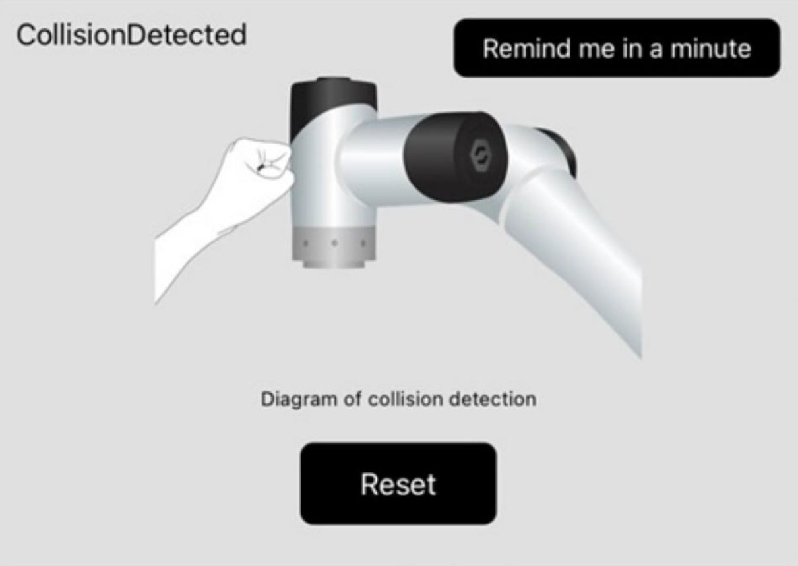
+ 로봇을 조깅할 때 정지에 필요한 힘이 감지되면 "충돌 감지됨" 창이 팝업 됩니다.
이 경우 충돌 원인을 해결하고 재설정을 클릭해야 합니다. 

 +충돌 원인을 해결하기 위해 앱을 작동해야 하는 경우 잠시 후 알림을 클릭 하여 
팝업 창을 일시적으로 닫습니다.(1분 후 팝업 메세지가 다시 표시됨).

****************************************

### 4.5.2 조인트 브레이크 ( Articulated Brake )
제동은 서보 드라이버가 작동하지 않을 때 서보 모터 축이 움직이는 것을 방지하여
모터가 위치를 고정하고 자중이나 외력으로 인해 기계의 움직이는 부분이 움직이지 않도록
합니다.

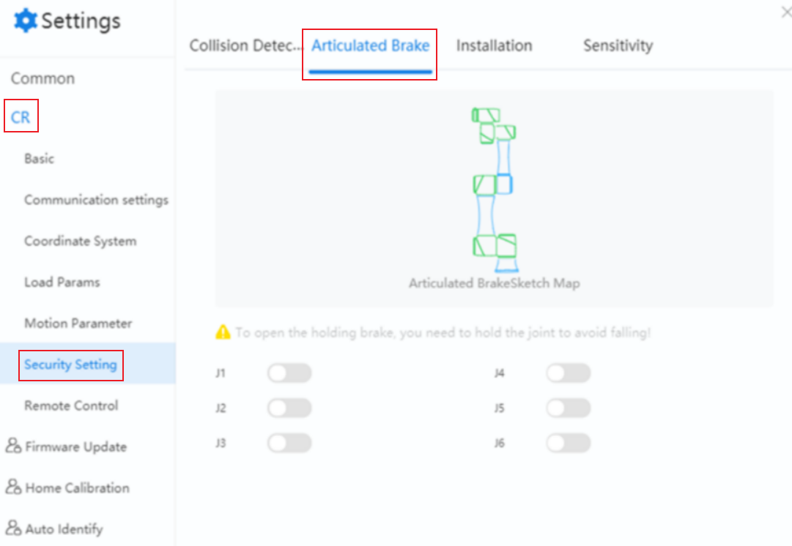

관절을 수동으로 드래그하려면 브레이크 기능을 활성화하십시오. 
즉, 로봇 팔이 비활성화된 후 수동으로 관절을 잡고 해당 관절의 버튼을 클릭하십시오

> ***(주의)*** 
>
> 기능을 활성화할 때 손으로 관절을 잡고 기능을 활성화 하십시오.

****************************************

### 4.5.3 종단부하 ( Load Parameters )
최적의 로봇 성능을 보장하려면 엔드 이펙터의 부하 및 편심 좌표가 로봇의 최대 범위 내에 있고 
관절 6이 편심되지 않는지 확인하는 것이 중요합니다.

하중과 편심 좌표를 적절히 활용하면 로봇의 움직임이 좋아지고 진동이 줄고 작업
시간이 단축됩니다.

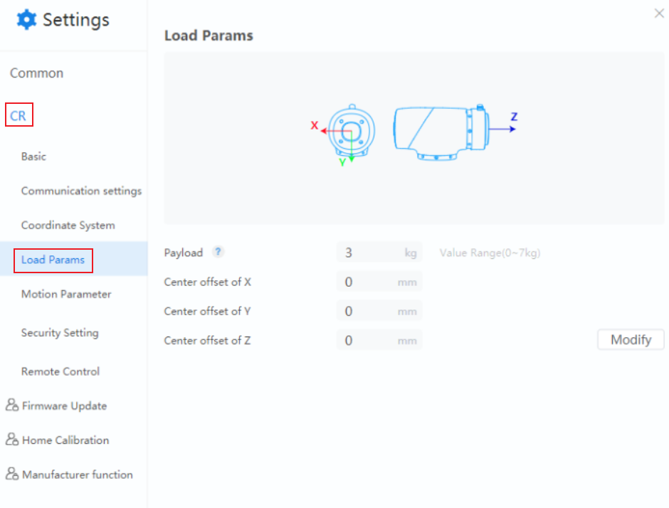

+ J6 축이 0도 일 때 하중의 편심 좌표를 설정해야 합니다.
+ 부하 중량에는 엔드 이펙터 및 작업물의 중량이 포함되며 로봇 암의 최대 부하를 
초과해서는 안 됩니다. 
+ 적재 중량을 0으로 설정하면 노란색 배경에 느낌표가 표시됩니다.
표시는 활성화 아이콘의 오른쪽 하단에도 나타납니다.

로봇이 활성화 된 후. 저장을 클릭하면 설정이 적용됩니다. 

하중과 편심 좌표를 적절하게 설정하십시오. 그렇지 않으면 오류나 과도한 충격이 
발생하고 부품의 수명이 단축될 수 있습니다.

****************************************

### 4.5.4 드래그 감도 ( Sensitivity ) 

주로 끌기 중 관절의 감도를 조정하는데 사용.

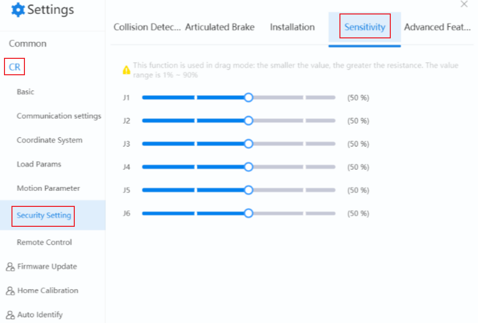

감도가 낮을수록 드래그하는 동안 저항이 커집니다.

****************************************

## 4.5.5 고급 기능 ( Advanced Function ) 
> <메모>
> 
> 이 기능은 관리자 권한(기본 암호 : 000000)이 필요합니다.

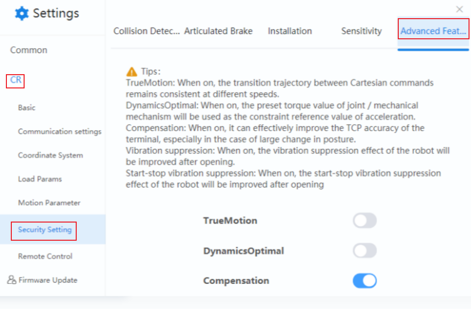

-> ***특별한 요구 사항이 없는 경우 기본 설정을 유지하는 것이 좋습니다.***

****************************************

## 4.6 원격 제어
외부 장비는 원격 I/O모드 및 원격 Modbus 모드와 같은 다양한 원격 제어 모드에서
로봇에게 명령을 보낼 수 있습니다.(교시된 프로그램 파일 제어 및 실행) 앱을 통해 
원격 모들르 설정할 수 있습니다.

> *< 메모 >*
> + *원격 제어 모드를 전환할 때 로봇 제어 시스템을 다시 시작할 필요 X*
> + *로봇 제어 시스템이 어떤 모드에 있든 비상 정지 스위치는 항상 켜져 있음*
> + *로봇이 원격 제어 모드에서 실행 중인 경우 다른 직업 모드로 전환할 수 없음. 
 다른 모드로 전환하기 전에 실행을 중지해야 합니다.*
> + *복원을 클릭하면 인터페이스가 현재 작업 모드로 자동 전환됩니다.*

### < online >
Dobot은 기본적으로 online 모드 입니다.

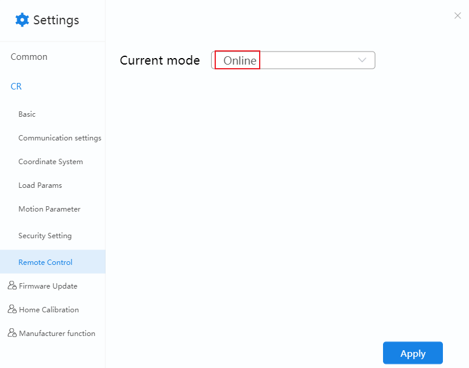

#### < Remote Modbus - offline >
외부 장비는 Modbus 오프라인 모드에서 로봇 팔을 제어할 수 있습니다.

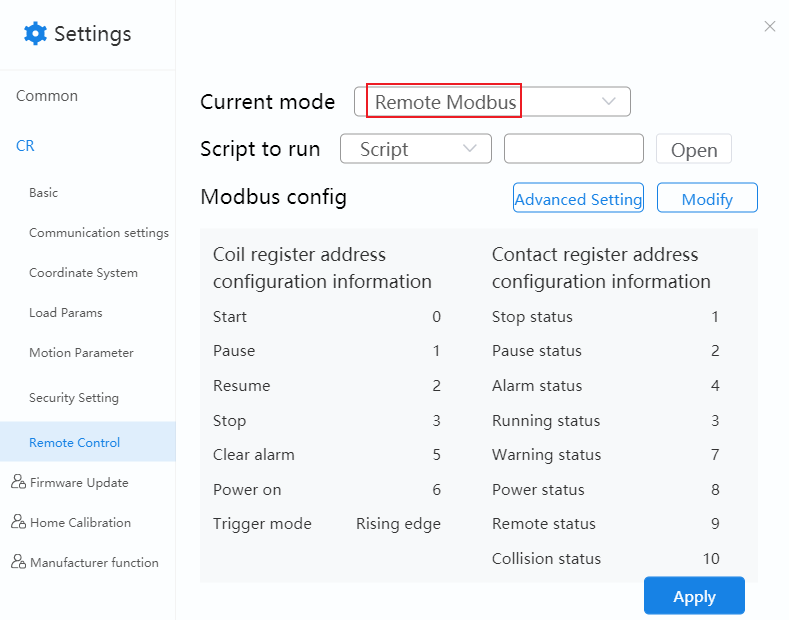

Modbus 레지스터의 기능은 위에 나와 있습니다. Modbus - offline 모드에서 
프로젝트를 실행하는 절차는 아래와 같습니다.

전제 조건
+ 원격 모드로 실행할 프로젝트가 준비
+ 로봇은 LAN 인터페이스를 통해 외부 장비에 연결되어있어야 합니다. 
(직접 또는 라우터를 통해 연결이 가능합니다.) CR 로봇과 외부 장비의 IP 주소는 
충돌 없이 동일한 네트워크 세그먼트 내에 있어야 합니다.
+ 로봇 팔 전원 ON

절차
1. 원격 제어 페이지에서 Modbus - offline을 클릭 하고 실행할 오프라인 프로젝트를 
선택합니다.
2. Modbus를 통해 여러 개의 서로 다른 프로젝트(최대 10개 프로젝트)를 시작해야
하는 경우 고급 설정을 클릭합니다. 고급 설정에서는 다음 그림과 같이 옴션 프로젝트의
홀드 레지스터 주소를 설정하고 옵션 프로젝트 목록을 구성할 수 있습니다.
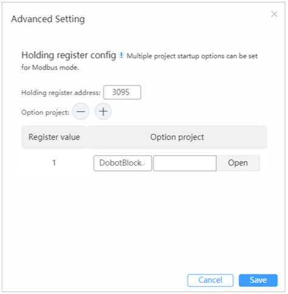
3. 저장을 클릭하면 로봇 팔이 원격 Modbus모드에 들어갔습니다. 비상 정지 명령만
사용할 수 있습니다. 동시에 The Debug log가 오른쪽 상단에 나타납니다. 클릭하면
로봇팔 작동 중 출력되는 디버그 정보를 볼 수 있습니다.
4. 외부 장비에서 시작 신호 트리거합니다. 선택한 프로젝트 파일로 로봇이 이동합니다.
5. 정지 신호가 트리거되면 로봇 암이 이동을 멈춥니다.

### < IO - offline >
외부 장비는 IO - offline 모드에서 로봇 팔을 제어할 수 있습니다.

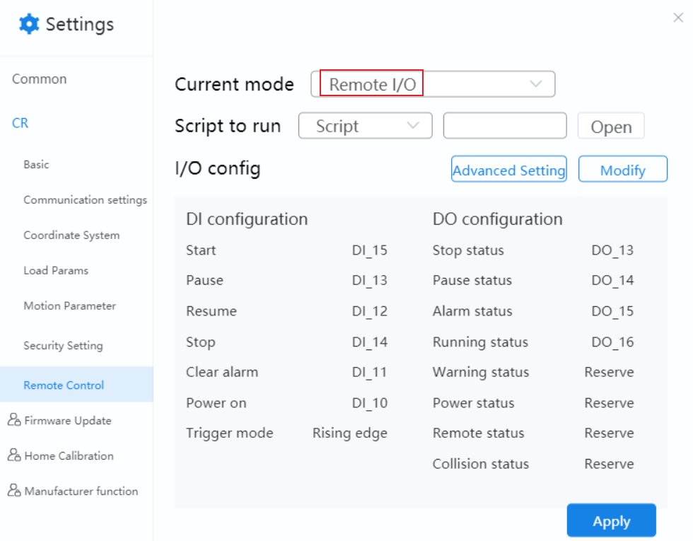

제어 시스템의 특정 IO 인터페이스 정의는 위 그림에 나와 있습니다. 
클릭하여 편집이 가능합니다.
제어 캐비닛의 유형이 CCBOX인 경우 Safe I/O와 Universal I/O는 동일한 단자를 공유합니다.

안전I/O로 구성된 터미널은 원격 I/O로 구성할 수 없습니다.

고급 설정을 클릭하려면 그룹 I/O를 통해 여러 프로젝트를 구성할 수 있습니다.

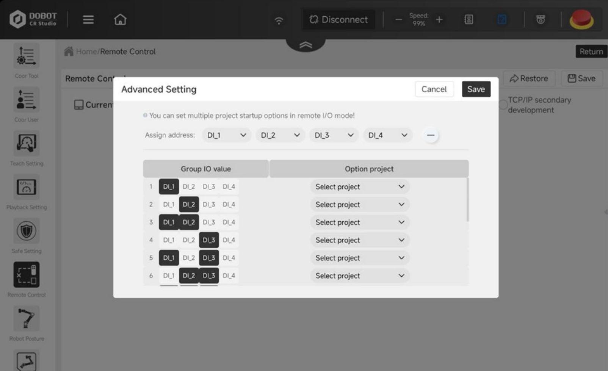

1. +또는 -를 클릭하여 그룹 I/O에 할당된 주소 수를 늘리거나 줄입니다. 할당된 주소가
	많을 수록 구성 가능한 프로젝트가 더 많아집니다. 
	- 0개의 주소 : 선택적 프로젝트를 구성할 수 없습니다.
	- 1개의 주소 : 1개의 선택적 프로젝트를 구성할 수 있습니다.
	- 2개의 주소 : 3개의 선택적 프로젝트를 구성할 수 있습니다.
	- 3개의 주소 : 7개의 선택적 프로젝트를 구성할 수 있습니다.
	- 4개의 주소 : 15개의 선택적 프로젝트를 구성할 수 있습니다.
2. 드롭다운 목록을 통해 할당된 주소를 수정할 수 있습니다. 그룹 I/O에 할당된 주소
원격 I/O 또는 안전 I/O(CCBOX)와 복제할 수 없습니다.
3. 주소를 할당한 후 각 그룹 IO 값에 대해 선택적 프로젝트(최소 하나)를 설정할 수
있습니다. 
4. 리모트 I/O 모드에서 프로젝트를 실행하기 전에 설정을 통해 해당 옵션 프로젝트를 선택합니다.
해당(검은색 ON, 흰색은 OFF를 나타냄) 그룹 IO값.
5. 위 그림에서 DI1~DI4 할당을 예로 들어 보겠습니다.
	+ DI은 ON, DI2, Di3 및 DI4는 OFF : 첫 번째 선택적 프로젝트를 선택합니다. 		
	+ DI1 및 DI2는 ON, DI3 및 DI4는 OFF : 세 번째 선택적 프로젝트를 선택합니다. 
	+ DI1~DI4 모두 ON : 15번째 프로젝트를 선택합니다.
6. 모든 그룹 IO가 OFF로 설정되면 이전에 구성한 메인 프로젝트를 선택한다는 의미입니다.
7. 저장을 클릭하여 구성을 완료합니다.

IO - offline 모드에서 프로젝트를 실행하는 절차는 다음과 같습니다.

전제 조건
+ 원격 보드로 실행할 프로젝트를 준비
+ 외부 장비는 I/O 인터페이스를 통해 로봇 팔에 연결
+ 로봇 팔의 전원 ON

절차 
1. 원격 제어 페이지에서 IO - offline을 클릭 하고 실행할 오프라인 프로젝트를 선택합니다.
2. 저장을 클릭. 이제 로봇의 팔이 원격 IO모드에 들어갔습니다. 비상 정지 명령만
사용 가능. 동시에 디버그 로그가 인터페이스의 오른쪽 상단에 나타납니다.
클릭하면 로봇팔 작동 중 출력되는 디버그 정보를 볼 수 있습니다.

3. 외부 장비에서 시작 신호를 트리거합니다. CR 로봇이 선택한 프로젝트로 이동합니다.
4. 정지 신호가 트리거되면 로봇 팔이 이동을 멈춥니다.

### < TCP/IP 보조 개발 >

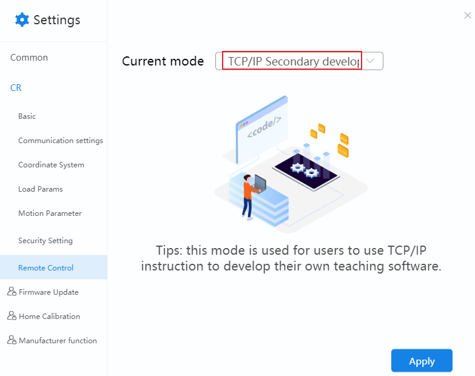

이 모드는 사용자가 TCP 기반의 제어 소프트웨어를 개발하기 위한 것. 소프트웨어를 
개발해야 하는 경우 <U>***두봇 TCP/IP 프로토콜***</U>을 참조하십시오.

****************************************

## 4.7 기본 페이지 설정 ( Basic )
기본 페이지 설정은 장치 사양을 확인하고 로봇 자세를 설정하는데 사용합니다.

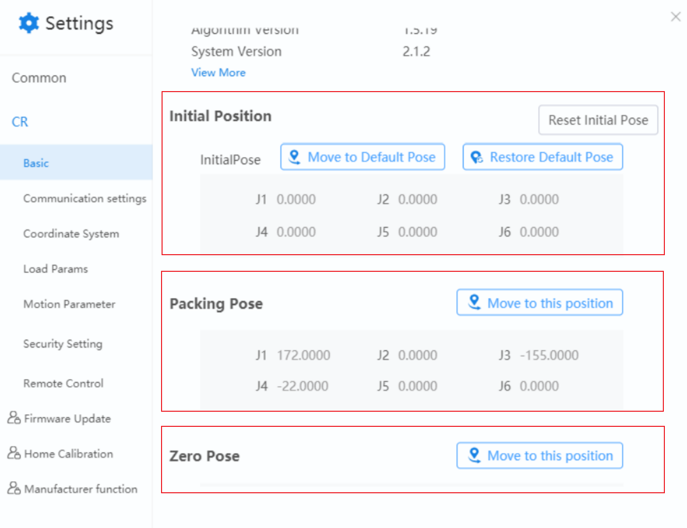

### 초기자세 ( Initial Position )

+ 초기 자세는는 모든 관절의 각도가 0인 자세로 설정이 되어있습니다.
+ "Reset Initial Pose"버튼을 클릭하면 초기 자세를 변경할 수 있습니다.
+ 관절의 각도를 직접 입력하거나, 로봇을 직접 움직여서 초기 자세를 설정할 수 있습니다.

### Packing pose

+ 패킹 자세는 로봇의 크기가 작아서 이동 또는 운반이 쉬운 자세입니다.
+ "Move to this position"버튼을 길게 누르면 해당하는 자세로 이동합니다.

### Zero Pose (= Home Pose)

+ 제로 자세는 모든 관절의 각도가 0도인 자세입니다. '홈 자세 (home posture)'라고 불립니다.
+ "Move to this position"버튼을 길게 누르면 해당하는 자세로 이동합니다.

****************************************

## 4.8 설치 ( Installation ) 
> < 메모 > 
> - 이 기능은 관리자 권한(기본 암호 : 000000)이 필요합니다.

일반적으로 CR 로봇은 안정된 테이블이나 지면에 설치되며 이 경우 별도의 조작이 
필요하지 않습니다. 

로봇이 천장 또는 벽처럼 특정 각도에 설치된 경우 
비활성화 상태에서 

회전 각도(Rotate Angle)와 기울기 각도(Slope Angle)를 설정해야 합니다.

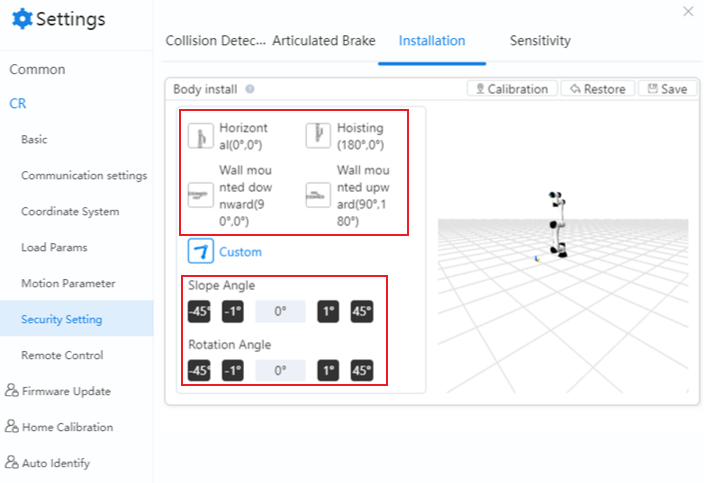

로봇을 설치하고 활성화 한 후 보정을 클릭 하고 팝업 상자에 따라 작동하여 기울기
각도와 회전 각도를 얻습니다.

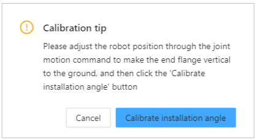

+ 기울기 각도(Slope Angle) : 로봇이 원점 위치에서 x축을 기준으로 반시계 방향으로
회전하는 각도
+ 회전 각도(Rotate Angle) : 로봇이 원점 위치에서 z축을 중심으로 반시계 방향으로
회전하는 각도

보정 후 저장을 클릭하여 설정을 저장합니다.

보정된 각도를 기본값으로 복원하려면 복원을 클릭합니다.

****************************************

## 4.9 제조사 기능 ( Manufacturer function )
이 모듈의 기능은 일반적으로 두봇 기술 지원 또는 공장에서 제공합니다. 
이 섹션에서는 모듈에 대한 자세한 설명을 제공하지 않습니다.
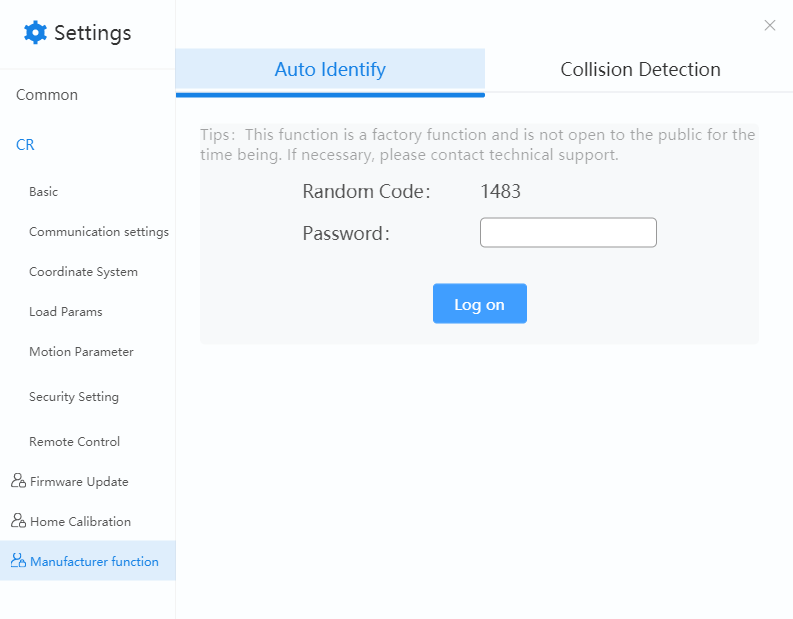

****************************************

## 4.10 전원 전압(CCBOX) - ***우리가 사용하는 UI에서는 제공하지 않음***
컨트롤러의 종류가 CCBOX인 경우 컨트롤러의 입력 전압 범위를 설정해야 합니다.

입력 전압의 실제 범위에 따라 설정. 최대 전압 60V 이하, 최소 전압은 30V 이상.

