# **Chapter 05: 모니터링**

```
[Summary]
5.1: 입출력 모니터
5.2: 모드버스
5.3: 글로벌 변수
5.4: 로봇 상태
5.5: 실행 로그
5.6: 두봇+
```

---

## **5.1: 입출력 모니터(I/O Monitor)**
### `I/O 페이지`에서는 컨트롤러와 엔드 툴의 I/O 상태를 모니터링하고 설정할 수 있다. 각각의 컨트롤러마다 I/O의 개수가 다르다.
\*스크린샷의 사진은 여러 컨트롤러 중 하나의 경우를 나타낸다.

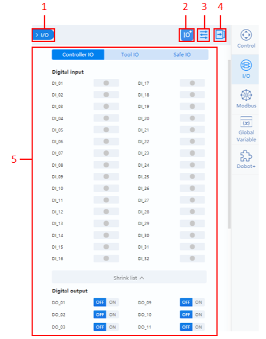

|No.|요약|
|---|---|
|1|패널 숨김/표시 버튼(다시 꺼낼 때는 오른쪽 툴바에서 I/O를 클릭)|
|2|확장 I/O 추가. Modbus 통신 모니터링에 사용할 수 있음|
|3|I/O에 별칭을 설정하거나 표시 여부를 선택할 수 있음|
|4|컨트롤 패널을 확장/축소|
|5|I/O 모니터링 영역|

### **5.1.2: 확장 IO(IO Extensions)**

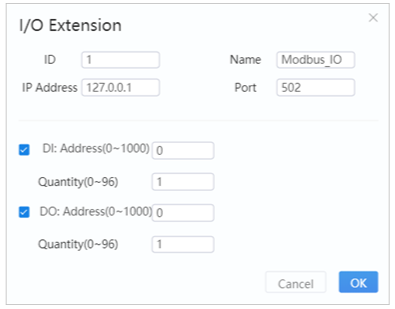

|구분|설명|
|---|---|
|ID|슬레이브 디바이스의 ID|
|이름|슬레이브 디바이스의 이름|
|IP주소|Modbus 장치의 주소를 입력한다|
|포트| Modbus 통신의 포트 번호를 입력한다|
|디지털 입력/디지털 출력(DI/DO)|레지스터 선택 후 DI/Do의 레지스터 주소와 번호를 구성한다. 확인을 클릭하면 I/O 패널 하단에 새로운 I/O가 나타난다|
* 모니터링 기능은 컨트롤러를 재시작한 후에만 적용
* 확장 I/O 오른쪽에 있는 X를 클릭하면 I/O를 삭제할 수 있다.

### **5.1.3: I/O구성(I/O Configuration)**
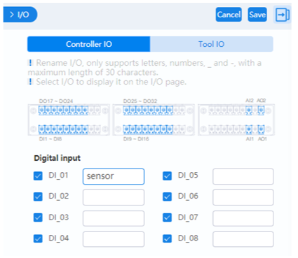
* 모니터링 페이지에서 I/O를 선택하여 표시한다
* 오른쪽에 I/O의 별칭(Alias)을 입력하면 해당 별칭이 모니터링 페이지에 표시되고, 동시에 Blockly 혹은 Script 프로그래밍에서 해당 I/O의 별칭을 통해 호출할 수 있다.
* 제어 캐비닛의 유형이 CCBOX인 경우, **아래 그림과 같이** 디지털 입력/출력 유형을 `PNP(상위 수준 레벨 동작)` 또는 `NPN(하위 수준 레벨 동작)`으로 설정할 수 있다.

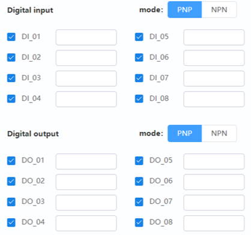

### **5.1.4: Monitoring**
컨트롤러 I/O 및 도구 I/O 페이지에서는 다음과 같은 기능을 제공

* 출력(Output): 디지털 / 아날로그 출력 설정
  * 디지털 출력의 경우, 우측에 해당 스위치를 클릭하여 상태를 전환할 수 있음
  * 아날로그 출력의 경우, `수정(Modify)`를 클릭한 후 출력 값을 수정한 후, `수정 사항 확인(Confirm Modification)`을 클릭해야 함.
* 모니터(Monitor): 입출력의 실제 상태를 확인한다.
* 시뮬레이션(Simulation): 디지털 입력 상태를 시뮬레이션하여 디버깅 및 프로그램 실행을 용이하게 함. 
  * DI(디지털 입력)의 상태 표시 영역을 클릭하면 설정 창이 나타남.
    * `Fictitous(가공)` 클릭 후 `DI 변환(DI Transformation)` 선택 시, DI는 가상 트리거 상태(초록색 점)으로 전환되어 논리적으로 ON으로 간주된다.
    * `DI Transformation` 미선택 시 DI는 실제 상태를 유지한다.


### **5.1.5: Safe IO**
각 안전 I/O 인터페이스의 기능을 `Safe IO` 페이지에서 설정할 수 있다.

제어 캐비닛 유형이 `CCBOX`인 경우, 안전 I/O와 유니버설 I/O는 동일한 단자를 공유한다. 원격 I/O로 구성된 단자는 안전 I/O로 구성할 수 없다.

> 로봇 제어 캐비닛
```
로봇 제어 캐비닛은 로봇 시스템의 제어와 모니터링을 위한 장치. 이 캐비닛은 로봇 컨트롤러, 전원 공급 장치, I/O 모듈, 통신 모듈 등의 구성 요소를 포함할 수 있다.

로봇 제어 캐비닛은 로봇 시스템을 안전하게 운영하고 제어할 수 있도록 하는 중앙 제어 장치로서 사용된다.
```

> `CCBOX` 캐비닛
```
로봇 제어 캐비닛 유형 중 하나로 로봇 시스템에서 제어 신호와 전원을 관리하고, 로봇의 안전 기능을 제공하기 위해 사용되는 장치이다.

CCBOX는 로봇 시스템의 주요 구성 요소 중 하나로, 안전 I/O 및 유니버설 I/O와 같은 다양한 I/O 인터페이스를 제공한다.

CCBOX는 로봇 시스템의 안전성과 기능성을 보장하기 위해 중요한 역할을 한다.
```

---

## **5.2: 모드버스(Modbus)**
Modbus 마스터로 사용되는 이 모듈은 Modbus 슬레이브를 연결하는 데 사용됨.

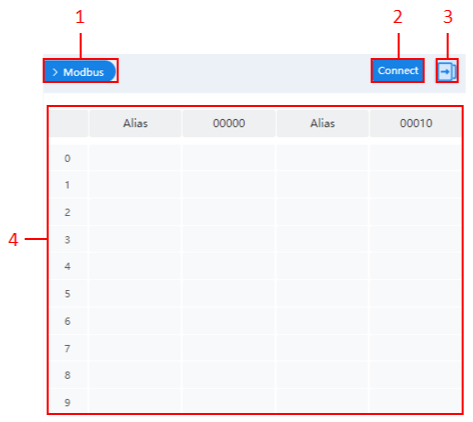

|No.|설명|
|---|---|
|1|패널 숨기기 / 표시|
|2|Modbus 슬레이브에 연결|
|3|컨트롤 패널 확대/축소|
|4|연결된 슬레이브의 레지스터 정보를 표시|

### **5.2.1: Modbus 슬레이브 연결하기**

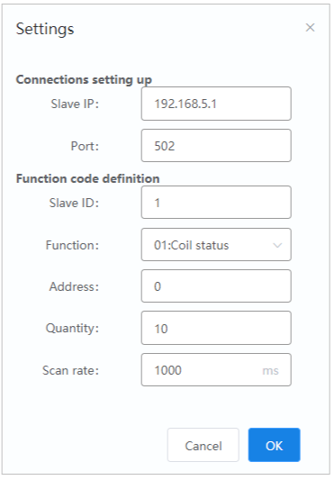

* Slave IP: Modbus 장치의 주소
* Port: Modbus 통신의 포트 번호
* Slave ID: 슬레이브 장치의 ID
* 기능: 슬레이브 장치의 기능 유형을 선택
* 주소/수량: 레지스터의 주소와 개수
* 스캔 속도: 로봇 암에 의해 슬레이브 스테이션을 스캔하는 시간 간격

---

## **5.3: 글로벌 변수**
이 모듈은 전역 변수를 구성하고 확인하는 데 사용된다. 설정된 전역 변수는 Blockly 프로그래밍 혹은 Script 프로그래밍에서 블록 혹은 변수명을 통해 호출할 수 있다.

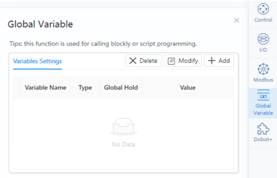

> CR Studio에서 지원되는 전역 변수 유형

|구분|설명|
|---|---|
|부울|부울 값|
|String|문자열|
|int|정수|
|float|배정도 부동 소수점|
|point|로봇의 위치를 지정한 위치로 이동하여 얻을 수 있는 로봇의 위치|
* 변수가 `Global Hold`로 설정된 경우, 로봇의 전원이 꺼진 후에도 전역 변수는 그 값을 유지할 수 있다.

---
## **5.4: 두봇+**
로봇의 엔드 툴을 제어하기 위한 엔드 플러그인을 설치 및 구성하는 데 사용된다.


`Add Plugins`를 클릭하여 플러그인의 목록을 볼 수 있다. 플러그인을 설치하려면 `Install`을 클릭하거나, 플러그인을 업로드하려면 `Import Plugins`를 클릭한다.

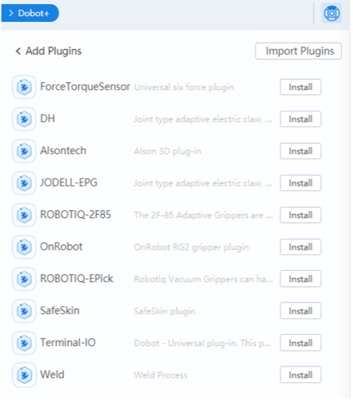

설치된 플러그인은 `두봇+`의 메인 페이지에 표시된다.

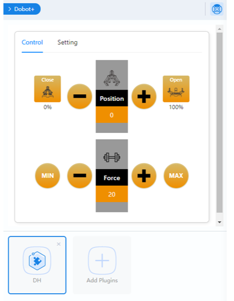

설치 후에는 Blockly와 Script 모듈에 해당하는 블록 혹은 명령이 추가된다.

예시로 `DH Gripper`의 경우를 들어 설명한다.

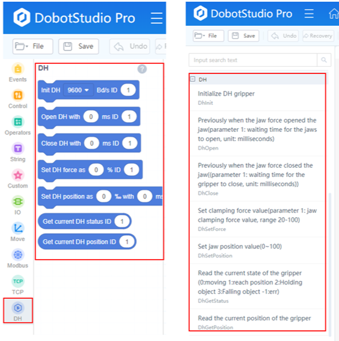

플러그인에 단축키를 설정하려면 페이지 우상단의

버튼을 클릭한다.

설정을 저장한 후, 엔드 툴을 엔드 버튼을 통해 제어할 수 있다.
> 예: DH를 선택하고 `Shortcut key1`을 `DhOpen`으로 설정하고, `Shortcut key2`를 `DhClose`로 설정하면, 로봇 끝에 있는 버튼을 누르면 Gripper가 열리고, 다시 누르면 Gripper가 닫힌다.

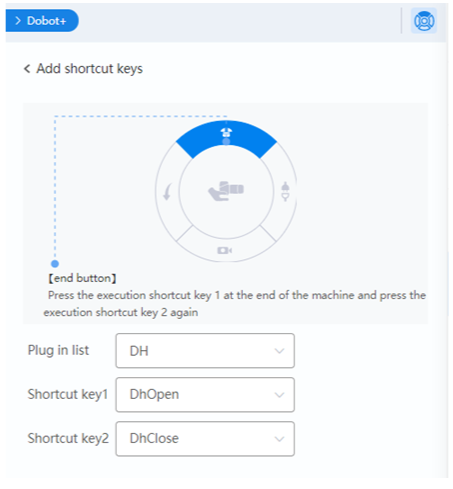