# **Chapter 07: 프로세스(Process)**

```
[Summary]
7.1: 궤적 재생(Trajectory Playback)
7.2: 컨베이어 벨트
```

---
## **7.1: 궤적 재생(Trajectory Playback)**

`궤적 재생`은 로봇을 **수동**으로 드래그하는 동안 기록된 궤적을 재생하는 데 사용된다.

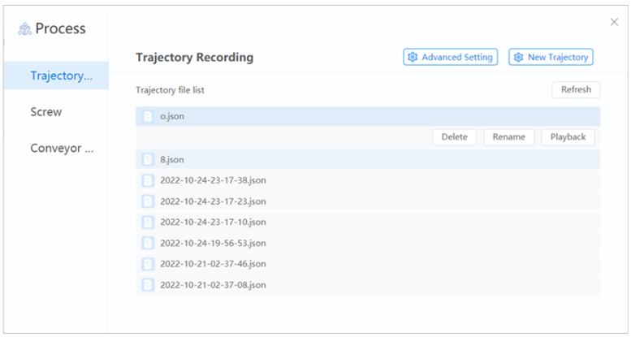

> 화면 우상단의 `New Trajectory(새 궤적)`를 클릭하면 로봇 끝에 있는 표시등이 <u>**노란색**</u>으로 바뀌며, 수동으로 로봇을 움직일(Drag) 수 있다. 수동으로 움직이는 궤적은 재생(Playback)을 위해 기록된다.

저장된 궤적을 클릭하면 `Delete(삭제)`, `Rename(이름 바꾸기)` 및 `Playback(재생)`의 두 가지 버튼이 표시된다.
* `Playback`을 클릭하여 로봇의 기록된 궤적을 재생할 수 있다. 로봇 암 끝의 표시등이 `노란색`으로 바뀌며 로봇은 기록된 궤적에 따라 움직인다. 기록 재생이 완료되면 로봇은 멈추고 표시등이 `녹색`으로 바뀐다.

* `Advanced Setting`을 클릭하여 재생 모드를 설정할 수 있다.

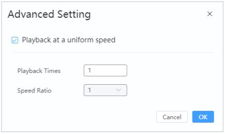

---

## **7.2: 컨베이어 벨트**

컨베이어 프로세스는 컨베이어가 움직일 때 광전 센서가 컨베이어에 있는 물체를 감지하고 로봇이 움직이는 물체를 픽업하는 과정을 말함.

### **7.2.1: Building Environment**

이하는 컨베이어 추적의 전체 프로세스 환경을 나타낸다.

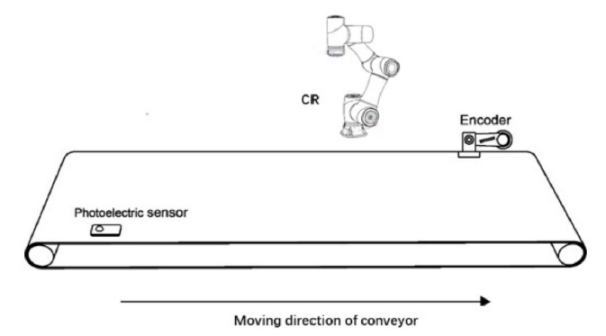

아래는 통신 다이어그램이다.

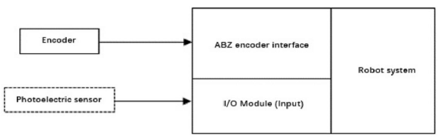

#### **Encoder**
`Encoder`을 사용하여 컨베이어 이동 거리와 공작물 위치를 기록하고 이를 CR 로봇에 보고한다. Encoder는 아래와 같이 CR 컨트롤러의 `ABZ Encoder Interface`에 연결해야 한다. 권장 Encoder 모델은 `E6B2-CWZ1X(1000P/R)`이다.

> ABZ Encoder 인터페이스
```
Encoder와 Robot Controller 사이의 연결을 위한 인터페이스
이 인터페이스는 Encoder의 신호를 Controller로 전달하여 Encoder의 회전 운동을 감지하고, 이동 거리 및 위치 정보를 가져올 수 있도록 한다.

ABZ 인터페이스는 주로 3개의 신호선(A, B, Z)를 사용하여 Encoder의 회전 방향과 속도를 측정하고, 추가적인 신호선을 통해 특정 위치를 나타낼 수도 있다. Robot Controller에서는 이 ABZ 신호를 해석하여 로봇의 운동 및 위치 제어에 활용한다.
```

> E6B2-CWZ1X(1000P/R) Encoder
```
Omron에서 제조되는 Encoder로, 회전 운동을 감지하고 회전하는 물체의 위치와 속도를 측정하는 데 사용된다. 1000펄스(파장) 당 1회전의 해상도를 가짐.

즉, Encoder가 1회전 시 1000개의 펄스 신호를 생성한다. 이렇게 생성된 펄스 신호는 ABZ 인터페이스를 통해 로봇 컨트롤러로 전달되어 회전 방향과 속도, 그리고 특정 위치 정보를 제공한다.

해당 Encoder는 다양한 산업 분야에서 사용되며, Robot Application에서도 자주 활용됨.
```


`E6B2-CWZ1X(1000P/R)` 모델 Encoder을 기준으로 한 핀 연결은 다음과 같다.

|색깔|포트|
|---|---|
|Black|A+|
|Black and Red|A-|
|White|B+|
|White and Red|B-|
|Orange|X+|
|Orange and Red|X-|
|Brown|I/O 5V|
|Brown and Red|I/O 0V|

#### **광전자 센서**
광전자 센서는 공작물의 감지 여부에 따라 서로 다른 레벨의 신호를 출력한다. 제어 시스템은 신호의 Edge(Signal Edge)를 통해 공작물을 감지할 수 있다.

광전자 센서를 Controller의 `DI(Digital Input) Interface`에 연결해야 한다.

### **7.2.2: 교정 컨베이어**
컨베이어 프로세스 구성 전 컨베이어와 로봇 간 위치 관계를 얻기 위해 컨베이어를 보정해야 한다. 보정을 위해 사용자 좌표계가 사용된다.

캘리브레이션을 하기 전 로봇 끝에 캘리브레이션 바늘을 설치하고 라벨을 준비해야 한다. 

1. 아래와 같이 컨베이어에 라벨을 붙인다.

    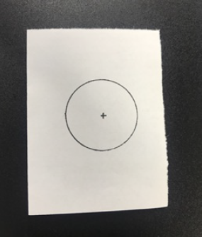

2. `사용자 좌표계` 페이지로 들어간다.

3. 로봇을 활성화한다. 컨베이어의 라벨 위치, 첫 번째 지점(Point A, 사용자 좌표계의 원점)으로 로봇을 Jog한다.

    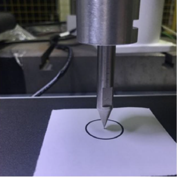

4. 컨베이어를 제어하여 지정된 거리를 이동한다.

5. 로봇을 컨베이어의 라벨 위치, 두 번째 지점(Point B(Axis X))로 이동한다.

6. 로봇을 컨베이어의 Point A와 B에 의해 결정된 라인에 없는 지점으로 이동하여 Point C(Axis Y)를 얻는다.

    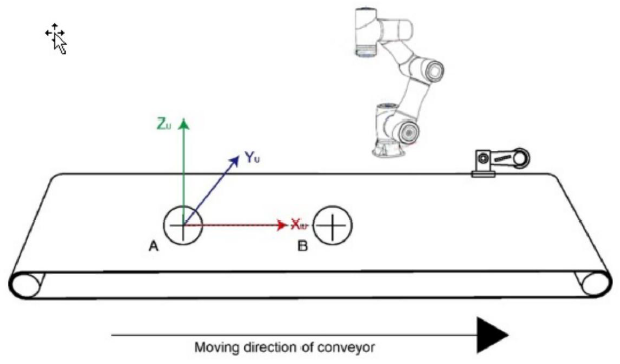

7. 좌표계를 추가하거나 덮고 저장한다.

### **7.2.3: 컨베이어 구성**
`Process` 페이지에서 `Conveyor Tracking`를 클릭하고, `Open Tool`을 클릭하면 다음 페이지가 나타난다.


[기본 설정]
* Conveyor Type(컨베이어 유형): 선형 유선만 지원됨(구성할 수 없음)
* Encoder Channel(인코더 채널): 채널은 기본값으로 설정(구성할 수 없음)
* User Coord Index(사용자 좌표 인덱스): 마지막 단계에서 저장한 컨베이어 좌표계를 선택한다
* Data Source(데이터 소스): 센서만 지원된다(구성할 수 없음)

#### **Encoder**
Encoder Resolution(해상도/분해능)를 Calibrate(보정)한다. Encoder Resolution은 컨베이어가 이동할 때 Encoder의 단위 길이 당 펄스 증가량이다.


1. 컨베이어에 라벨을 붙인다. 로봇을 컨베이어의 라벨 위치로 이동하고 `Pos` 칼럼의 `1`을 클릭하여 `Position 1`의 값을 얻는다.

2. 컨베이어를 지정된 거리만큼 이동하도록 제어하고 정지시킨다.

3. 로봇을 컨베이어의 라벨 위치로 이동시킨 후, `Pos` 칼럼의 `2`를 클릭하여 `Position 2`의 값을 얻는다.

4. Encoder의 방향을 실제 상황에 맞게 설정한다.
   
5. `Calculation(계산)`을 클릭하여 Encoder Resolution을 얻는다.


#### **센서 설정**

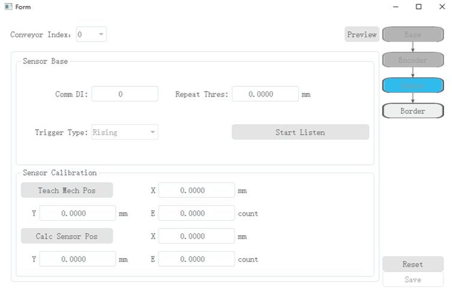

* Trigger Input IO(트리거 입력 IO): 센서가 연결된 컨트롤러의 DI 포트 인덱스를 설정한다  
* Deduplication distance(중복 제거 거리): 유효한 신호가 감지된 후 후속 거리 내에서 신호가 변경되면 신호가 유효하지 않은 것으로 간주되어 자동으로 제거된다. 값은 `실제 상황에 따라 2mm ~ 5mm`로 설정할 수 있다.
* Trigger Type(트리거 유형): 상승 Edge Trigger만 지원됨(구성할 수 없음)

#### **센서 Calibration**
센서 Calibration은 워크가 컨베이어를 따라 이동할 때 좌표 오프셋을 기반으로 매 순간 사용자 좌표계에서 워크의 위치를 계산할 수 있도록 센서가 워크를 감지하는 위치를 얻는 것을 목표로 한다.

1. 센서 설정에서 `Start Listening`을 클릭하여 `센서 신호 수신(Listening the Sensor Signal)`을 시작한다.

2. 컨베이어의 업스트림에 작업물을 놓는다. 컨베이어를 제어하여 이동하면 작업물이 컨베이어와 함께 이동하고, 센서가 작업물을 감지하고 작업물이 로봇의 작업 영역 내에 있을 때 컨베이어를 `정지`시킨다.

3. 로봇을 작업물의 중심으로 이동시킨 다음, `Teach Mech Pos`를 클릭하여, 현재 위치를 얻는다.

4. `Calc Sensor Pos`을 클릭하여 센서의 위치를 얻는다.

#### **작업 경계(Working Border)**

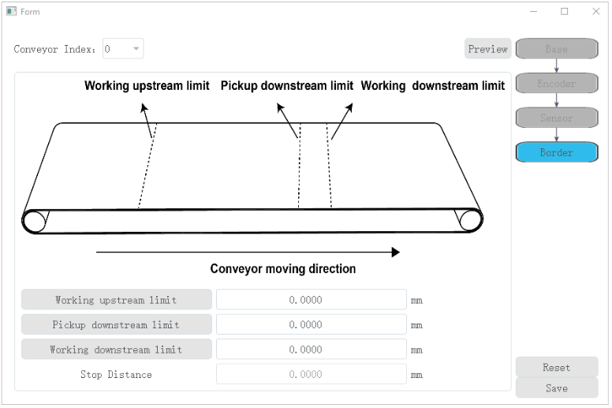

Working Border는 컨베이어에서 로봇의 작업 영역을 설정하는 데 사용된다.

* Work Enter Border(작업 진입 경계): 작업물이 이 경계를 넘어가면 로봇 암이 작업물을 추적하고 집어들이기 시작한다. 
* Pick Max Border(집기 최대 경계): 작업물이 이 경계를 넘어가면 로봇 암이 작업물을 집어들이기 시작하지 않은 경우, 작업물의 Pick 작업을 완료할 수 없다고 간주하여 작업물을 Pick하지 않는다. 이 경계는 컨베이어의 이동 속도와 실제 경험을 기반으로 Set되어야 한다. 최적의 값을 얻기 위해 여러 번의 Debugging을 권장함.
* Work Off Border: 작업물이 이 경계를 넘어가면 로봇 암은 작업물의 추적을 중지한다. 로봇이 작업 영역을 벗어나는 것을 방지하기 위해 알람을 트리거한다.

각 Border의 해당 위치로 로봇을 Jog하고 버튼을 클릭해 값을 설정한다.

우상단의 `Save`을 클릭하면, 프로젝트에서 컨베이어 구성을 사용할 수 있게 된다.

### **7.2.4: 예시**

컨베이어 벨트의 매개변수를 구성한 후 컨베이어 벨트 API를 호출하여 스크립트를 편집하여 컨베이어 추적을 구현할 수 있다.

컨베이어 벨트 추적 프로세스

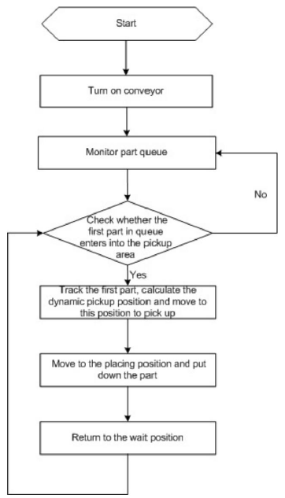

해당의 예에서는 컨베이어 벨트 구성 시 설정한 사용자 좌표계 아래에 6개의 지점을 학습시켜야 한다.

* 대기 지점: P1
* 추적 지점: P2
* 픽업(Pickup) 지점: P3
* 들어올리기(Lifting) 지점: P4
* 놓을 지점 위의 지점(Point above the placing point): P5
* 배치 지점(Placing Point): P6

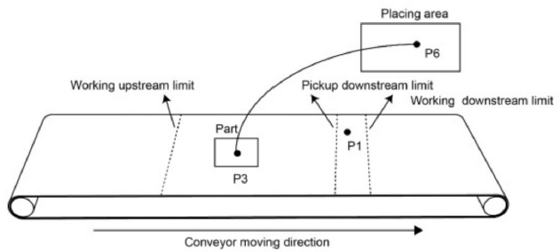

> Script
```
CnvVision(0)    // 컨베이어 시작
DO(9, 0)        // DO_1 및 DO_2를 통해 공기 펌프의 시작 및 상태 제어
DO(2, 0)

local flag      // 작업물 라벨이 있는지 여부
local typeObject    // 작업물의 종류
local point = {0, 0, 0} // Queue 작업물 좌표
while true do
    Go((P1, "Speed=100 Accel=100 SYNC=1"))  // 대기 지점은 일반적으로 작업 영역 내부에 위치됨.
    print("Test")   // 테스트 메시지 출력

    while true do
        flag, typeObject, point = GetCnvObject(0, 0)    // 작업물이 있는지 확인하고, 있으면 중단한다.
        
        if flag == true then    
            break;  // 있는 경우 중단
        end

        Sleep(20)
    end

    SyncCnv(0)      // 컨베이어벨트 동기화 및 추적 시작

    Move(P2, "SpeedS=100 AccelS=100")   // 픽업 지점 위로
    Move(P3, "SpeedS=100 AccelS=100")   // 픽업 지점
    Wait(100)

    DO(9, 1)    // 공기 펌프를 켜서 작업물을 집어올린다(Pick).
    Wait(100)

    Move(P4, "SpeedS=100 AccelS=100 SYNC=1")    // 작업물을 들어올린다(Lift).

    StopSyncCnv()   // 컨베이어 추적 중지
    Sleep(20)

    Go(P5, "Speed=100 Accel=100")           // 배치 지점 위로
    Go(P6, "Speed=100 Accel=100 SYNC=1")    // 배치 지점으로
    Sleep(1000)

    DO(1, 0)            // 공기 펌프 끄기
    DO(2, 0, "SYNC=1")
    Sleep(1000)
    Go(P5, "Speed=100 Accel=100")
End
```
