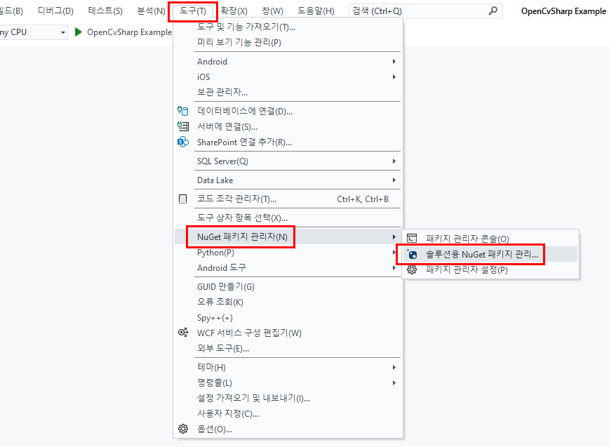
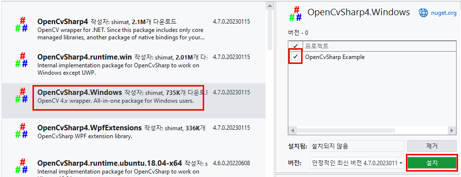

# **Chapter01. OpenCvSharp4 설치**
## **개요**
### **OpenCV**
**OpenCv(Open Source Computer Vision)** 은 오픈 소스 컴퓨터 비전 라이브러리로, `객체·얼굴·행동 인식`, `독순`, `모션 추적` 등의 응용 프로그램에서 사용한다.

---

## **1-1. 설치**

> 본 가이드는 Windows와 Visual Studio 2022 버전을 토대로 작성됨.

1. Visual Studio에서 `C#` 프로젝트를 생성하고, 상단 메뉴의 `도구` → `NuGet 패키지 관리자(N)` → `솔루션용 NuGet 패키지 관리...` 을 클릭한다.

    

2. `NuGet 패키지`에서 `찾아보기`를 누르고 검색창에 **OpenCvSharp4** 를 검색한다.

    

3. 사용하고 있는 운영체제가 `Windows`라면, 단일 패키지인 `OpenCvSharp4.Windows`를 설치한다.

    

\* Ubuntu에서 사용할 경우 이하의 패키지를 모두 설치해 주어야 한다.
* OpenCvSharp4
* OpenCvSharp4.runtime.ubuntu