# **Chapter13. 이미지 연산(2)**
## **개요**
이미지 연산은 `하나 또는 둘 이상`의 이미지에 대해 **비트 연산**, 또는 **비교 연산** 을 수행한다. Mat 클래스의 행렬 연산은 OpenCvSharp의 `비트 연산 표현(&, | 등)`을 통해서도 Mat 클래스 간의 연산을 수행할 수 있다.

\* OpenCvSharp에서는 비교 연산 표현(<, = 등)은 지원하지 않음.

## **13.1. 프로그램 작성**

> 원본 이미지: flamingo.jpg


```cs
Mat src1 = new Mat("fairy.jpg", ImreadModes.ReducedColor2);
Mat src2 = src1.Flip(FlipMode.Y);
```

둘 이상의 이미지를 연산 대상에 사용하는 경우, 이미지는 서로 `크기`, `데이터 타입`, `깊이`가 서로 일치해야 한다.

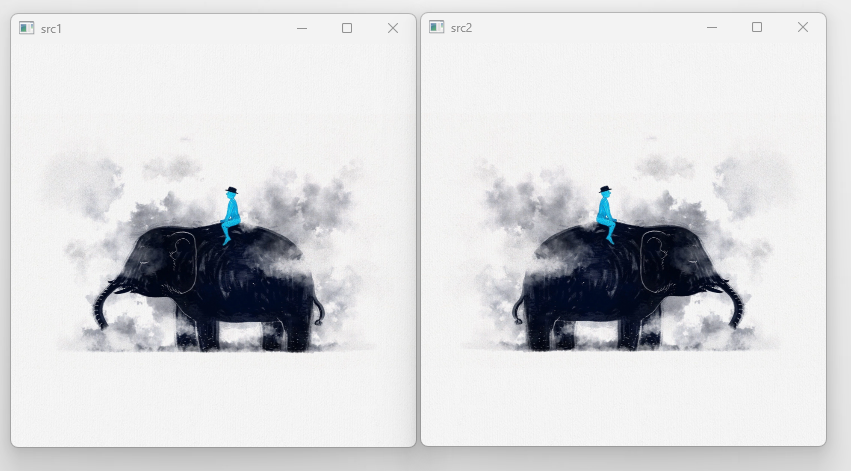

### **13.1.1. 논리곱 연산(BitwiseAnd)**
논리곱 함수 `Cv2.BitwiseAnd()`는 배열과 배열, 배열과 스칼라의 요소별 `논리곱`을 계산한다.

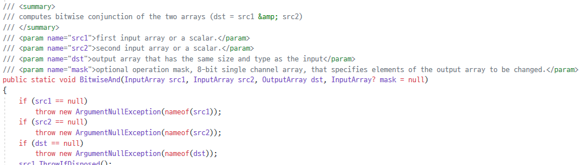

**Cv2.BitwiseAnd(원본 배열1, 원본 배열2, 결과 배열)** 으로 논리곱을 적용한다.

수식으로 표현할 경우 `dst = src1 & src2`의 형태를 갖는다.

src1의 픽셀값이 (243, 243, 243)이고, src2의 픽셀값이 (249, 249, 249)라고 가정했을 때, 243의 비트값은 `11110011`이고, 249의 비트값은 `11111001`이므로 각 자리수 별로 연산을 진행하면 `11110001`이 되므로 10진수 값인 `(241, 241, 241)`의 값을 얻는다.

```cs
Mat BitwideAnd = new Mat();
Cv2.BitwiseAnd(src1 , src2, BitwideAnd);
```

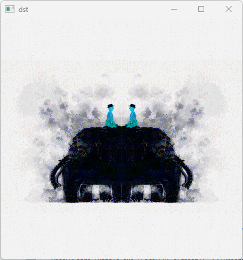

### **13.1.2. 논리합 연산(BitwiseOr)**
논리합 함수 `Cv2.BitwiseOr()`는 배열과 배열, 배열과 스칼라의 요소별 `논리합`을 계산한다.

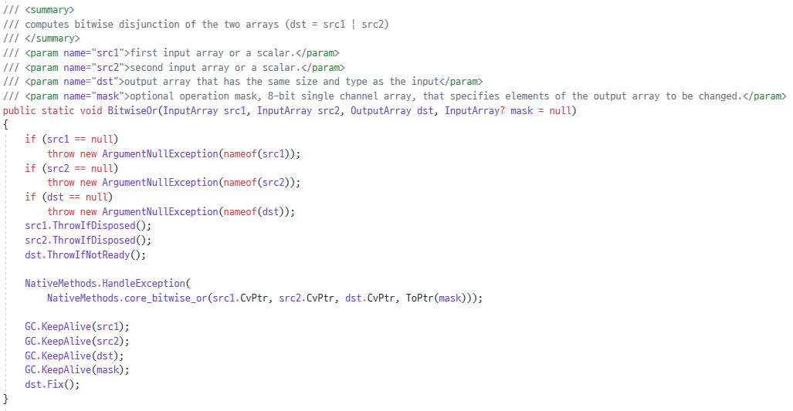

**Cv2.BitwiseOr(원본 배열1, 원본 배열2, 결과 배열)** 으로 논리합을 적용한다.

수식으로 표현할 경우 `dst = src1 | src2`의 형태를 갖는다.

src1의 픽셀값이 (243, 243, 243)이고, src2의 픽셀값이 (249, 249, 249)라고 가정했을 때, 243의 비트값은 `11110011`이고, 249의 비트값은 `11111001`이므로 각 자리수 별로 연산을 진행하면 `11111011`이 되므로 10진수 값인 `(251, 251, 251)`의 값을 얻는다.

```cs
Mat BitwideOr = new Mat();
Cv2.BitwiseOr(src1 , src2, BitwideOr);
```

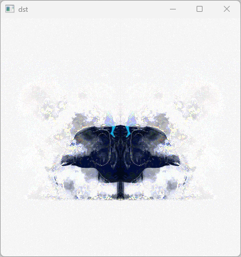

### **13.1.3. 배타적 논리합 연산(BitwiseXor)**
배타적 논리합 함수 `Cv2.BitwiseXor()`는 배열과 배열, 배열과 스칼라의 요소별 `배타적 논리합`을 계산한다.

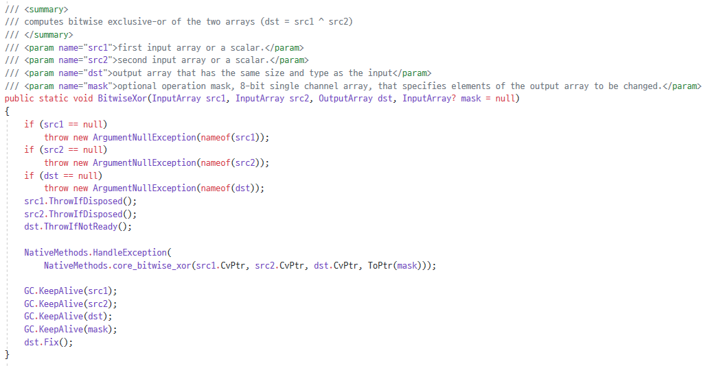

**Cv2.BitwiseXor(원본 배열1, 원본 배열2, 결과 배열)** 으로 배타적 논리합을 적용한다.

수식으로 표현할 경우 `dst = src1 ^ src2`의 형태를 갖는다.

src1의 픽셀값이 (243, 243, 243)이고, src2의 픽셀값이 (249, 249, 249)라고 가정했을 때, 243의 비트값은 `11110011`이고, 249의 비트값은 `11111001`이므로 각 자리수 별로 연산을 진행하면 `00001010`이 되므로 10진수 값인 `(10, 10, 10)`의 값을 얻는다.

```cs
Mat BitwideXor = new Mat();
Cv2.BitwiseXor(src1, src2, BitwideXor);
```

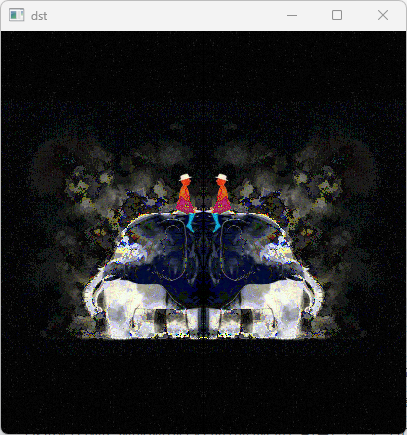

### **13.1.4. 논리 부정 연산(BitwiseNot)**
논리 부정 함수 `Cv2.BitwiseNot()`는 배열의 요소별 `논리 부정`을 계산한다.

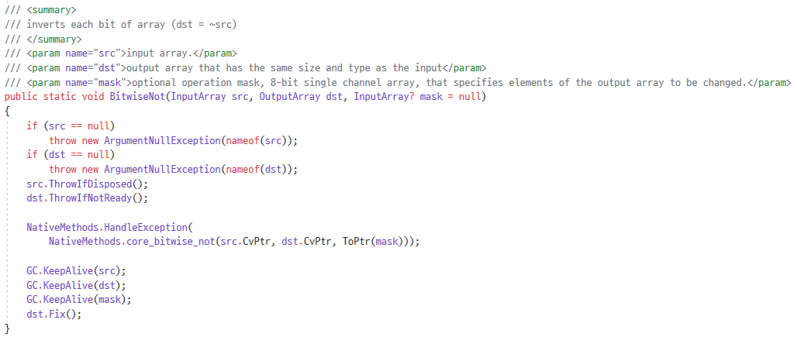

**Cv2.BitwiseNot(원본 배열, 결과 배열)** 으로 논리 부정을 적용한다.

수식으로 표현할 경우 `dst = ~src1`의 형태를 갖는다.

src1의 픽셀값이 (243, 243, 243)이라고 가정했을 때, 243의 비트값은 `11110011`이므로 각 자리수 별로 연산을 진행하면 `00001100`이 되므로 10진수 값인 `(12, 12, 12)`의 값을 얻는다.

```cs
Mat BitwideNot = new Mat();
Cv2.BitwiseNot(src1, BitwideNot);
```

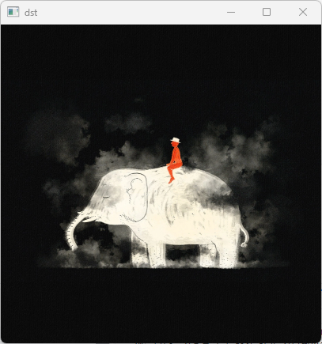

### **13.1.5. 비교 연산(Compare)**
비교 함수 `Cv2.Compare()`는 배열과 배열, 배열과 스칼라의 요소별 `비교값`을 계산한다.

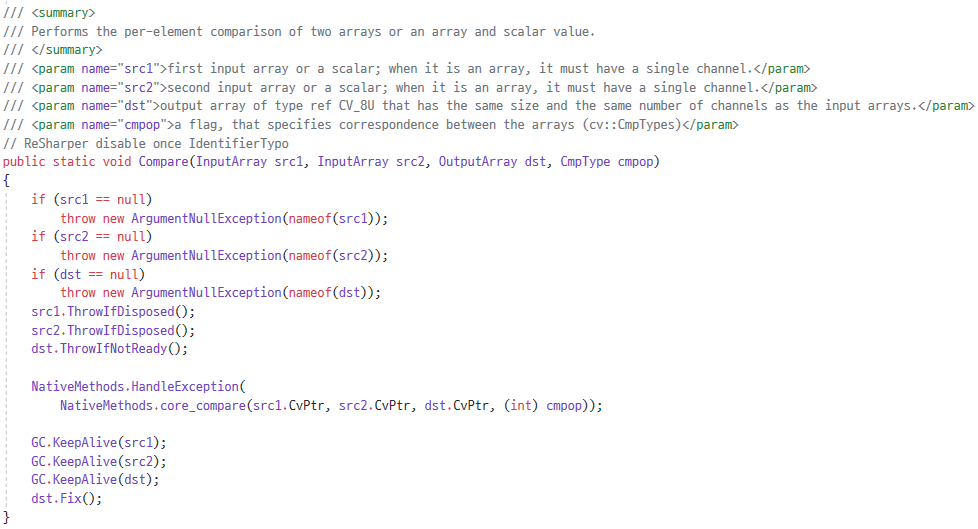

**Cv2.Compare(원본 배열1, 원본 배열2, 결과 배열, 비교 플래그)** 으로 비교를 적용한다.

두 배열의 요소에 대해 `비교 플래그`에 의한 비교 연산의 요솟값이 결과 배열에 할당된다.

src1의 픽셀값이 (245, 245, 245)이고, src2의 픽셀값이 (245, 244, 246)라고 가정했을 때, 조건에 부합하면 `255`가, 아니라면 `0`의 값이 반환되므로 결과 값은 `(255, 0, 0)`이 된다.

```cs
Mat Compare = new Mat();
Cv2.Compare(src1, src2, Compare, CmpType.EQ);
```

> 비교 플래그 종류
* `CmpTypes.EQ`: src1 == src2
* `CmpTypes.GT`: src1 > src2
* `CmpTypes.GE`: src1 >= src2
* `CmpTypes.LT`: src1 < src2
* `CmpTypes.LE`: src1 <= src2
* `CmpTyes.NE`: src1 != src2

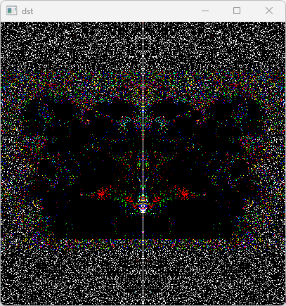