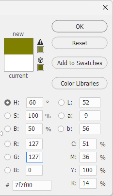
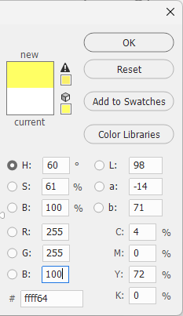
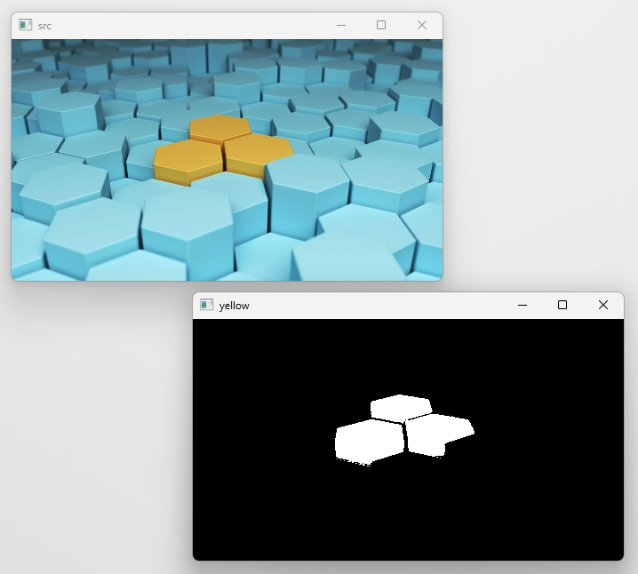
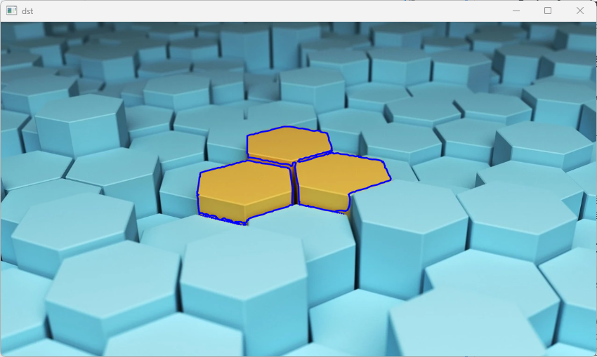

# **Chapter16. 윤곽선 검출**

## **개요**

`Edge Detaction(가장자리 검출)` 함수는 입력된 이미지에서 가장자리를 검출해 이미지로 반환하였으나, 검출된 객체들의 `Segment` 구성요소가 구분되어 있지 않아 어떤 형태인지 알 수 없었다.

`Contour Detection(윤곽선 검출)` 알고리즘은 전처리가 진행된 이미지에서 가장자리로 검출된 픽셀을 대상으로 `Segmentation`이라는 작업을 진행하여 검출된 객체들을 `Value(값)`으로 반환하여 사용할 수 있다.

검출된 윤곽선(Contour)은 형상의 분석과 물체 감지 및 인식에 가장 효과적인 방법 중 하나이다.

## **16.1. 프로그램 작성**

이미지의 특정 색상(노란색 영역)을 찾아 해당 영역의 `윤곽선(Contour)`을 찾고, 찾은 윤곽선을 `Draw` 한다.

### **16.1.1. 이미지 준비**

> 원본 이미지: hex.jpg


```cs
Mat src = new Mat("hex.jpg");
Mat yellow = new Mat();
Mat dst = src.Clone();
```
* `src`: 원본
* `yellow`: 전처리 이미지
* `dst`: 결과 이미지

### **16.1.2. 전처리**

> 찾을 색상 범위: (좌: Scalar(0, 127, 127) / 우: Scalar(100, 255, 255))




```cs
Cv2.InRange(src, new Scalar(0, 127, 127), new Scalar(100, 255, 255), yellow);
```
* `InputArray src`: 원본 배열
* `Scalar lowerb`: 하한 값 행렬 또는 스칼라
* `Scalar upperb`: 상한 값 행렬 또는 스칼라
* `dst`: 결과 배열



### **16.1.3. 윤곽선(Contour) 검출**
```cs
Point[][] contours;
HierarchyIndex[][] hierarchy;
```
* `contours`: 검출된 윤곽선의 실제 값이 저장되는 변수
  * `OpenCvSharp.Point` 타입의 2차원 배열로 구성(좌표를 하나로 묶어 윤곽선을 구성하기 위한 차원, 윤곽선 단위로 구별하기 위한 차원)
* `hierarchy`: 검출된 윤곽선들의 계층 구조가 저장되는 변수
  * `현재 Node`에 대한 정보를 담으며, `다음/이전 윤곽선`, `자식/부모 노드`의 4가지 정보가 담겨 있다.
    * `자식 Node`: 자기 자신 **안쪽**에 있는 윤곽선
    * `부모 Node`: 자기 자신 **바깥쪽**에 있는 윤곽선

```cs
Cv2.FindContours(yellow, out contours, out hierarchy, RetrievalModes.Tree, ContourApproximationModes.ApproxTC89KCOS);
```
* `InputArray image`: 원본 배열
* `out Point[][] contours`: 검출된 윤곽선(by Ref.)
* `out HierarchyIndex[]`: 계층 구조(by Ref.)
* `RetrievalModes mode`: 검색 방법 - 윤곽선을 검출하여 어떤 계층 구조의 형태를 사용할지 설정한다.
* `ContourApproximationModes method`: 근사 방법 - 윤곽점의 근사법을 설정(설정된 근사법에 따라 검출된 윤곽선에 포함될 좌표의 수나 정교함의 수준이 달라진다)
* `Point? offset = null`: 반환된 윤곽점들의 좌푯값에 이동할 값(오프셋)을 설정한다.

> RetrievalModes(검색 방법) 플래그 종류

|속성|의미|
|---|---|
| **RetrievalModes.External** |최 외곽의 윤곽선만 검색|
| **RetrievalModes.List** |모든 윤곽선 검출, 계층 구조는 형성하지 않음(모든 윤곽선을 동일 레벨로 간주)|
| **RetrievalModes.CComp** |모든 윤곽선을 검색해서 `2단계` 계층 구조로 구성(최상위 레벨은 외곽, 두 번째 레벨은 내곽)|
| **RetrievalModes.Tree** |모든 윤곽선을 검출하고 트리 구조로 구성|

> ContourApproximationModes(근사 방법) 플래그 종류

|속성|의미|
|---|---|
| **ContourApproximationModes.ApproxNone** |검출된 모든 윤곽점을 반환|
| **ContourApproximationModes.ApproxSimple** |수평, 수직, 대각선 부분을 압축해서 끝점만 반환|
| **ContourApproximationModes.ApproxTC89L1** |Teh-Chin 체인 근사 알고리즘을 적용|
| **ContourApproximationModes.ApproxTC89KCOS** |Teh-Chin 체인 근사 알고리즘을 적용|

\* 모든 옵션에 따른 결과에 유의미한 차이가 존재하지 않아 별도의 비교 사진은 첨부하지 않음

### **16.1.4. 검출된 윤곽선 구분**
```cs
List<Point[]> new_contours = new List<Point[]>();

foreach(Point[] p in contours) {
    double length = Cv2.ArcLength(p, true);
    if(length > 100) new_contours.Add(p);
}
```

검출된 Contour 가운데, 그 윤곽선의 길이가 100 이상인 Contour을 구별하여, 불필요한 윤곽선을 제한 나머지를 `new_contours` 리스트에 저장한다.

### **16.1.5. 윤곽선 그리기**
```cs
Cv2.DrawContours(dst, new_contours, -1, new Scalar(255, 0, 0), 2, LineTypes.AntiAlias, null, 1);
```

* `InputOutputArray image`: 결과 배열
* `IEnumerable<IEnumerable<Point>> contours`: 검출된 윤곽선
* `int contourIdx`: 윤곽선 번호
  * 번호를 지정할 경우 지정된 윤곽선만 그린다.
  * `-1`로 지정할 경우, 모든 윤곽선을 그린다.
* `Scalar color`: 그려질 윤곽선의 색상
* `int thickness`: 그려질 윤곽선의 두께
* `LineTypes lineType = LineTypes.Link8`: 선형 타입
* `IEnumerable<HierarchyIndex>? hierarchy = null`: 계층 구조
  * FindCountours()에서 반환된 계층 구조
  * `new_contours`를 통해 새로운 윤곽선을 구성하였으므로, 초기의 계층 구조가 맞지 않으므로 `null` 사용
* `int maxLevel = int.MaxValue`: 계층 구조 최대 레벨
  * 0으로 설정 시 최상위 레벨만 그려진다.
  * 계층 구조가 존재하지 않으므로 `0 이상의 값`으로 설정

### **실행 결과**

