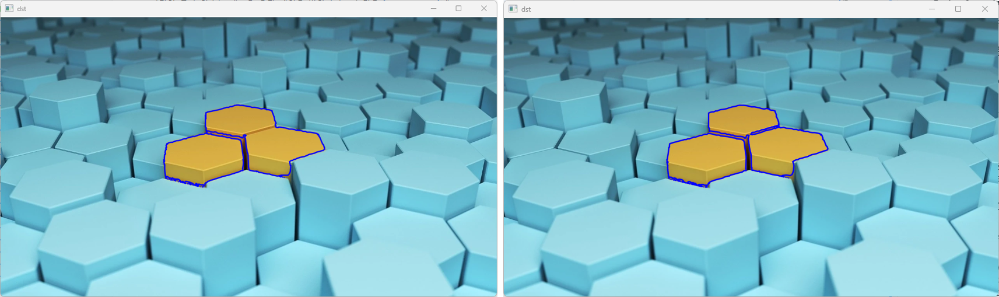

# **Chapter17. 다각형 근사**

## **개요**
`다각형 근사`는 검출된 윤곽선의 형상을 분석할 때 정점(Vertex)의 수가 적은 다각형으로 표현할 수 있도록 다각형 곡선을 근사하는 방법이다.

다각형 근사는 `더글라스-패커(Douglas-Peucker)` 알고리즘을 사용한다.

> **Douglas-Peucker Algorithm**
> : 지리 정보 시스템(GIS) 및 컴퓨터 그래픽스에서 주어진 선분을 단순화하는 데 사용되는 알고리즘으로, Line Simplification(라인 간소화) 또는 Data Reduction(데이터 축소)라고도 불린다. `선분의 형태를 보존`하면서 선분을 `가능한 한 적은 수`의 직선 세그먼트로 근사화한다.

**반복**과 **끝점**을 이용해 선분으로 구성된 윤곽선들을 `더 적은 수의 윤곽점`으로 `동일하거나 비슷한` 윤곽선으로 Decimate한다.

> **Decimate(데시메이트)**
> : 일정 간격으로 샘플링된 데이터를 기존 간격보다 더 큰 샘플링 간격으로 다시 샘플링하는 것

더글라스-패커 알고리즘은 `근사치 정확도(Epsilon)`의 값으로 기존의 다각형과 윤곽점이 합축된 다각형의 `최대 편차`를 고려하여 다각형을 근사한다.

다각형을 근사화하는 이유는 주어진 다각형의 형태를 더 간단하고 효율적으로 표현하기 위해서이다. 더글라스-패커 알고리즘과 같은 근사화 알고리즘은 다각형을 더 적은 수의 꼭짓점으로 표현함으로써 다각형의 형태를 가능한 한 보존하면서도 데이터의 크기를 축소할 수 있으며, 경계선 검출, 객체 추적, 형상 인식 등의 작업에서 계산 및 분석의 효율성을 높일 수 있다.

따라서 다각형 근사화는 데이터의 크기와 처리 비용을 줄이고, 효율적인 데이터 분석 및 시각화를 위한 필수적인 과정이다.

## **17.1. 프로그램 작성**

### **17.1.1. 이미지 및 코드**

예제 이미지와 코드는 16장과 동일

> 원본 이미지: hex.jpg


```cs
using System;
using OpenCvSharp;
using System.Collections.Generic;

namespace Project {
    class Program {
        static void Main(string[] args) {
            Mat src = new Mat("hex.jpg");
            Mat yellow = new Mat();
            Mat dst = src.Clone();

            Point[][] contours;
            HierarchyIndex[] hierarchy;

            Cv2.InRange(src, new Scalar(0, 127, 127), new Scalar(100, 255, 255), yellow);   // 범위 내 색상에 해당하는 부분만 분류
            Cv2.FindContours(yellow, out contours, out hierarchy, RetrievalModes.Tree, ContourApproximationModes.ApproxTC89KCOS); // 윤곽선 검출 실행

            List<Point[]> new_contours = new List<Point[]>();

            foreach(Point[] p in contours) {
                double length = Cv2.ArcLength(p, true); // p의 윤곽선
                if(length > 100) new_countours.Add(p);  // 윤곽선 길이가 100 이상인 contour만 분류하여 new_contour에 저장
            }

            Cv2.DrawContours(dst, new_contours, -1, new Scalar(255, 0, 0), 2, LineTypes.AntiAlias, null, 1);    // 윤곽선 그리기

            Cv2.ImShow("src", src); // 원본 이미지 src 출력
            Cv2.ImShow("dst", dst); // 원본 이미지 src 출력
            Cv2.WaitKey(0);
        }
    }
}
```

### **17.1.2. 수정 사항**

```cs
foreach(Point[] p in contours) {
    double length = Cv2.ArcLength(p, true);

    if(length > 100) {
        // new_countours.Add(p); 삭제
        new_contours.Add(Cv2.ApproxPolyDP(p, length * 0.02, true));
    }
}
```

다각형 근사 알고리즘은 `하나의 다각형을 근사`하므로, 기존 코드와 동일하게 **foreach(반복문)** 을 사용하여, 개별의 다각형을 근사한다.

```cs
// return type : OpenCvSharp.Point[]
Cv2.ApproxPolyDP(p, length * 0.02, true);
```

`Cv2.ApproxPolyDP(원본 배열, 근사치 정확도, 폐곡선 여부)`로 다각형 근사를 적용한다. **원본 배열**에서 근사치 정확도 값으로 다각형 근사를 진행한다.

**폐곡선 여부**는 시작점과 끝점의 연결 여부를 의미한다. `true` 입력 시, 마지막 점과 시작 점이 연결된 것으로 간주한다.

**근사치 정확도(epsilon)** 는, 해당 다각형 근사 함수에서 가장 중요한 매개값으로, 일반적으로 전체 윤곽선 길이의 1% ~ 5%를 사용한다. 일반적으로 epsilon 값은 다각형의 둘레 길이에 비례하는 값을 설정하는데, 해당 값이 작을 수록 원래 다각형에 더욱 근접하는 근사 다각형을 얻을 수 있다. 해당의 코드는 0.02를 곱하여 전체 윤곽선 길이의 2%를 적용한 형태로 동작하도록 되어 있다.

다각형 근사 함수는 새로운 윤곽 배열을 반환하며, 이 값을 `new_contours`에 추가하도록 하는 형태로 동작한다.

### **실행 결과**


> 근사 적용(좌) / 미적용(우) 비교

