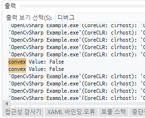
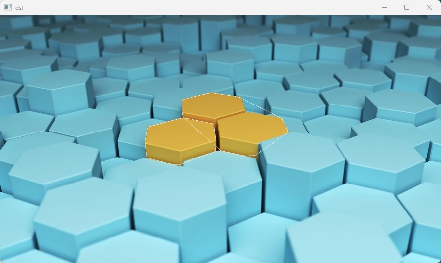

# **Chapter19. 윤곽선 관련 함수(2)**

## **개요**
OpenCvSharp에서는 검출된 윤곽선의 형상을 **분석 및 재가공**할 때, 사용할 수 있는 함수를 제공한다. 검출된 윤곽선의 정보를 활용하여 파생될 수 있는 정보를 제공한다.

윤곽선 객체의 `중심점`, `길이`, `넓이`, `최소 사각형` 등의 윤곽선 정보를 통해 계산할 수 있는 정보들을 쉽게 구할 수 있다.

## **19.1. 프로그램 작성**

### **19.1.1. 이미지 및 코드**

예제 이미지는 18장과 동일하며, 코드 또한 18장의 코드에서 시작

> 원본 이미지: hex.jpg


```cs
using System;
using System.Collections.Generic;
using OpenCvSharp;

namespace Project {
    class Program {
        static void Main(string[] args) {
            Mat src = new Mat("hex.jpg");
            Mat yellow = new Mat();
            Mat dst = src.Clone();

            Point[][] contours;
            HierarchyIndex[] hierarchy;

            Cv2.InRange(src, new Scalar(0, 127, 127), new Scalar(100, 255, 255), yellow);
            Cv2.FindContours(yellow, out contours, out hierarchy, RetrievalModes.Tree, ContourApproximationModes.ApproxTC89KCOS);

            foreach (Point[] p in contours)
            {
                double length = Cv2.ArcLength(p, true);
                double area = Cv2.ContourArea(p, true);

                if (length < 100 && area < 1000 && p.Length < 5) continue;

                Rect boundingRect = Cv2.BoundingRect(p);
                RotatedRect rotatedRect = Cv2.MinAreaRect(p);
                RotatedRect ellipse = Cv2.FitEllipse(p);

                Point2f center;
                float radius;
                Cv2.MinEnclosingCircle(p, out center, out radius);

                Cv2.Rectangle(dst, boundingRect, Scalar.Red, 2);
                Cv2.Ellipse(dst, rotatedRect, Scalar.Blue, 2);
                Cv2.Ellipse(dst, ellipse, Scalar.Green, 2);
                Cv2.Circle(dst, (int)center.X, (int)center.Y, (int)radius, Scalar.Yellow, 2);
            }
            Cv2.ImShow("dst", dst);
            Cv2.WaitKey(0);
        }
    }
}
```

### **19.1.2. 수정 사항**

```cs
foreach (Point[] p in contours) {
    double length = Cv2.ArcLength(p, true);
    double area = Cv2.ContourArea(p, true);

    if (length < 100 && area < 1000 && p.Length < 5) continue;

    // Rect boundingRect = Cv2.BoundingRect(p); 삭제
    // RotatedRect rotatedRect = Cv2.MinAreaRect(p); 삭제
    // RotatedRect ellipse = Cv2.FitEllipse(p); 삭제

    // Point2f center; 삭제
    // float radius; 삭제
    // Cv2.MinEnclosingCircle(p, out center, out radius); 삭제

    // Cv2.Rectangle(dst, boundingRect, Scalar.Red, 2); 삭제
    // Cv2.Ellipse(dst, rotatedRect, Scalar.Blue, 2); 삭제
    // Cv2.Ellipse(dst, ellipse, Scalar.Green, 2); 삭제
    // Cv2.Circle(dst, (int)center.X, (int)center.Y, (int)radius, Scalar.Yellow, 2); 삭제
}
```

윤곽선 관련 함수 알고리즘은 `하나의 윤곽선을 대상으로 진행`되므로, 기존 코드와 동일하게 **foreach(반복문)** 을 사용하여, 개별의 윤곽선으로부터 정보를 계산한다.

#### **19.1.2.1. 볼록성 시험 함수**
```cs
bool convx = Cv2.IsContourConvex(p);
```
볼록성 시험 함수 `Cv2.IsContourConvx()`는 주어진 윤곽선이 볼록 다각형(convx polygon)인지 여부를 판단한다.

볼록 다각형은 다각형 내의 임의의 두 점을 이어 만든 선분이 다각형 내에 위치하는 것을 의미. 즉, 다각형의 모든 내부 각이 180˚보다 작거나 같은 것을 말한다.

볼록 다각형일 경우 `true`, 그렇지 않을 경우 적어도 하나의 내부 각이 180˚보다 크다는 뜻이므로 `false`가 반환된다.

#### **19.1.2.2. 볼록 껍질 함수**
```cs
Point[] hull = Cv2.ConvexHull(p, true);
```
\* Hull: 껍데기

볼록 껍질 함수 `Cv2.ConvexHull(윤곽선 배열, 방향)`는 **윤곽선의 경계면을 둘러싸는 다각형**을 반환한다.

볼록한 형태를 반환하므로, 윤곽선의 배열과 동일한 값을 반환한다.

`방향`은 검출된 볼록 껍질 배열의 `색인(Index)` 순서를 결정한다.
* `true`: 시계 방향으로 정렬
* `false`: 반시계 방향으로 정렬

볼록 껍질 알고리즘은 `O(NlogN)` 시간 복잡도를 갖는 <u>**스크랜스키(Sklansky) 알고리즘**</u>을 이용하여 입력된 좌표들의 볼록한 외곽을 찾는다.

> **스크랜스키(Sklansky) 알고리즘**: 
>
> 이미지의 이진화된 윤곽선을 추출하기 위해 사용되는 알고리즘으로, 재귀 호출을 사용하여 이진화된 이미지에서 윤곽선을 따라가면서 픽셀을 탐색한다.
>
> 1. 시작점(시작 픽셀)을 선택
> 2. 현재 위치의 픽셀 값을 확인하여 윤곽선 여부 결정
> 3. 현재 위치에서 이웃한 픽셀을 확인
> 4. 이웃한 픽셀 중 방문하지 않은 픽셀이 있다면 해당 픽셀을 새로운 시작점으로 선택하고 2단계로 돌아감
> 5. 모든 이웃한 픽셀을 방문하고 윤곽선을 형성할 수 없을 때까지 2 ~ 4단계를 반복한다.


#### **19.1.2.3. 모멘트 함수**
\* 모멘트(Moments): 영상이나 이미지에서 대상 객체의 특징을 표현하기 위한 통계적인 측정값

```cs
Moments moments = Cv2.Moments(p, false);
```

모멘트 함수 `Cv2.Moments(배열, 이진화 이미지)`는 윤곽선의 **0차 모멘트**부터, **3차 모멘트**까지 계산한다.

* `배열`: 입력된 배열이 **이미지**일 경우, 이미지의 픽셀 값들을 이진화 처리할지 결정한다.
* `이진화 이미지`: 모멘트의 정규화(Normalize)하는 옵션
  * `true`: 정규화된 모멘트를 계산 - 이미지의 픽셀 값이 **0**이 아닌 값은 모두 **1**의 값으로 변경하여 모멘트를 계산한다. 정규화된 모멘트를 계산하므로 이미지의 크기에 상관없이 모멘트 값을 비교하거나 분석하는 데 사용할 수 있음.
  * `false`: 정규화되지 않은 모멘트를 계산. 이 경우, 이미지의 크기 정보가 모멘트 계산에 반영된다.

모멘트는 **여러 개의 차수/순서(order)** 를 가진다.
* `0차 모멘트`: **영상의 Pixel 개수** 또는 **총 질량**
* `1차 모멘트`: 객체의 **무게중심 좌표**
* `2차 모멘트`: 객체의 **크기**와 **회전**에 대한 정보
* `3차 모멘트`: 객체의 **분포**와 **대칭성**에 대한 정보를 제공, 주로 객체의 **회전 비대칭성**을 나타내는 데 사용

모멘트 함수는 `공간 모멘트(Spatial Moments)`, `중심 모멘트(Central Moments)`, `정규화된 중심 모멘트(Normalized Central Moments)`를 계산한다.
* `공간 모멘트(Spatial Moments)`: 이미지에서 픽셀 값과 좌표 간의 관계를 설명하는 모멘트
* `중심 모멘트(Central Moments)`: 공간 모멘트에서 원점을 중심으로 이동한 모멘트
* `정규화된 중심 모멘트(Normalized Central Moments)`: 중심 모멘트를 **정규화(Normalize)** 하는 것으로, 크기와 회전에 비교적 덜 민감한 모멘트. 객체 크기에 대한 정보를 제거하고, 서로 다른 크기의 객체들 간의 비교를 용이하게 한다. 정규화된 중심 모멘트는 표준화된 형태로 계산된다.

#### **19.1.2.4. 시각화**

> convex 값 확인
```cs
Debug.WriteLine("convex Value: " + convex);
```



> 볼록 껍질 그리기

```cs
Cv2.FillConvexPoly(dst, hull, Scalar.White);
```

\* `Cv2.FillConvexPoly()`: 볼록 껍질 그리기 함수

해당 함수는 내부가 채워진 이미지로 그려진다. 내부가 채워지지 않은 다각형을 그리려면 `다각형 그리기 함수(Cv2.Polylines)`나, `윤곽선 그리기 함수(Cv2.DrawContours)`를 사용할 수 있다. 이 함수들은 2차원 배열을 입력 값으로 요구하므로, 2차원 배열로 변경하여 값을 입력한다.


```cs
// Cv2.Polylines로 그리기
Cv2.Polylines(dst, new Point[][] { hull }, true, Scalar.White, 1);
```


```cs
// Cv2.DrawContours로 그리기
Cv2.DrawContours(dst, new Point[][] { hull }, -1, Scalar.White, 1);
```



> 중심점(무게 중심) 그리기
```cs
// moments.M10: x축과 y축을 곱한 가중 평균의 합
// moments.M01: y축과 x축을 곱한 가중 평균의 합
// moments.M00: 픽셀 값의 합
// 이들을 나눔으로써 중심 모멘트를 계산하여 객체의 중심 좌표를 추정

Cv2.Circle(dst, (int)(moments.M10 / moments.M00), (int)(moments.M01 / moments.M00), 5, Scalar.Black, -1);
```
`-1`: 원의 내부를 채움

모멘트는 픽셀 값과 좌표 값의 조합으로 계산되는데, `M_ij`에서의 **i**와 **j**는 이 조합에서 좌표 값의 차수를 나타낸다.

