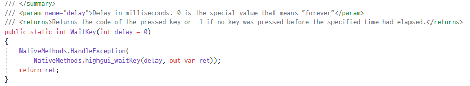

# **Chapter03. CAMERA 출력**
## **개요**

`내장 카메라` 또는 `외장 카메라`로부터 이미지를 불러와 `프레임`을 재생한다. 실시간으로 카메라에서 프레임을 읽어 `Mat` 클래스 형식으로 출력된다.

## **3.1. 프로그램 작성**

```cs
using System;
using OpenCvSharp;

namespace Project {
    class Program {
        static void Main(String[] args) {
            VideoCapture video = new VideoCapture(0);
            Mat frame = new Mat();

            while(Cv2.WaitKey(33) != 'q') {
                video.Read(frame);
                Cv2.ImShow("frame", frame);
            }

            frame.Dispose();
            video.Release();
            Cv2.DestroyAllWindows();
        }
    }
}
```

### **3.1.1. 코드 분석**
```cs
VideoCapture video = new VideoCapture(0);
```

`VideoCapture` 클래스로 참조 변수 `video`를 초기화한다. 생성자의 매개변수로 입력된 **0** 은 `첫 번째로 연결된 카메라`를 의미한다. 

* 웹캠 내장형 노트북
* 내장 카메라가 없는 PC에 카메라를 연결한 경우

해당의 경우, 장치 번호는 **0** 을 사용한다.

여러 카메라가 연결된 경우, 0이 아닌 `1, 2, 3, ...` 등의 장치 번호를 사용하여 외부 카메라로 전환한다.

> 카메라에 대한 접근 권한이 허용되어 있어야 함

```
Mat frame = new Mat();
```
카메라의 프레임을 표시하기 위해 `Mat` 클래스인 `frame`을 초기화한다.

```cs
while(Cv2.WaitKey(33) != 'q') { ... }
```
`33ms`마다 **q** 키가 입력될 때까지 `while()`문을 통해 반복한다.

> 
> 
> `Cv2.WaitKey(ms)`는 키 입력 대기 함수로, 매개 변수로 입력한 밀리초 단위의 시간 동안 Wait(대기) 동작을 한다. 또한 반환값을 인식하여 활용할 수도 있다.
> 
> 단, **0** 이 입력된 경우는 예외로, 시간 관계 없이 `Forever` 즉, 키 입력이 있을 때까지 무한대로 Wait한다.

```cs
video.Read(frame);
Cv2.ImShow("frame", frame);
```

video의 `Read` 메서드를 통해 프레임을 읽어 `frame` Mat로 불러온다.

이후 `Cv2.ImShow()` 이미지 출력 메서드를 사용하여 `frame` Mat에 저장된 카메라의 프레임을 시각적으로 표시한다. 첫 번째 인수는 윈도우 제목 표시줄에 표시될 이름이고, 두 번째 인수는 표시할 Mat이다.

```cs
frame.Dispose();
video.Release();
Cv2.DestroyAllWindows();
```

앞선 `while(WaitKey(33) != 'q') { ... }` 에서 **q** 가 입력되면, 루프가 종료되어 도달하게 되는 코드이다.

`Dispose()` 와 `Release()` 구분으로 `frame` Mat와 `video` 에 대한 메모리를 해제한다. 또한, `ImShow()`에 의해 표시된 윈도우 창을 더 이상 사용하지 않으므로, `Cv2.DestroyAllWindows()`를 통해 모든 윈도우 창을 종료한다.

\* 더 이상 사용되지 않는다면, 명시적으로 메모리를 Free해 주는 것이 좋다.