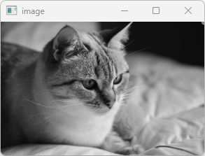
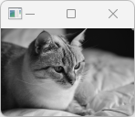
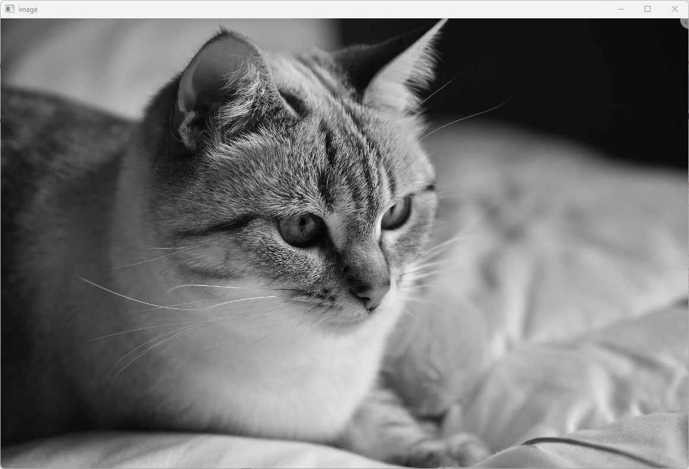
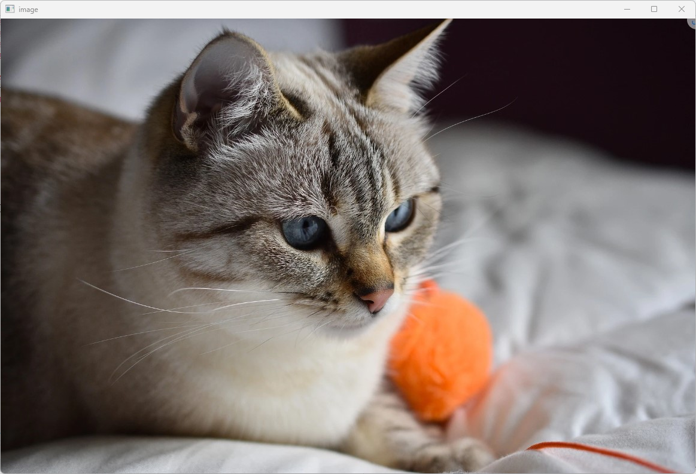

# **Chapter04. IMAGE 출력**
## **개요**

컴퓨터에 저장된 `이미지 파일`을 불러와 출력한다. 불러온 이미지는 `Mat`클래스 형식으로 저장, 출력된다.

## **4.1. 프로그램 작성**
### **4.1.1. 이미지 준비**


프로그램에 사용할 이미지를 C# 프로젝트 `Debug` 내부의 `*.exe` 실행파일이 있는 디렉터리에 저장한다.
> 파일명은 `cat.jpg`로 가정한다.

### **4.1.2. 소스 작성**
```cs
using System;
using OpenCvSharp;

namespace Project {
    class Program {
        static void Main(String[] args) {
            Mat image = Cv2.ImRead("cat.jpg", ImreadModes.Grayscale);
            Cv2.ImShow("image", image);
            Cv2.WaitKey(0);
            Cv2.DestroyAllWindows();
        }
    }
}
```

### **4.1.3. 코드 분석**
```cs
Mat image1 = Cv2.ImRead("cat.jpg", ImreadModes.Grayscale);

Mat image2 = new Mat("cat.jpg), ImreadModes.Grayscale);
```
이미지 입력 함수 `Cv2.ImRead("경로", flags)`를 활용해 이미지를 불러와 Mat 클래스의 참조 변수에 할당한다.

* 경로는 상대 혹은 절대 경로를 사용하며, 상대 경로 지정 시 실행파일을 기준으로 작성한다.
* `flags`는 이미지를 불러올 때 적용할 **초기 상태 값** 을 지정한다.
  * `ImreadModes.Unchanged`: 원본 사용
  * `ImreadModes.Grayscale`: 1채널, 그레이스케일 적용
  * `ImreadModes.Color`: 3채널, BGR이미지 사용
  * `ImreadModes.AnyDepth`: 이미지에 따라 정밀도를 16/32비트 또는 8비트로 사용
  * `ImreadModes.AnyColor`: 가능한 3채널, 색상 이미지로 사용
  * `ImreadModes.LoadGdal`: GDAL에서 지원하는 지리공간 데이터 이미지로 사용
  * `ImreadModes.ReducedGrayscale2`: 1채널, 1/2 크기, 그레이스케일 적용
  * `ImreadModes.ReducedColor2`: 3채널, 1/2 크기, BGR 이미지 사용
  * `ImreadModes.ReducedGrayscale4`: 1채널, 1/4 크기, 그레이스케일 적용
  * `ImreadModes.ReducedColor4`: 3채널, 1/4 크기, BGR 이미지 사용
  * `ImreadModes.ReducedGrayscale8`: 1채널, 1/8 크기, 그레이스케일 적용
  * `ImreadModes.ReducedColor8`: 3채널, 1/8 크기, BGR 이미지 사용
  * `ImreadModes.IgnoreOrientation`: EXIF의 방향 플래그에 따라 이미지를 회전하지 않음

\* `GDAL`은 지리공간 데이터 추상화 라이브러리
\* `EXIF`는 이미지에 포함된 회전 정보 등을 의미

`Cv2.ImRead()`대신에 `new Mat()`와 같이 Mat 클래스에 직접 이미지를 할당할 수 있으며, 매개변수의 순서와 의미는 `Cv2.ImRead()`와 동일하다.

```cs
Cv2.ImShow("image", image);
Cv2.WaitKey(0);
Cv2.DestroyAllWindows();
```

* `Cv2.ImShow()`: 3장에서 설명한 이미지 출력 메서드로 이미지를 새로운 윈도우 창에 표시할 수 있음
* `Cv2.WaitKey()`: 시간 대기 메서드의 파라미터 값을 0(ms)로 설정하여, **키 입력** 이 있을 때까지 유지한다.
* `Cv2.DestroyAllWindows()`: 모든 `Cv2.ImShow()`에 의해 생성된 윈도우를 종료한다.

> 결과 이미지


---
## **ImReadModes flag값에 따른 결과**

> Unchanged


> Grayscale (GrayScale, ReducedGrayscale 2, 4, 8)

 
GrayScale


ReducedGrayscale2


ReducedGrayscale4


ReducedGrayscale8

> Color(Reduced 생략)


> AnyDepth



> AnyColor


> LoadGdal



> IgnoreOrientation

