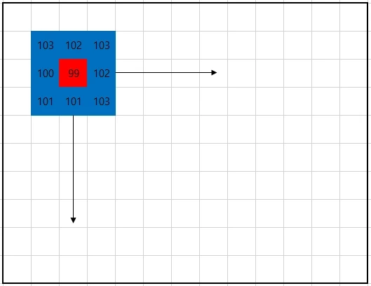

# 제 14장 - 흐림 효과
***
## 흐림 효과 (Blurring)
` 또는 `스무딩(Smoothing)`이라 불리며, 
`노이즈를 줄이`거나 `외부 영향을 최소화`하는 데 사용합니다.

`흐림 효과`는 단순히 이미지를 흐리게 만드는 것뿐만 아니라 
`노이즈를 제거`해서 연산 시 `계산을 빠르고 정확하게` 수행할 수 있습니다.

***

+ ## 커널(Kernel)



`커널 (Kernel)`은 이미지에서 `(x, y)의 픽셀`과 `(x, y) 픽셀 주변`을 `포함`한 `작은 크기의 공간`을 의미합니다.

이 영역 `각 픽셀`에 `특정한 수식이나 함수 등을 적용`해 `새로운 이미지를 얻는 알고리즘`에서 사용됩니다.

위 이미지의 `파란색 사각형 내부가 커널`이 되며, 파란색 사각형 크기가 3x3이므로, `커널의 크기는 3x3`이 됩니다.

***

+ ## 고정점(Achor Poing)

고정점(Anchor Point)은 커널을 통해 컨벌루션된 값을 할당한 지점입니다.

컨벌루션(Convolution)이란 새로운 픽셀을 만들어 내기 위해 커널 크기의 화소 값을 이용해 어떤 시스템을 통과해 계산하는 것을 의미합니다.

커널 내에서 고정점은 하나의 지점만을 가지며, 이미지와 어떻게 정렬되는지를 나타냅니다.

위 이미지의 <u>빨간색 부분이 고정점</u>이 되며, 빨간색 사각형의 위치는 파란색 사각형을 기준으로 (1, 1)에 위치합니다.

***

+ ## 테두리 외삽법(Border Extrapolation)

`테두리 외삽법(Border Extrapolation)`은 컨벌루션을 적용할 때, `이미지 가장자리 부분의 처리 방식`을 의미합니다.

컨벌루션을 적용하면 `이미지 가장자리 부분`은 계산이 불가능한 데, 
이 문제를 해결하기 위해 테두리의 이미지 바깥쪽에 `가상의 픽셀`을 만들어 처리합니다.

`가상 픽셀`의 값을 `0`으로 처리하거나, `임의의 값`을 할당하거나, 
커널이 연산할 수 있는 부분부터 연산을 수행하기도 합니다.

위 이미지의 굵은 선 바깥 부분에 대해 테두리 외삽법이 적용됩니다.

### < 테두리 외삽법 플래그 종류 >

|속성                       |의미                                   |
|-----------------------    |-------------------------------------- |
|BorderTypes.`Constant`     |`픽셀`을 `고정값`으로 확장               |
|BorderTypes.`Replicate`	|`테두리 픽셀`을 `복사`해서 확장            |
|BorderTypes.`Reflect`	    |`픽셀`을 `반사`해서 확장                   |
|BorderTypes.`Wrap`	        |`반대쪽 픽셀`을 `복사`해서 확장            |
|BorderTypes.`Reflect101`	|`이중 픽셀`을 만들지 않고 `반사`해서 확장  |
|BorderTypes.`Default`	    |`Reflect101` 방식을 사용                 |
|BorderTypes.`Transparent`  |`픽셀`을 `투명`하게 해서 확장              |
|BorderTypes.`Isolated`     |`관심 영역(ROI)` 밖은 고려하지 않음      |

`예제에서는 Default만 사용합니다.`

***

+ ## 메인코드

```c#
            // 객체 선언
            Mat src = new Mat("sparkler.jpg");
            Mat blur = new Mat();
            Mat box_filter = new Mat();
            Mat median_blur = new Mat();
            Mat gaussian_blur = new Mat();
            Mat bilateral_filter = new Mat();

            // 1. Blur 단순 흐림 효과 적용
            Cv2.Blur(src, blur, new Size(9, 9), new Point(-1, -1), BorderTypes.Default);
            
            // 2. BoxFilter  박스필터 흐림 효과
            Cv2.BoxFilter(src, box_filter, MatType.CV_8UC3, new Size(9, 9), new Point(-1, -1), true, BorderTypes.Default);
            
            // 3. MedianBlur 중간값 흐림 함수
            Cv2.MedianBlur(src, median_blur, 9);
            
            // 4. GaussianBlur 가우시안 흐림 함수
            Cv2.GaussianBlur(src, gaussian_blur, new Size(9, 9), 1, 1, BorderTypes.Default);
            
            // 5. BilateralFilter 양방향 필터 흐림 효과 함수
            Cv2.BilateralFilter(src, bilateral_filter, 9, 3, 3, BorderTypes.Default);

            // 출력
            Cv2.ImShow("blur", blur);
            Cv2.ImShow("box_filter", box_filter);
            Cv2.ImShow("median_blur", median_blur);
            Cv2.ImShow("gaussian_blur", gaussian_blur);
            Cv2.ImShow("bilateral_filter", bilateral_filter);
            Cv2.WaitKey(0);
```

***

+ ## 세부코드

***

+ ### 객체 선언
```c#
Mat src = new Mat("sparkler.jpg");
Mat blur = new Mat();
Mat box_filter = new Mat();
Mat median_blur = new Mat();
Mat gaussian_blur = new Mat();
Mat bilateral_filter = new Mat();
```

new Mat을 사용해 이미지를 src에 할당합니다.

연산 결과를 저장할 blur, box_filter, median_blur, gaussian_blur, bilateral_filter를 선언합니다.

흐림 효과 관련 함수는 반환 형식을 void로 가집니다.

즉, 메모리 공간을 미리 할당합니다.

***

+ ### < Blur : 단순 흐림 효과 함수 > 


```c#
Cv2.Blur(src, blur, new Size(9, 9), new Point(-1, -1), BorderTypes.Default);
//      (원본,결과,      커널     ,      고정점      ,     테두리 외삽법  );
```

`Cv2.Blur (단순 흐림 효과 함수)` : `각 픽셀`에 대해 `커널을 적용`해 모든 `픽셀의 단순 평균`을 구함

`고정점의 위치`를 `(-1, -1)`로 할당할 경우, 고정점이 `중앙`에 위치한다는 의미가 됩니다.

Cv2.Blur(원본 배열, 결과 배열, 커널, 고정점, 테두리 외삽법)로 단순 흐림 효과를 적용합니다.

즉, 커널의 중심부를 고정점으로 간주합니다.

***

+ ### < BoxFilter : 박스 필터 흐림 효과 함수 >
+ 


```c#
Cv2.BoxFilter(src, box_filter, MatType.CV_8UC3, new Size(9, 9), new Point(-1, -1), true, BorderTypes.Default);
//           (원본,   결과   , 결과배열정밀도 ,      커널     ,       고정점     ,     ,    테두리 외삽법   );
```

`Cv2.BoxFilter(박스 필터 흐림 효과 함수)` : `커널`의 `내부 값`이 `모두 같은 값으로 값을 구합`

Cv2.BoxFilter(원본 배열, 결과 배열, 결과 배열 정밀도, 커널, 고정점, 테두리 외삽법)로 
박스 필터 흐림 효과를 적용합니다.

결과 배열의 정밀도를 MatType.CV_64FC3로 할당할 경우, 64비트 double 형식의 배열로 반환합니다.

***

+ ### < MedianBlur : 중간값 흐림 효과 함수 >


```c#
Cv2.MedianBlur(src, median_blur,    9     );
//            (원본,   결과    ,커널 크기 );
```

`Cv2.MedianBlur(중간값 흐림 효과 함수)` :  `고정점을 사용하지 않고` 
중심 픽셀 주변으로 사각형 크기(ksize×ksize)의 `이웃한 픽셀들의 중간값`을 사용해 
각 픽셀의 값을 변경합니다.

Cv2.MedianBlur(원본 배열, 결과 배열, 커널 크기)로 중간값 흐림 효과를 적용합니다.

커널 크기는 int 형식을 사용하며, 홀수값만 가능합니다.

짝수 크기의 정사각형이나 직사각형의 경우, 중심점을 명확하게 선택할 수 없으므로 홀수 크기의 정사각형만 가능합니다.

***

+ ### < GaussianBlur : 가우시안 흐림 효과 함수 > 


```c#
Cv2.GaussianBlur(src , gaussian_blur, new Size(9, 9),        1        ,        1        , BorderTypes.Default);
//              (원본,      결과    ,      커널     , x 방향 표준편차 , y 방향 표준편차 ,    테두리 외삽법   );
```

`가우시안 흐림 효과 함수(Cv2.GaussianBlur)`는 이미지의 `각 지점`에 `가우시안 커널을 적용`해 
합산한 후에 출력 이미지를 반환합니다.

Cv2.GaussianBlur(원본 배열, 결과 배열, 커널, X 방향 표준 편차, Y 방향 표준 편차, 테두리 외삽법)
로 가우시안 흐림 효과를 적용합니다.

X 방향 표준 편차와 Y 방향 표준 편차는 가우스 커널의 표준 편차를 의미합니다.

X 방향 표준 편차가 0인 경우, Y 방향 표준 편차의 값은 X 방향 표준 편차의 값과 같아집니다.

`표준편차`를 모두 `0으로 설정`한다면 `커널 크기를 고려`해 `자동 설정`됩니다.

***

+ ### < BilateralFilter : 양방향 필터 흐림 효과 함수 > 


```c#
Cv2.BilateralFilter(src, bilateral_filter, 9, 3, 3, BorderTypes.Default);
```
`Cv2.BilateralFilter(양방향 필터 흐림 효과 함수)` : `가장자리(Edge)를 선명하게 보존`하면서 
`노이즈를 우수하게 제거`하는 흐림 효과 함수입니다.

Cv2.BilateralFilter(원본 배열, 결과 배열, 지름, 시그마 색상, 시그마 공간, 테두리 외삽법)로 
가우시안 흐림 효과를 적용합니다.

지름은 흐림 효과를 적용할 각 픽셀 영역의 지름을 의미합니다.

시그마 색상은 색상 공간(color domain)에서 사용할 가우시안 커널의 너비를 설정하며, 
매개변수의 값이 클수록 흐림 효과에 포함될 강도의 범위가 넓어집니다.

시그마 공간은 좌표 공간(space domain)에서 사용할 가우시안 커널의 너비를 설정하며, 
값이 클수록 인접한 픽셀에 영향을 미칩니다.

