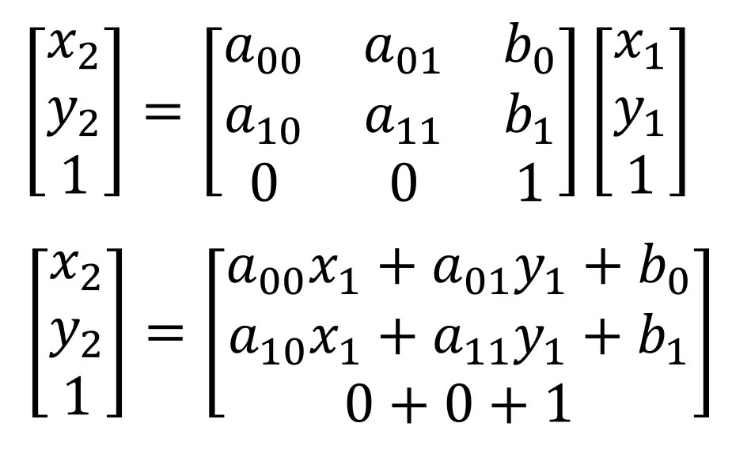
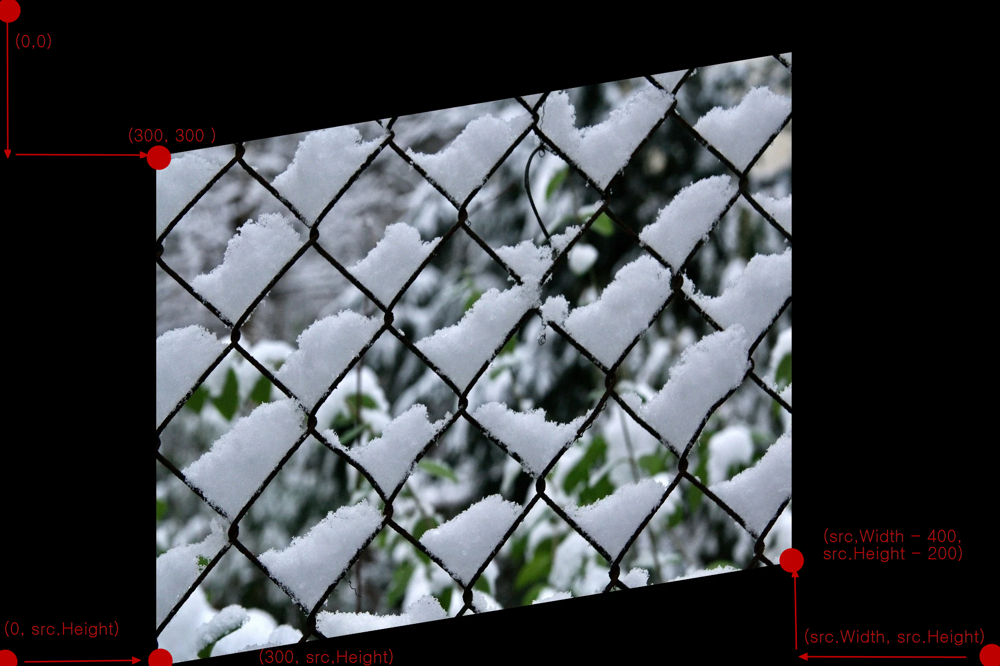

# 제 21강 - 아핀 변환

<br>

## 아핀 변환(Affine Transformation)

 


`아핀 변환(Affine Transformation)`은 선형 변환에 이동 변환까지 포함된 변환입니다.

선의 수평성을 유지하며, 변환 전의 서로 평행한 선은 변환 후에도 평행함을 의미합니다.

즉, 길이의 비와 평행성이 보존되는 변환입니다. `사각형을 평행사변형으로 변환`하는 것을 `아핀 변환`으로 간주합니다.

<br>

## 아핀 변환 행렬(Affine Transformation Matrix)



`아핀 변환 행렬`의 `기본형`은 `3×3 행렬`이지만 `세 번째 행의 값`은 `0, 0, 1의 값`을 지닙니다.

좌변의 행렬과 우변의 행렬의 세 번째 행의 값은 항상 같은 값을 지니게 되어 `OpenCV에서는 2×3 행렬로 표현`합니다.

행렬의 x1, y1은 변환 전 원본 이미지의 픽셀 좌표를 의미하며, 

x2, y2는 변환 후의 결과 이미지의 픽셀 좌표를 의미합니다.

여섯 개의 미지수를 구하기 위해 세 개의 좌표를 활용해 미지수를 계산합니다.

<br>

## 메인 코드

```cs
            Mat src = new Mat("snow.jpg");
            Mat dst = new Mat();

            // 아핀 맵 행렬 생성
            List<Point2f> src_pts = new List<Point2f>()     // 변환 전 3개 픽셀 좌표
            {
                new Point2f(0.0f, 0.0f),
                new Point2f(0.0f, src.Height),
                new Point2f(src.Width, src.Height)
            };

            List<Point2f> dst_pts = new List<Point2f>()     // 변환 후 3개 픽셀 좌표
            {
               new Point2f(300.0f, 300.0f),
               new Point2f(300.0f, src.Height),
               new Point2f(src.Width - 400.0f, src.Height - 200.0f)
            };

            // 아핀 맵 행렬 생성 함수
            Mat matrix = Cv2.GetAffineTransform(     src_pts     ,      dst_pts     );
                                               (변환 전 픽셀 좌표, 변환 후 픽셀 좌표);

            // 생성된 아핀 행렬로 아핀 변환 진행
            Cv2.WarpAffine(src, dst, matrix, new Size(src.Width, src.Height));

            Cv2.ImShow("dst", dst);
            Cv2.WaitKey(0);
```
