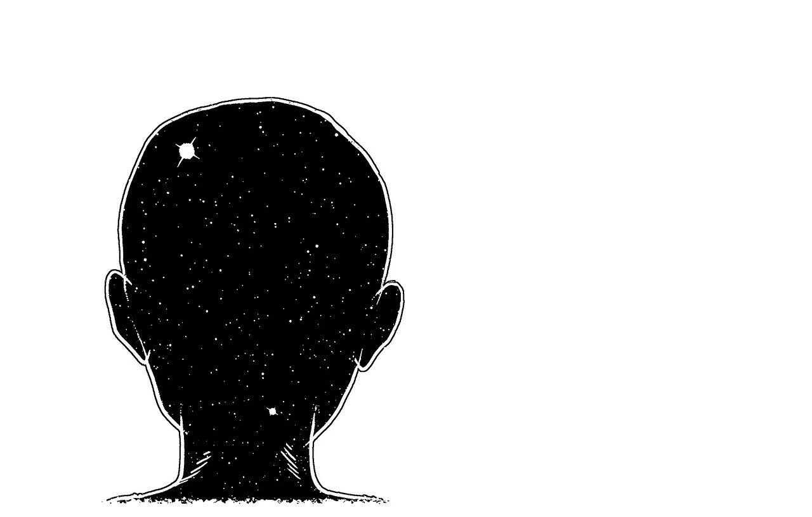
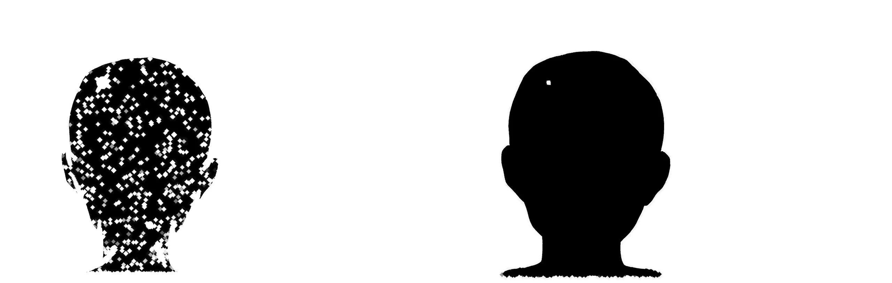
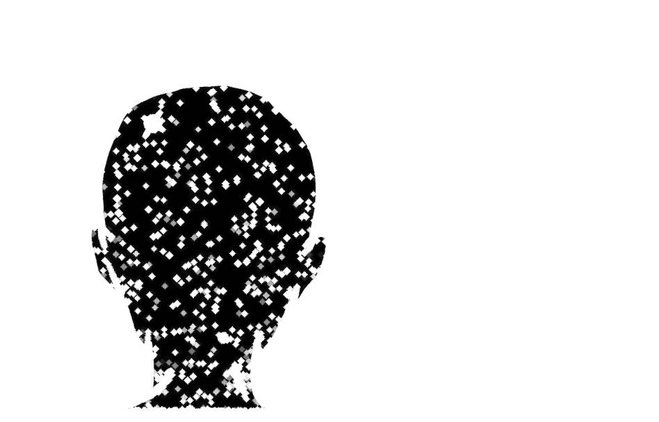
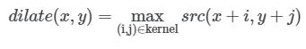
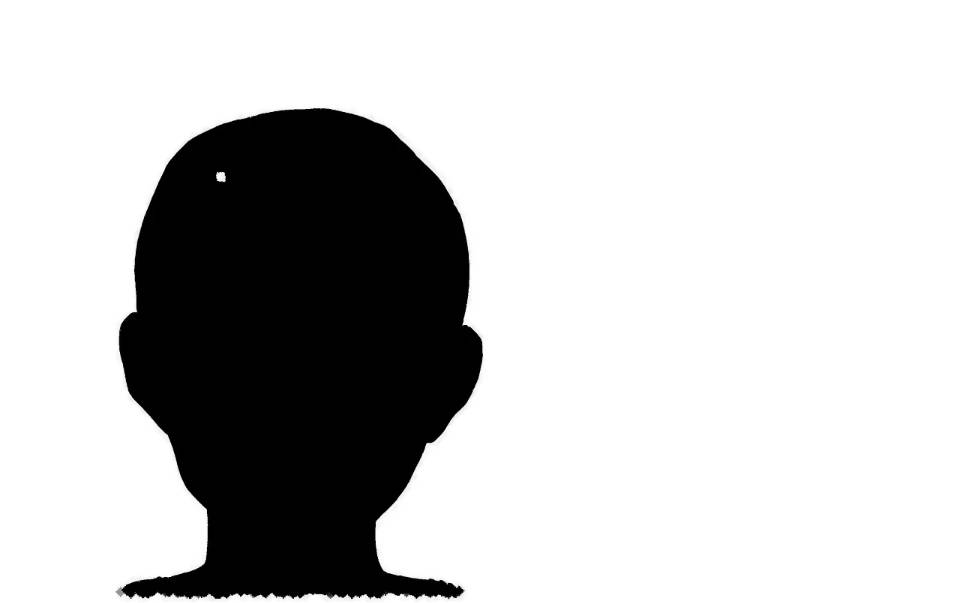
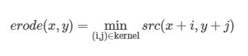

# 제 23장 - 모폴로지 변환

<br>

## 모폴로지 변환(Morphological Transformation)



`모폴로지 변환(Perspective Transformation)`은 영상이나 이미지를 형태학적 관점에서 접근하는 기법을 의미합니다.

모폴로지 변환은 `주로 영상 내 픽셀값 대체에 사용`됩니다. 이를 응용해서 `노이즈 제거` , `요소 결합 및 분리` , `강도 피크 검출` 등에 이용할 수 있습니다.

집합의 포함 관계, 이동(translation), 대칭(reflection), 여집합(complement), 차집합(difference) 등의 성질을 사용합니다.

`기본적인 모폴로지 변환`으로는 `팽창(dilation)`과 `침식(erosion)`이 있습니다.

팽창과 침식은 이미지와 커널의 컨벌루션 연산이며, 이 두 가지 기본 연산을 기반으로 복잡하고 다양한 모폴로지 연산을 구현할 수 있습니다.



<br>

## 팽창(Dilation)

  

 


`팽창(dilation)`은 커널 영역 안에 존재하는 모든 픽셀의 값을 `커널 내부의 극댓값(local maximum)`으로 대체합니다.

즉, 구조 요소(element)를 활용해 이웃한 픽셀들을 최대 픽셀값으로 대체합니다.

팽창 연산을 적용하면 `어두운 영역이 줄어들고 밝은 영역이 늘어`납니다.

커널의 크기나 `반복 횟수에 따라 밝은 영역이 늘어`나 스펙클(speckle)이 커지며 객체 내부의 홀(holes)이 사라집니다.

팽창 연산은 `노이즈 제거 후 줄어든 크기를 복구하고자 할 때`주로 사용합니다.

<br>

## 침식(Erosion)

  



`침식(erosion)`은 커널 영역 안에 존재하는 모든 픽셀의 값을 `커널 내부의 극솟값(local minimum)`으로 대체합니다.

즉, 구조 요소(element)를 활용해 이웃한 픽셀을 최소 픽셀값으로 대체합니다.

침식 연산을 적용하면 `밝은 영역이 줄어들고 어두운 영역이 늘어`납니다.

커널의 크기나 `반복 횟수에 따라 어두운 영역이 늘어`나 스펙클(speckle)이 사라지며, 객체 내부의 홀(holes)이 커집니다.

침식 연산은 `노이즈 제거에 주로 사용`합니다.

<br>

## 메인 코드 - `GetStructuringElement()`, `Dilate()`, `Erode()`

```cs
            Mat src = new Mat("nape.jpg");
            Mat dilate = new Mat();
            Mat erode = new Mat();
            Mat dst = new Mat();

            // 모폴로지 연산을 위한 '구조요소' 생성
            Mat element = Cv2.GetStructuringElement(MorphShapes.Cross, new Size(5, 5));
            //                                     (   커널 형태     , 커널 크기     , 고정점 );
            // 커널 형태 : 직사각형, 십자가, 타원
            // 커널 크기 : 너무 작으면 영향이 없음.
            // 고정점 : 중심점의 위치. 필수X -> 함수에서 자동 결정

            // 팽창(Dilation) 적용
            Cv2.Dilate(src, dilate, element, new Point(2, 2), 3);
            // 침식(Erosion) 적용
            Cv2.Erode(src, erode, element, new Point(-1, -1), 3);

            Cv2.HConcat(new Mat[] { dilate, erode }, dst);
            Cv2.ImShow("dst", dst);
            Cv2.WaitKey(0);
```

<br>

## 세부 코드

```cs
Mat src = new Mat("nape.jpg");
Mat dilate = new Mat();
Mat erode = new Mat();
Mat dst = new Mat();
```

new Mat을 사용해 이미지를 src에 할당합니다.

팽창 결과를 저장할 dilate와 침식 결과를 저장할 erode를 선언합니다.

팽창 연산과 침식 연산 결과를 비교하기 위한 dst를 선언합니다.

```cs
Mat element = Cv2.GetStructuringElement(MorphShapes.Cross, new Size(5, 5));
```

모폴로지 연산을 진행하기 위해서 구조요소를 생성합니다.

구조 요소 생성 함수(Cv2.GetStructuringElement)는 커널의 형태(shape)와 커널의 크기(size), 고정점(anchor)를 설정합니다.

Cv2.GetPerspectiveTransform(커널의 형태, 커널의 크기, 중심점)로 구조 요소을 생성합니다.

커널의 형태는 직사각형(Rect), 십자가(Cross), 타원(Ellipse)이 있습니다.

커널의 크기는 구조 요소의 크기를 의미합니다. 이때, 커널의 크기가 너무 작다면 커널의 형태는 영향을 받지 않습니다.

고정점은 커널의 중심 위치를 나타냅니다. 필수 매개변수가 아니며, 설정하지 않을 경우 사용되는 함수에서 값이 결정됩니다.

>Tip : 고정점을 할당하지 않을 경우 조금 더 유동적인 커널이 됩니다.

```cs
Cv2.Dilate(src, dilate, element, new Point(2, 2), 3);
Cv2.Erode(src, erode, element, new Point(-1, -1), 3);
```

생성된 구조 요소를 활용해 모폴로지 변환을 적용합니다.

팽창 함수(Cv2.Dilate)와 침식 함수(Cv2.Erode)로 모폴로지 변환을 진행합니다.

Cv2.Dilate(원본 배열, 결과 배열, 구조 요소, 고정점, 반복 횟수, 테두리 외삽법, 테두리 색상)로 팽창 연산을 진행합니다.

Cv2.Erode(원본 배열, 결과 배열, 구조 요소, 고정점, 반복 횟수, 테두리 외삽법, 테두리 색상)로 침식 연산을 진행합니다.

팽창 함수와 침식 함수의 매개변수 순서와 의미는 동일합니다.

단, 팽창 연산의 경우 밝은 영역이 커지며, 침식 연산의 경우 어두운 영역이 커집니다.

Tip : 고정점을 (-1, -1)로 할당할 경우, 커널의 중심부에 고정점이 위치하게 됩니다.

```cs
Cv2.HConcat(new Mat[] { dilate, erode }, dst);
```

수평 연결 함수(Cv2.HConcat)로 팽창 결과와 침식 결과를 하나의 이미지로 연결합니다.

Cv2.HConcat(연결할 이미지 배열들, 결과 배열)로 이미지를 연결합니다.

Tip : 수직 방향은 수직 연결 함수(Cv2.VConcat)로 이미지를 연결할 수 있습니다.